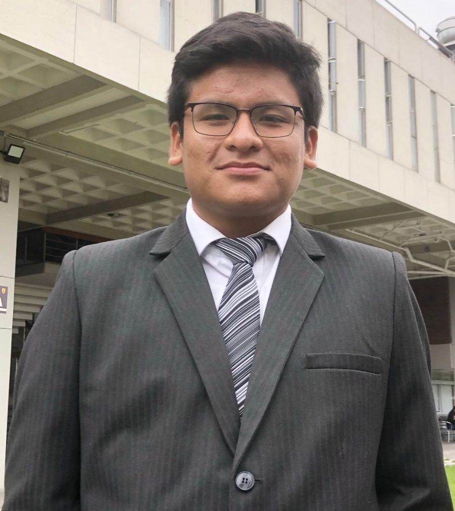

# Introducción de Señales Biomédicas - Grupo 1

## Miembros:
### Líder del equipo: Fabian Alcides Ñaña Alfaro

---

### Miembro: Christian Huarancca Quispe
*Responsabilidad: por asignar*

---

### Miembro: Ryoshin Cavero Mosquera
*Responsabilidad: por asignar*

---

### Miembro: Flavio Andreas Avendanho Çaceres
*Responsabilidad: por asignar*

---

### Miembro: Joao Marco Torres Rivera
*Responsabilidad: por asignar*

---

