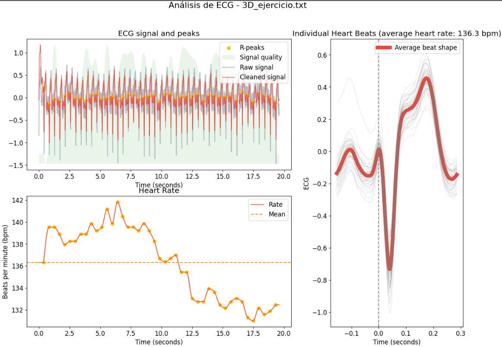

# LABORATORIO 10: – Procesamiento de señales ECG
## Integrantes
- Fabian Alcides Ñaña Alfaro
- Christian Huarancca Quispe
- Ryoshin Cavero Mosquera
- Flavio Andreas Avendanho Cáceres
- Joao Marco Torres Rivera

## Contenido de la sesión

1. [Introducción](#id1)
2. [Objetivos](#id2)
3. [Metodología](id3)
4. [Resultados](#id4)  
5. [Discusión](#id5)  
6. [Conclusiones](#id6)  
7. [Bibliografia](#id7)
***


## Introducción <a name="id1"></a>
<div align="justify">
En previas presentaciones se habló del funcionamiento del Electrocardiograma (ECG) junto con la historia que hay detrás. Una vez extraída la información de los electrodos, el siguiente paso es el procesamiento de la señal para extraer características que sirvan de utilidad ser mencionadas. La extracción de los picos R se muestra muy útil para encontrar la frecuencia cardiaca evaluando el intervalo R-R. Algoritmos como Pan-Tompkins son muy útiles para indicar la frecuencia cardiaca en pacientes al usar los picos R extraídos de la señal, cuyo procedimiento fue detallado por El Yaakoubi[2]. Junto a las transformadas wavelet ambos algoritmos utilizan el filtrado como paso previo, sin embargo, las wavelets utilizan el componente frecuencial como una herramienta adicional. Según una investigación, las wavelets presentan un 99.8% de precisión de extracción del complejo QRS [3], otra por su parte realizó un conteo estadísticos de falsos negativos y falsos positivos llegando a un error de 0.24% y 0.39% respectivamente, usando la wavelet Daubechies 6 (Db6), presentandose asi como una de los mejores algoritmos para detección del complejo QRST [4]. La apliación de las wavelets requiere de un lenguaje de programación que pueda darle al usuario una representación visual de lo realizado. En este punto "Neurokit2" es una librería reciente, no tan antigua como los algoritmos ya mencionados, que mediante funciones usando lenguaje de programación python, nos permite una mejor visualización de lo que sucede en la señal ECG [5]. En este trabajo nos enfocaremos el uso de la librería "Neurokit2" en el procesamiento de nuestras señales ECG extraídas en un laboratorio pasado.

## Objetivos <a name="id2"></a>
* Elección del mejor filtro Wavelet para ECG en base a búsqueda bibliográfica 
* Extracción de picos R-R de las señales.
* Verificar el comportamiento de la señal ECG.

## Metodología <a name="id3"></a>
<p style="text-align: justify;"> 

En este trabajo usaremos la librería "Neurokit2" en Python usando funciones específicas que sinteticen la labor del programador. Primero usaremos ecg_clean(), una función que limpia la señal de ruido que altere su comportamiento. 

```python

ecg_cleaned = nk.ecg_clean(ecg_signal, sampling_rate=sampling_rate)

```

Posterior a ello, se trabajará con la función ecg_peaks(), el cual, según al documentación, transforma datos de una lista en un dataframe con la ubicación de picos R marcados según el número de muestra tomado

```python

instant_peaks, rpeaks, = nk.ecg_peaks(ecg_cleaned, sampling_rate=1000)

```

Luego se utiliza la funcion, ecg_rate(), el cual calcula la frecuencia cardiaca respecto al número de muestra de la señal.

```python

rate = nk.ecg_rate(rpeaks, sampling_rate=1000, desired_length=len(ecg_cleaned))

```

Para finalizar, el último paso se divide el proceso en dos secciones para comparar los ploteos finales y su presentación de estos. La diferencia es que una sección utiliza la función ecg_quality para una presentación mejor y distinta que se va a visualizar en resultados

```python

quality = nk.ecg_quality(ecg_cleaned, sampling_rate=1000)

```

## Resultados: <a name="id4"></a>

### 1° Derivacion 
<table>
   <tr>
      <th>Estado del sujeto</th>    
      <th>Ploteo de la señal (usando ecg_plot)</th>
      <th>Ploteo de la señal</th>
   </tr>
   <tr>
      <td rowspan="1">Reposo</td>
      <td></td>
      <td></td>
   </tr>
   <tr>
        <td rowspan="1">Respiración</td>
        <td></td>
        <td></td>
    </tr>
    <tr>
        <td rowspan="1">Post_respiración</td>
        <td></td>
        <td></td>
    </tr>
    <tr>
        <td rowspan="1">Ejercicio</td>
        <td></td>
        <td></td>
    </tr>
</table>

### 2° Derivacion 
<table>
   <tr>
      <th>Estado del sujeto</th>    
      <th>Ploteo de la señal (usando ecg_plot)</th>
      <th>Ploteo de la señal</th>
   </tr>
   <tr>
      <td rowspan="1">Reposo</td>
      <td></td>
      <td></td>
   </tr>
   <tr>
        <td rowspan="1">Respiración</td>
        <td></td>
        <td></td>
    </tr>
    <tr>
        <td rowspan="1">Post_respiración</td>
        <td></td>
        <td></td>
    </tr>
    <tr>
        <td rowspan="1">Ejercicio</td>
        <td></td>
        <td></td>
    </tr>
</table>

### 3° Derivacion 
<table>
   <tr>
      <th>Estado del sujeto</th>    
      <th>Ploteo de la señal (usando ecg_plot)</th>
      <th>Ploteo de la señal</th>
   </tr>
   <tr>
      <td rowspan="1">Reposo</td>
      <td></td>
      <td></td>
   </tr>
   <tr>
        <td rowspan="1">Respiración</td>
        <td></td>
        <td></td>
   </tr>
   <tr>
        <td rowspan="1">Post_respiración</td>
        <td></td>
        <td></td>
   </tr>
   <tr>
        <td rowspan="1">Ejercicio</td>
        <td></td>
        <td></td>
   </tr>
</table>

<div align="justify">

## Discusión <a name="id5"></a>


## Conclusión <a name="id6"></a>
<div align="justify">


### Hallazgos de Interés:


## Bibliografía<a name="id7"></a>
 
[1] https://ieeexplore.ieee.org/document/4122029

[2] https://riuma.uma.es/xmlui/bitstream/handle/10630/20493/Amrani%20El%20Yaakoubi%20Nissrin%20Memoria.pdf?sequence=1 

[3] https://ieeexplore.ieee.org/abstract/document/362922
 
[4] https://www.sciencedirect.com/science/article/abs/pii/S0263224109002139

[5] Makowski, D., Pham, T., Lau, Z. J., Brammer, J. C., Lespinasse, F., Pham, H.,
Schölzel, C., & Chen, S. A. (2021). NeuroKit2: A Python toolbox for neurophysiological signal processing.
Behavior Research Methods, 53(4), 1689–1696. https://doi.org/10.3758/s13428-020-01516-y


