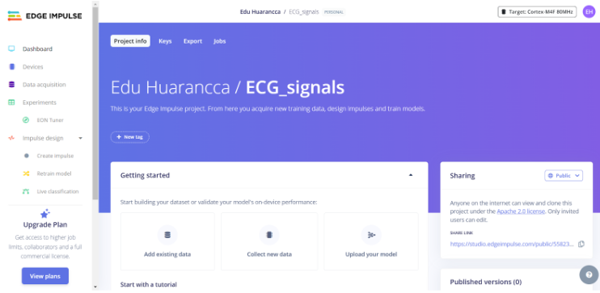
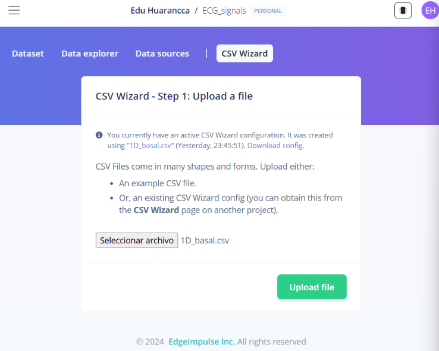
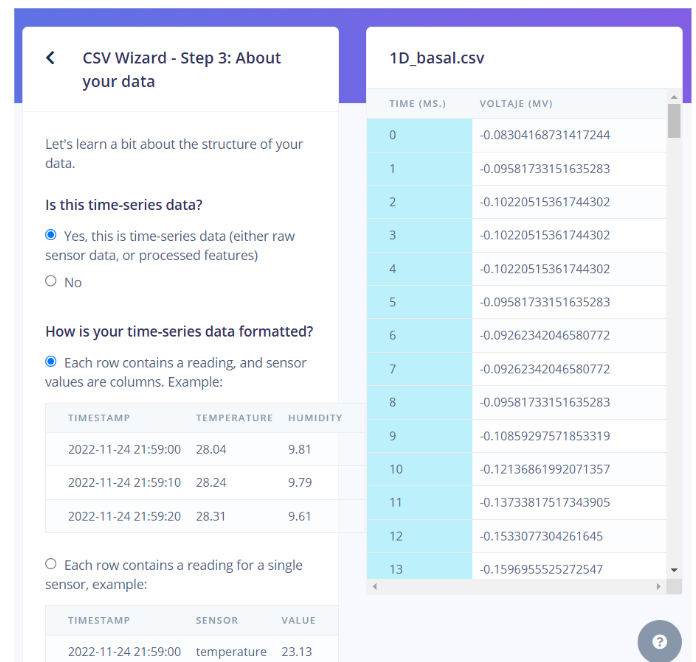
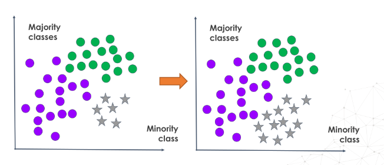

# LABORATORIO 11: Edge Impulse
## Integrantes
- Fabian Alcides Ñaña Alfaro
- Christian Huarancca Quispe
- Ryoshin Cavero Mosquera
- Flavio Andreas Avendaño Cáceres
- Joao Marco Torres Rivera

---

## Contenido de la sesión

1. [Entregable por miembro del grupo](#id1)
    - [Fabian Ñaña](#id2)
    - [Christian Huarancca](#id3)
    - [Ryoshin Cavero](#id4)
    - [Flavio Avendaño](#id5)
    - [Joao Torres](#id6)

---

## 1. Entregable por miembro del grupo <a name="id1"></a>

### 1.1 Fabian Alcides Ñaña Alfaro <a name="id2"></a>
https://studio.edgeimpulse.com/studio/560365/acquisition/training?page=1 

Para realizar la clasificación de señales de ECG en **Edge Impulse**, se utilizaron archivos CSV preprocesados. A continuación, se detallan los pasos seguidos para configurar los datos.

### Configuración del CSV Wizard en Edge Impulse

#### Paso 1: Subir archivos CSV
En esta etapa, se selecciona el archivo CSV para su carga en el **CSV Wizard**.


---

#### Paso 2: Selección de archivos y carpeta
Se eligió la opción para cargar múltiples archivos dentro de una carpeta para una mayor eficiencia. Aquí se muestran los archivos cargados con éxito.


---

#### Paso 3: Vista previa del conjunto de datos cargado
En esta sección se visualizan los datos de entrenamiento y prueba ya cargados.

**Datos de Prueba:**


**Datos de Entrenamiento:**


---

#### Paso 4: Proceso de carga de datos
El sistema permite cargar archivos **JSON**, **CSV**, y otros formatos. Para este proyecto, se utilizaron archivos CSV configurados con delimitadores adecuados.


---

### Descripción del proceso del CSV Wizard

#### Paso 2: Procesar el archivo CSV
El delimitador seleccionado fue el punto y coma (;), lo cual permitió que los datos fueran correctamente separados en columnas.


---

#### Paso 3: Información sobre los datos
Se indicó que los datos cargados corresponden a **series de tiempo**, con una frecuencia de **1000 Hz**.


---

#### Paso 4: Selección de valores
En esta etapa, se determinó qué columnas contienen los datos relevantes.


---

#### Paso 5: División de muestras
Se configuraron muestras de **300 ms** para la creación de segmentos de datos, lo que permite una mejor clasificación durante el entrenamiento.


---

### 1.2. Christian Huarancca Quispe <a name="id3"></a>

#### 1.2.1 OBJETIVOS:
<p style="text-align: justify;">

* Implementar el uso de Edge Impulse como plataforma de aprendizaje automático para procesar señales de ECG obtenidas en diferentes condiciones (estado basal, respiración, post-respiración, actividad física y señales simuladas).
* Subir las señales procesadas a Edge Impulse mediante el asistente CSV Wizard para facilitar el análisis de datos y el desarrollo de modelos de aprendizaje automático.
* Realizar interpolación de datos para generar puntos adicionales entre los valores originales. 

#### 1.2.2 ¿QUÉ ES EDGE IMPULSE?

<p style="text-align: justify;">
Edge Impulse es una plataforma líder en el desarrollo de aprendizaje automático para dispositivos IoT y aplicaciones embebidas. Proporciona herramientas que permiten a los desarrolladores crear, entrenar y desplegar modelos de inteligencia artificial directamente en dispositivos embebidos, como microcontroladores y sensores. Edge Impulse facilita el procesamiento de datos y el desarrollo de modelos de machine learning optimizados para ejecutar en el edge, es decir, en el propio dispositivo, reduciendo la necesidad de depender de conexiones a la nube.

#### 1.2.3 DESCRIPCIÓN DEL PROYECTO:

Inicialmente , en laboratorios previos se  realizó la obtención de señales ECG para distintos momentos , entre ellos en estado basal , durante respiración , post respiración , ejercicio y de señales obtenidas usando ProSim ( simulador de señales ) . El link del proyecto está [aquí](https://studio.edgeimpulse.com/public/558233/live)

<div align="center">



Figura 1. Creación de proyecto en Edge Impulse

</div>

<p style="text-align: justify;">
Se empleó un código en Python para la lectura de cada señal , conversión a mV y guardado en formato .csv , el código se encuentra a continuación . Finalmente, los archivos CSV generados se suben a Edge Impulse para su posterior procesamiento y aplicación en modelo de aprendizaje automático . 

```python

import os
import pandas as pd
import matplotlib.pyplot as plt
from matplotlib.widgets import Slider

def ADCtomV(ADC, n=10, VCC=3.3):
    volts = (((ADC / (2**n)) - (1/2)) * VCC) / 1009
    return volts * 1000

def process_and_plot(folder_path, sampling_rate):
    if not os.path.exists(folder_path):
        print("La carpeta no existe.")
        return
    
    txt_files = [f for f in os.listdir(folder_path) if f.endswith('.txt')]
    
    if not txt_files:
        print("No se encontraron archivos .txt en la carpeta.")
        return

    for file_name in txt_files:
        file_path = os.path.join(folder_path, file_name)
        print(f"Procesando: {file_name}")
        
        with open(file_path, 'r') as file:
            lines = file.readlines()
        header_end_index = next(i for i, line in enumerate(lines) if line.startswith("# EndOfHeader"))
        data_lines = lines[header_end_index + 1:]
        
        data = pd.DataFrame([line.split() for line in data_lines], dtype=float)
        fifth_column = data[5]
        mv_values = fifth_column.apply(ADCtomV)
        
        time = [i / sampling_rate for i in range(len(mv_values))]

        csv_file_name = os.path.splitext(file_name)[0] + ".csv"
        csv_file_path = os.path.join(folder_path, csv_file_name)
        processed_data = pd.DataFrame({'Tiempo (s)': time, 'Voltaje (mV)': mv_values})
        processed_data.to_csv(csv_file_path, index=False)
        print(f"Archivo guardado como: {csv_file_path}")

        fig, ax = plt.subplots()
        plt.subplots_adjust(bottom=0.25)
        l, = plt.plot(time, mv_values, label=f"Archivo: {file_name}")
        ax.set_title(f"Señal procesada: {file_name}")
        ax.set_xlabel("Tiempo (s)")
        ax.set_ylabel("Voltaje (mV)")
        plt.legend()

        ax_slider = plt.axes([0.2, 0.1, 0.65, 0.03])
        slider = Slider(ax_slider, 'Tiempo (s)', 0, len(time) / sampling_rate - 1, valinit=0, valstep=1/sampling_rate)

        def update(val):
            pos = slider.val
            ax.set_xlim(pos, pos + 1000 / sampling_rate)
            fig.canvas.draw_idle()
        
        slider.on_changed(update)
        plt.show()

```

En Edge Impulse, los datos pueden subirse mediante tres estrategias principales: CSV Wizard, que permite cargar fácilmente datos históricos procesados en archivos CSV al proyecto, ideal para análisis offline; SDK y API, que automatizan la recolección y subida de datos en tiempo real desde dispositivos o scripts personalizados, útiles para flujos IoT; y modelos de series temporales, diseñados para señales continuas como audio o ECG, permitiendo procesar datos en ventanas para entrenamiento de modelos avanzados . La estrategia usada , en este caso , para subir los datos al proyecto de Edge Impulse fue mediante CSV Wizard  .

#### 1.2.4 CONFIGURACIÓN DE CSV_WIZARD:

<p style="text-align: justify;">
El Asistente CSV facilita a los usuarios la carga de conjuntos de datos grandes o complejos sin necesidad de convertirlos al formato específico de adquisición de datos, simplificando así el proceso. 

<div align="center">



Figura 2. Paso 1 - Subir un archivo 




Figura 3. Paso 2 y 3  - Análisis de datos 


Figura 4. Paso 4  - Acerca de los datos 


Figura 5. Paso 5  - División de muestras

</div>

<p style="text-align:justify">
Se realizó un proceso de oversampling relacionado a la interpolación de puntos con el objetivo de obtener data sintética , ya que en laboratorios pasados solo se obtuvo una medición de 20 segundos con Open Signals por cada señal , para este caso se analizaron  los casos de estado basal , respiración , post respiración y durante actividad física de la primera derivada de una señal ECG . 

El código utiliza una técnica conocida como interpolación para generar datos adicionales entre los puntos de una señal original, logrando así el llamado oversampling, lo cual es útil para analizar señales con mayor resolución temporal o para adaptar la señal a un tamaño o duración específica, una vez obtenidos los datos del Open Signals y realizar su conversión de ADC a mV , estos datos pasan de nuevo a través de un filtro digital (el oversampling) con la función de aplicar un proceso matemático de interpolación, cuyo objetivo es añadir más puntos de lectura o muestreo entre dos puntos conocidos de una curva. 

</p>

```python

import os
import pandas as pd
import numpy as np
import matplotlib.pyplot as plt
from matplotlib.widgets import Slider

def ADCtomV(ADC, n=10, VCC=3.3):
    volts = (((ADC / (2**n)) - (1/2)) * VCC) / 1009
    return volts * 1000

def generate_oversampling(time, values, target_length):
    current_length = len(time)
    new_time = np.linspace(time[0], time[-1], target_length)
    new_values = np.interp(new_time, time, values)
    return new_time, new_values

def process_and_plot(folder_path, sampling_rate):
    if not os.path.exists(folder_path):
        print("La carpeta no existe.")
        return
    
    txt_files = [f for f in os.listdir(folder_path) if f.endswith('.txt')]
    
    if not txt_files:
        print("No se encontraron archivos .txt en la carpeta.")
        return

    for file_name in txt_files:
        file_path = os.path.join(folder_path, file_name)
        print(f"Procesando: {file_name}")
        
        with open(file_path, 'r') as file:
            lines = file.readlines()
        header_end_index = next(i for i, line in enumerate(lines) if line.startswith("# EndOfHeader"))
        data_lines = lines[header_end_index + 1:]
        
        data = pd.DataFrame([line.split() for line in data_lines], dtype=float)
        fifth_column = data[5]
        mv_values = fifth_column.apply(ADCtomV)
        
        time = [i / sampling_rate for i in range(len(mv_values))]

        csv_file_name = os.path.splitext(file_name)[0] + ".csv"
        csv_file_path = os.path.join(folder_path, csv_file_name)
        processed_data = pd.DataFrame({'Tiempo (s)': time, 'Voltaje (mV)': mv_values})
        processed_data.to_csv(csv_file_path, index=False)
        print(f"Archivo guardado como: {csv_file_path}")

        oversample_points = sampling_rate * 150
        new_time, new_values = generate_oversampling(time, mv_values, oversample_points)

        oversampled_csv_file_name = os.path.splitext(file_name)[0] + "_oversampled.csv"
        oversampled_csv_file_path = os.path.join(folder_path, oversampled_csv_file_name)
        oversampled_data = pd.DataFrame({'Tiempo (s)': new_time, 'Voltaje (mV)': new_values})
        oversampled_data.to_csv(oversampled_csv_file_path, index=False)
        print(f"Señal oversampleada guardada como: {oversampled_csv_file_path}")

        fig, ax = plt.subplots()
        plt.subplots_adjust(bottom=0.25)
        l, = plt.plot(new_time, new_values, label=f"Oversampled: {file_name}")
        ax.set_title(f"Señal Oversampleada: {file_name}")
        ax.set_xlabel("Tiempo (s)")
        ax.set_ylabel("Voltaje (mV)")
        plt.legend()

        ax_slider = plt.axes([0.2, 0.1, 0.65, 0.03])
        slider = Slider(ax_slider, 'Tiempo (s)', 0, len(new_time) / sampling_rate - 1, valinit=0, valstep=1/sampling_rate)

        def update(val):
            pos = slider.val
            ax.set_xlim(pos, pos + 1000 / sampling_rate)
            fig.canvas.draw_idle()
        
        slider.on_changed(update)
        plt.show()

folder_path = "D:/Users/DELL/Downloads/Data_ECG"
sampling_rate = 1000
process_and_plot(folder_path, sampling_rate)

```

En este caso, la función generate_oversampling toma como entrada los tiempos y valores de la señal  originales, junto con el número de puntos deseados en la señal resultante . Se genera un nuevo conjunto de tiempos que tiene una distribución lineal uniforme entre el inicio y el final de la señal original. Luego, utilizando interpolación lineal con la función np.interp, los nuevos valores de la señal son calculados para estos nuevos tiempos, basándose en los valores originales, estos finalmente se guardan en formato .csv para poder subirlos al proyecto creado en Edge Impulse . 

<div align="center">



Figura 6. Oversampling para obtención de data sintética
</div>

<div align="justify">

Training data  es el conjunto de datos que se utiliza para entrenar un modelo de machine learning. Durante esta fase, el modelo analiza los datos y ajusta sus parámetros internos para aprender patrones, relaciones y estructuras en los datos. Este aprendizaje permite que el modelo tome decisiones o haga predicciones basadas en nuevas entradas.Por otro lado , testing data es un conjunto separado de datos que nunca se utiliza durante el entrenamiento del modelo. Se reserva exclusivamente para evaluar el rendimiento del modelo una vez entrenado. Su propósito es comprobar cómo se comporta el modelo con datos no vistos, simulando su desempeño en un entorno real. Si el modelo tiene un buen desempeño en el conjunto de prueba, se considera que ha aprendido a generalizar correctamente, en lugar de simplemente memorizar los datos de entrenamiento.

La proporción recomendada , como se mencionó en el taller de Edge Impulse pasado ,  es de 80%-20%. Un 80% para el entrenamiento proporciona al modelo suficientes datos para aprender, mientras que un 20% para la prueba asegura una evaluación fiable. Si el conjunto de prueba es muy pequeño, no se podrá evaluar con precisión el rendimiento del modelo, y si el conjunto de entrenamiento es muy pequeño, el modelo no tendrá suficientes datos para aprender de manera adecuada.

Para el proyecto actual  se tiene la proporción de 83%-17% , la cual es  es muy cercana a la recomendada. Esta ligera variación sigue siendo válida, ya que aún se deja un porcentaje razonable de datos para evaluar el modelo , lo cual  asegura que el entrenamiento tenga suficientes datos para ser efectivo, mientras que el conjunto de prueba sigue siendo lo suficientemente amplio para validar el modelo adecuadamente .

</div>

#### 1.2.5 CONCLUSIONES

<p style="text-align:justify">

* Edge Impulse se establece como una herramienta eficiente para el desarrollo de modelos de aprendizaje automático en dispositivos IoT y sistemas embebidos, facilitando la integración de datos procesados y su uso en modelos avanzados.
* El uso de interpolación para oversampling permite generar datos sintéticos que aumentan la resolución temporal de las señales de ECG para un análisis de largos periodos de tiempo . 
* La estrategia CSV Wizard simplifica la carga de señales procesadas al proyecto de Edge Impulse, facilitando la gestión de datos históricos y asegurando su compatibilidad con la plataforma.
* La proporción de 83-17% es cercana a  la recomendada de 80-20%, permitiendo un aprendizaje efectivo del modelo y una evaluación confiable de su capacidad para generalizar a datos no vistos.


### 1.3. Ryoshin Cavero Mosquera <a name="id4"></a>

Puede encontrar el enlace a **Edge Impulse** [aquí](https://studio.edgeimpulse.com/studio/552481/acquisition/training?page=1).

He realizado la separación de las señales de acuerdo a la actividad realizada en el momento, como se aprecia en la Figura a continuación:


A continuación, se muestra la tabla de los archivos utilizados para cada clase de ECG separado:

<table>
    <tr>
        <th>BASAL</th>
        <th>RESPIRACIÓN</th>
        <th>POST-RESPIRACIÓN</th>
        <th>EJERCICIO</th>
    </tr>
    <tr>
        <td></td>
        <td></td>
        <td></td>
        <td></td>
    </tr>
</table>

---

### 1.4. Flavio Andreas Avendaño Cáceres <a name="id5"></a>
**Descripción pendiente por completar**

---

### 1.5. Joao Marco Torres Rivera <a name="id6"></a>
**Descripción pendiente por completar**
