# LABORATORIO 11: Edge Impulse
## Integrantes
- Fabian Alcides Ñaña Alfaro
- Christian Huarancca Quispe
- Ryoshin Cavero Mosquera
- Flavio Andreas Avendaño Cáceres
- Joao Marco Torres Rivera

---

## Contenido de la sesión

1. [Entregable por miembro del grupo](#id1)
    - [Fabian Ñaña](#id2)
    - [Christian Huarancca](#id3)
    - [Ryoshin Cavero](#id4)
    - [Flavio Avendaño](#id5)
    - [Joao Torres](#id6)

---

## 1. Entregable por miembro del grupo 

### 1.1 Fabian Alcides Ñaña Alfaro 
https://studio.edgeimpulse.com/studio/560365/acquisition/training?page=1 

Para realizar la clasificación de señales de ECG en **Edge Impulse**, se utilizaron archivos CSV preprocesados. A continuación, se detallan los pasos seguidos para configurar los datos.

### Configuración del CSV Wizard en Edge Impulse

#### Paso 1: Subir archivos CSV
En esta etapa, se selecciona el archivo CSV para su carga en el **CSV Wizard**.

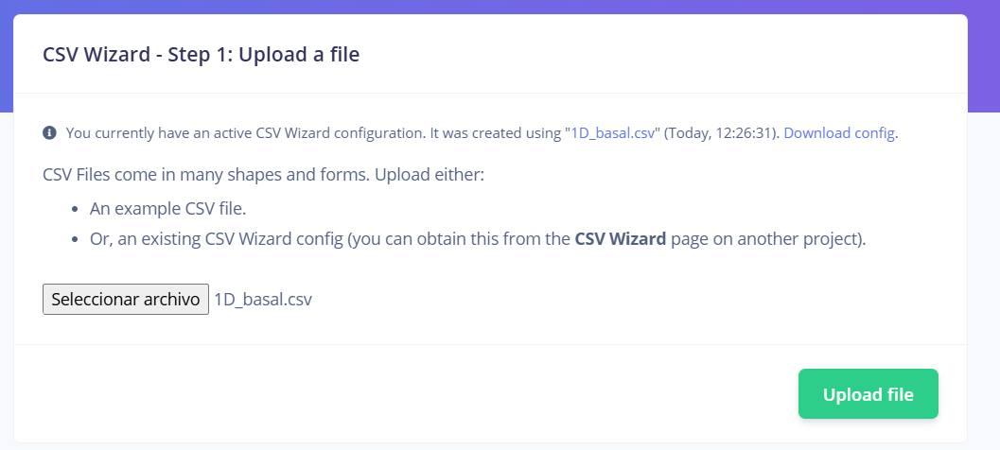

---

#### Paso 2: Selección de archivos y carpeta
Se eligió la opción para cargar múltiples archivos dentro de una carpeta para una mayor eficiencia. Aquí se muestran los archivos cargados con éxito.

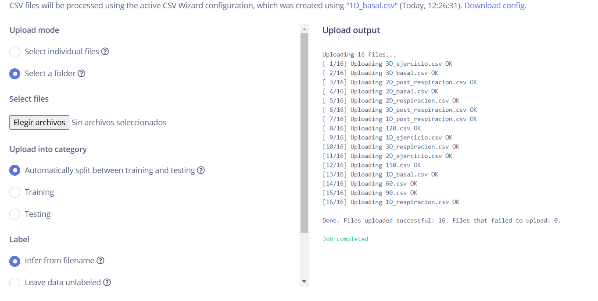

---

#### Paso 3: Vista previa del conjunto de datos cargado
En esta sección se visualizan los datos de entrenamiento y prueba ya cargados.

**Datos de Prueba:**
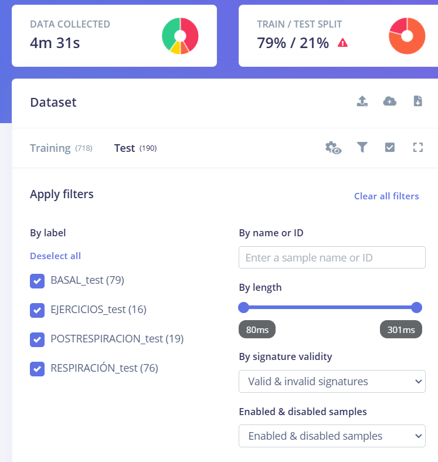

**Datos de Entrenamiento:**
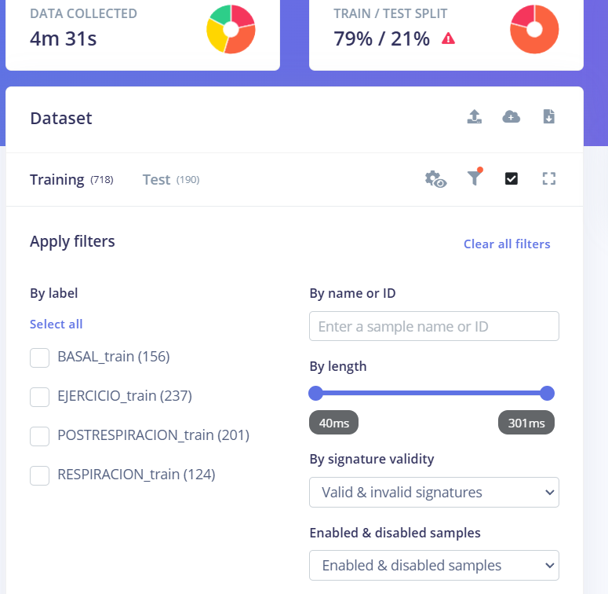

---

#### Paso 4: Proceso de carga de datos
El sistema permite cargar archivos **JSON**, **CSV**, y otros formatos. Para este proyecto, se utilizaron archivos CSV configurados con delimitadores adecuados.

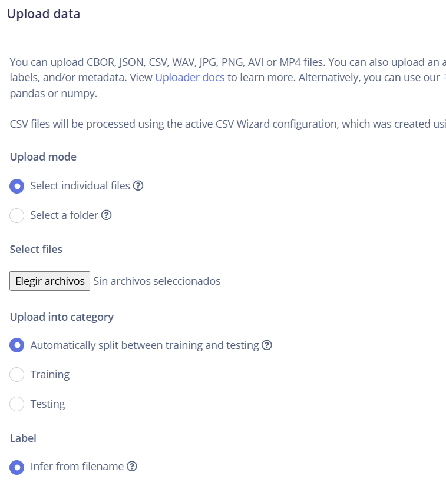

---

### Descripción del proceso del CSV Wizard

#### Paso 2: Procesar el archivo CSV
El delimitador seleccionado fue el punto y coma (;), lo cual permitió que los datos fueran correctamente separados en columnas.

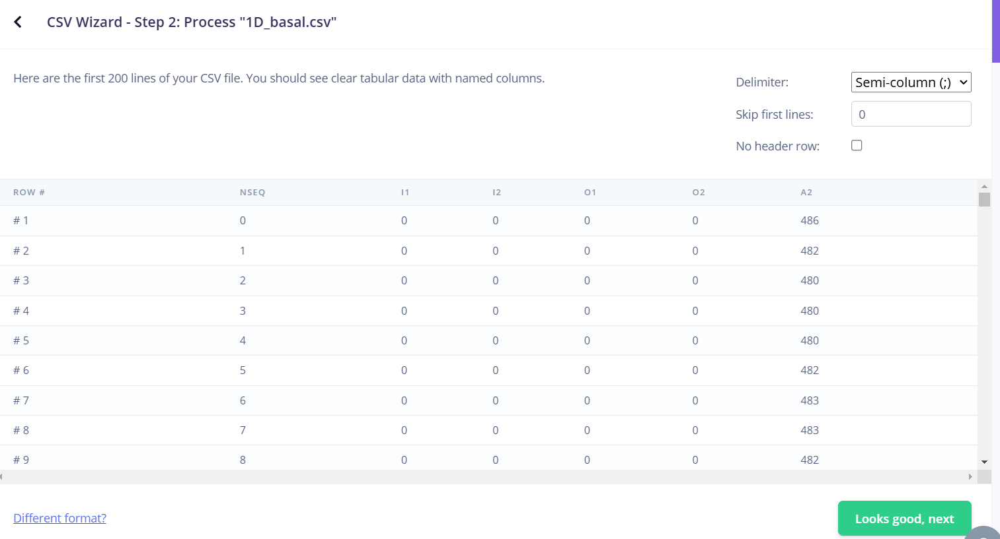

---

#### Paso 3: Información sobre los datos
Se indicó que los datos cargados corresponden a **series de tiempo**, con una frecuencia de **1000 Hz**.

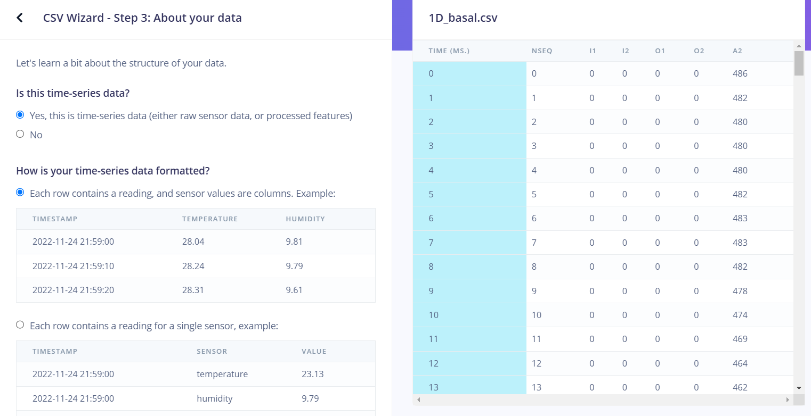
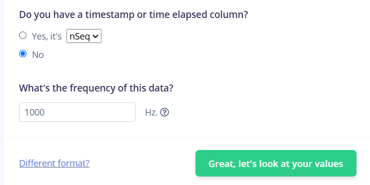

---

#### Paso 4: Selección de valores
En esta etapa, se determinó qué columnas contienen los datos relevantes.

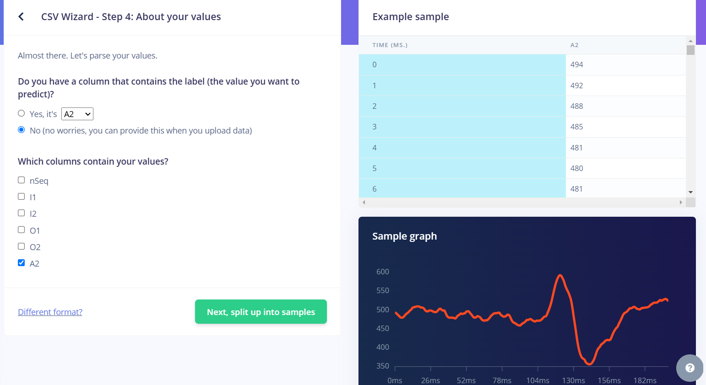

---

#### Paso 5: División de muestras
Se configuraron muestras de **300 ms** para la creación de segmentos de datos, lo que permite una mejor clasificación durante el entrenamiento.

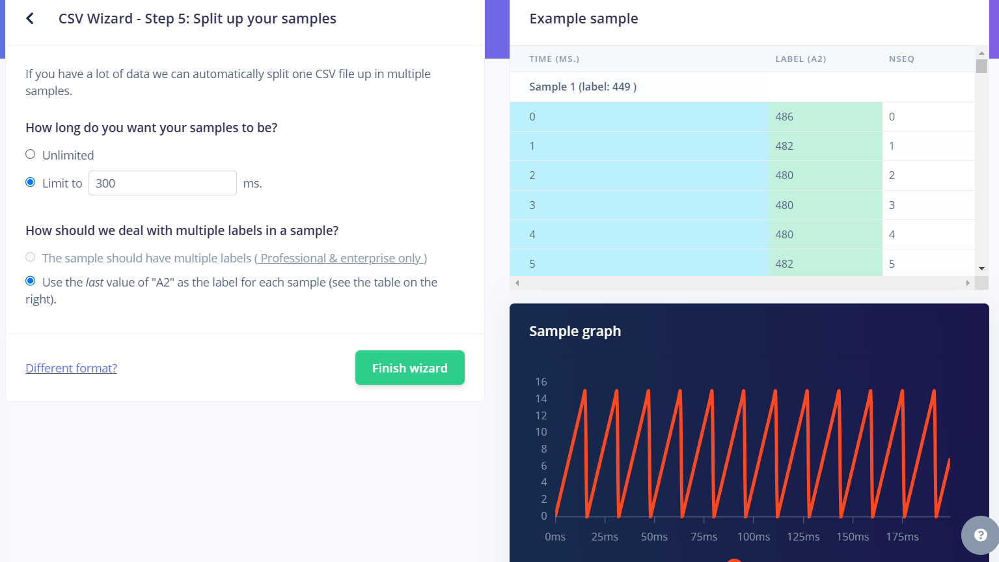

---

### 1.2. Christian Huarancca Quispe 
**Descripción pendiente por completar**

---

### 1.3. Ryoshin Cavero Mosquera 

Puede encontrar el enlace a **Edge Impulse** [aquí](https://studio.edgeimpulse.com/studio/552481/acquisition/training?page=1).

He realizado la separación de las señales de acuerdo a la actividad realizada en el momento, como se aprecia en la Figura a continuación:

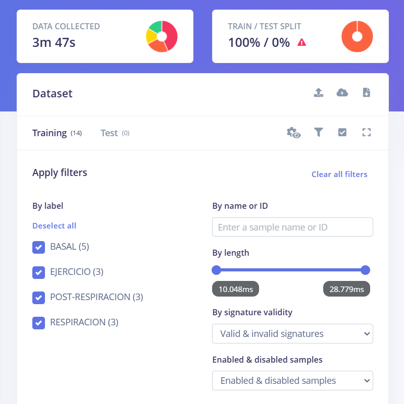

A continuación, se muestra la tabla de los archivos utilizados para cada clase de ECG separado:

<table>
    <tr>
        <th>BASAL</th>
        <th>RESPIRACIÓN</th>
        <th>POST-RESPIRACIÓN</th>
        <th>EJERCICIO</th>
    </tr>
    <tr>
        <td>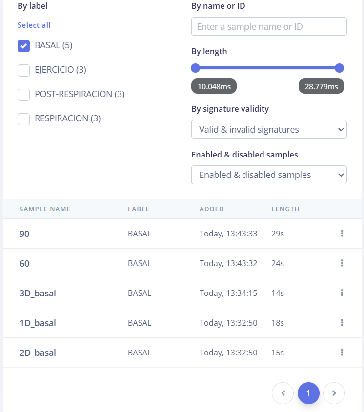</td>
        <td>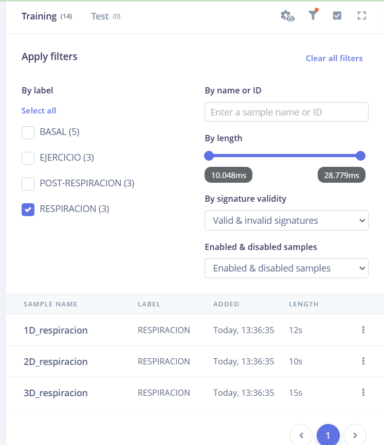</td>
        <td>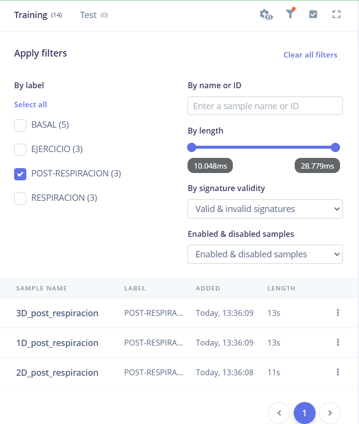</td>
        <td>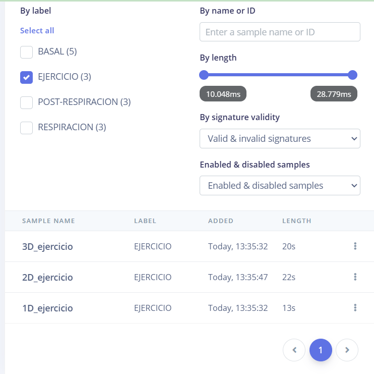</td>
    </tr>
</table>

---

### 1.4. Flavio Andreas Avendaño Cáceres 
**Descripción pendiente por completar**

---

### 1.5. Joao Marco Torres Rivera 
**Descripción pendiente por completar**
