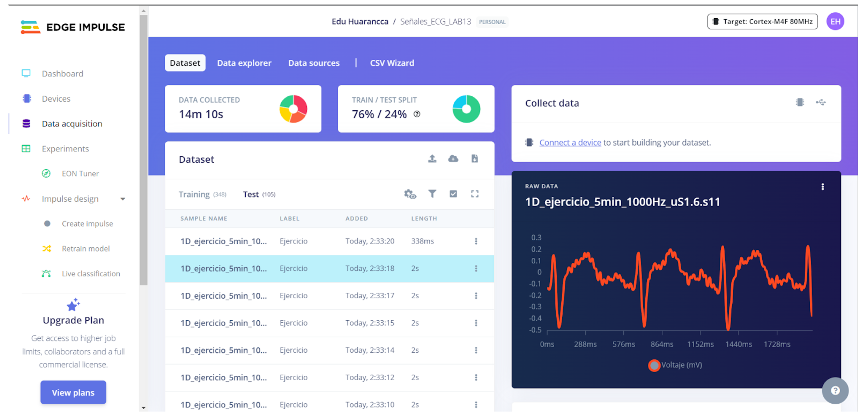
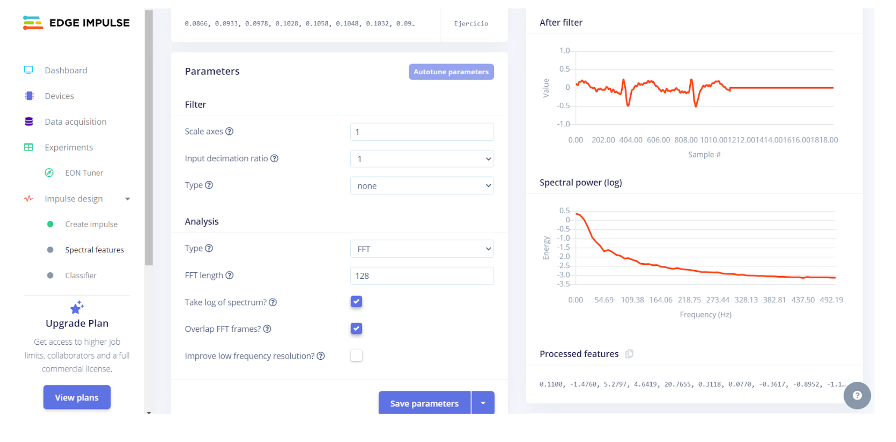
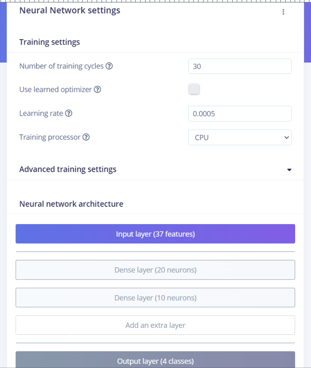
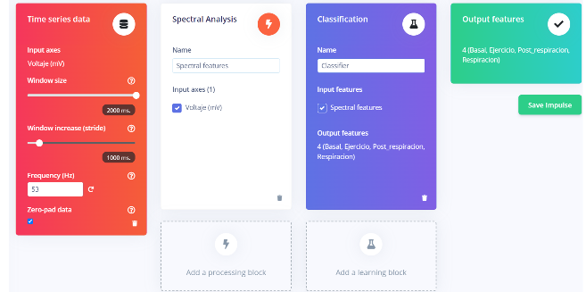
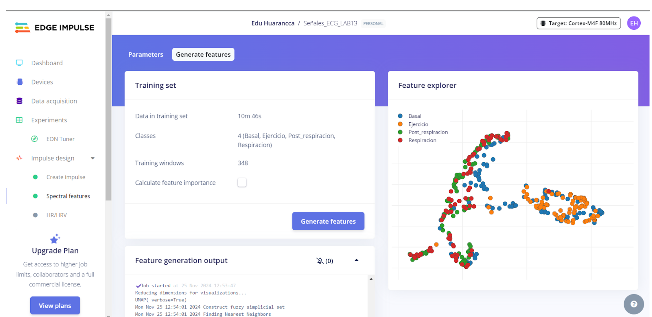
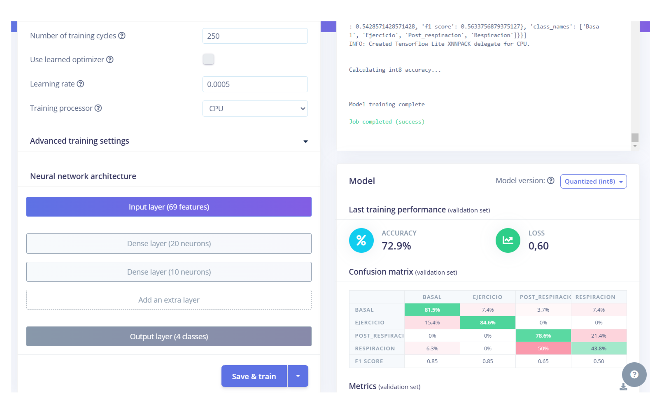
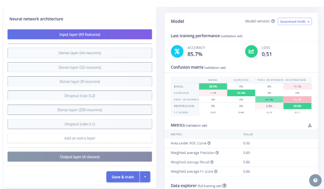

# LABORATORIO 13: Generacion Impulso Edge Impulse
## Alumno
- Christian Edú Huarancca Quispe

## Link del Edge Impulse:

https://studio.edgeimpulse.com/public/565867/live

## Contenido de la sesión

1. [Informe Laboratorio](#id1)
    - [Base de datos](#id2)
    - [Create Impulse](#id3)
    - [Spectral features](#id4)
    - [Classifier](#id5)
    - [Retrain](#id6)
    - [Discusión](#id7)
    - [Conclusiones](#id8)

---
## 1.1 Base de datos 

Con respecto al anterior laboratorio , he realizado algunos cambios en la base de datos , a partir de la data inicial obtenida por el software OpenSignals, he realizado un proceso de upsampling y downsampling a las señales de la primera derivada de señal ECG en estado basal , respiración ,post respiración y durante el ejercicio . 
codigo ECG_upDownsampling
Este código procesa archivos de señales ECG en formato .txt, ajustándose primero con una frecuencia de muestreo de 1000 Hz (Fs del kit bitalino). Posteriormente, aplica upsampling y downsampling mediante interpolación, utilizando factores configurables. Los resultados fueron guardados como archivos CSV y subidos mediante CSV_wizard al proyecto de Edge Impulse  . 

 

Figura 1. Fuente: edgeimpulse

## 1.2. Create Impulse 

A continuación se muestran las características de creación del impulso por default que nos brinda el Edge Impulse , donde se realiza análisis espectral y se selecciona la opción de clasificación entre estado basal , respiración ,post respiración y ejercicios .

Figura 2. Edge Impulse

## 1.3. Spectral features 

Para el análisis espectral , se consideró tomar 128 FFT length,ya que con el cual se logra una buena resolución para capturar las componentes de baja frecuencia características de las señales ECG, como las variaciones periódicas que representan las ondas P, QRS, y T ; por otro lado ,  no se pierde demasiada resolución temporal .

Figura 3. Edge Impulse

## 1.4. Classifier 

Para el classifier , momentáneamente se dejaron los parámetros por default para evaluar un accuracy inicial del modelo de aprendizaje , con el cual se obtuvieron los siguientes resultados : 

Figura 4. Edge Impulse

Figura 5. Edge Impulse

## 1.5. Retrain 

Posteriormente , procedí a variar algunas de las características para el diseño del impulso . A continuación se muestra la composición de bloques para la creación del impulso . 

Figura 6. Edge Impulse

Consideré evaluación de parámetros como la frecuencia cardiaca y variación de la frecuencia cardiaca , pero al momento de evaluar el modelo se obtuvo un menor accuracy del modelo ( 50.4% aproximadamente) .  El menor accuracy se debe a que HR y HRV son características globales que condensan información de manera que no capturan suficiente variabilidad entre clases específicas en ventanas pequeñas definidas en 2000 ms como máximo , lo cual  resulta en una pérdida de poder discriminativo en comparación con características directamente derivadas de la forma de onda del ECG (picos, amplitudes, duraciones, etc.). Debido a esto , procedí a iniciar desde la creación de un impulso : 

Figura 7. Edge Impulse

Elegí  53 Hz como frecuencia límite superior de las frecuencias que se considerarán durante el análisis de la señal de ECG en el dominio temporal y espectral debido a que a esa frecuencia se captura toda la información relevante del ECG (0.5 a 50 Hz) , también se filtra ruido eléctrico y artefactos musculares, además de optimizar la resolución espectral para identificar patrones específicos del ECG.

Figura 8. Edge Impulse

Con estos parámetros configurados se obtuvieron los siguientes resultados :

Figura 9. Edge Impulse

Figura 10. Edge Impulse

Figura 11. Edge Impulse

Figura 12. Edge Impulse

## 1.6. Discusión 

Además de las configuraciones ya explicadas anteriormente , en la arquitectura de red neuronal realicé algunas modificaciones con las cuales se pudo obtener un mayor accuracy (85.7%), estas configuraciones son :  

* Mayor número de capas

En la última arquitectura, las capas son más densas , tienen 64, 32 y 256 neuronas, en comparación con las 20 y 10 neuronas de la inicial. Un mayor número de neuronas permite al modelo aprender características más complejas y variadas de los datos, como diferencias sutiles entre clases . Asimismo , las capas iniciales (64 y 32 neuronas) aprenden patrones generales como amplitudes o variaciones en la forma de las ondas (P, QRS, T) y la capa de 256 neuronas profundiza en patrones más específicos de características, lo que mejora la discriminación entre clases.

* Dropout para Regularización

La última arquitectura utiliza dos capas de Dropout con tasas de 0.2 y 0.1, lo que ayuda a evitar el sobreajuste , ya que durante el entrenamiento, algunas conexiones de las capas densas se deshabilitan aleatoriamente, lo que obliga al modelo a aprender representaciones más robustas en lugar de memorizar los datos de entrenamiento. El dropout es muy  útil en modelos con muchas neuronas , ya que reduce la probabilidad de que el modelo dependa excesivamente de patrones específicos del conjunto de entrenamiento y mejora su capacidad de generalización en los datos de validación.

* Incremento de la Profundidad del Modelo

La última arquitectura tiene más capas densas (cuatro capas densas) en comparación con las dos de la primera diseñada .  Más capas permiten al modelo aprender características jerárquicas y combinaciones más complejas. La primera  arquitectura, con solo dos capas densas, carece de la profundidad necesaria para capturar esta jerarquía, lo que limita su capacidad para clasificar correctamente las clases(basal , respiración , post respiración y ejercicio ) .

* Incorporación de una Capa Grande (256 Neuronas)

En la segunda  arquitectura diseñada , la capa de 256 neuronas actúa como un "cuello de botella inverso" , ya que ayuda a combinar las características aprendidas en capas anteriores para formar representaciones más ricas y específicas.  Esta capa final contribuye a mejorar la capacidad del modelo para diferenciar entre clases que podrían solaparse ( post-respiración y respiración). En la primera arquitectura, el modelo no tiene la capacidad de consolidar características complejas porque sus capas densas son pequeñas. 

## 1.7. Conclusiones: 

* Elegir un tamaño de FFT de 128 ofrece un equilibrio ideal entre resolución temporal y frecuencia, locual permite  capturar componentes relevantes sin introducir ruido o perder información importante para el análisis que realiza el modelo .
* Analizar frecuencias en el rango de 0.5 a 50 Hz incluye la mayor parte de la información útil del ECG, excluyendo artefactos de alta frecuencia o ruido .
* Una red neuronal con varias capas densas jerárquicas (como en el modelo con 64, 32, y 256 neuronas) permite al modelo aprender patrones más complejos y específicos, necesarios para diferenciar entre clases similares.
* Agregar capas como Dropout reduce el sobreajuste y mejora la generalización del modelo, especialmente cuando se trabaja con un número limitado de datos.

