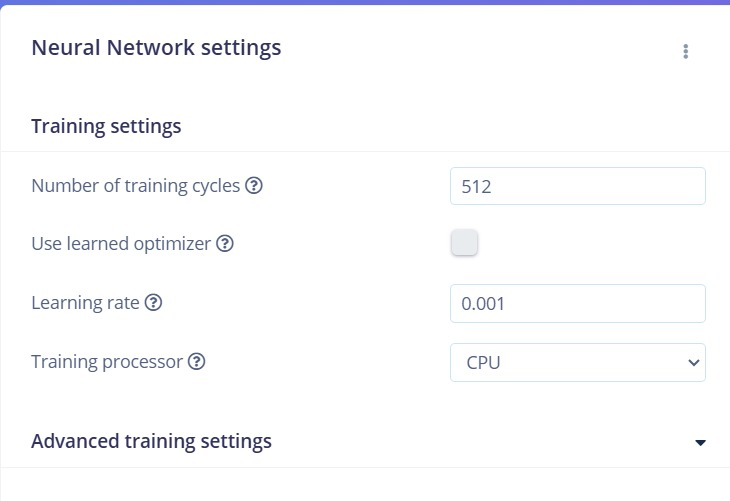
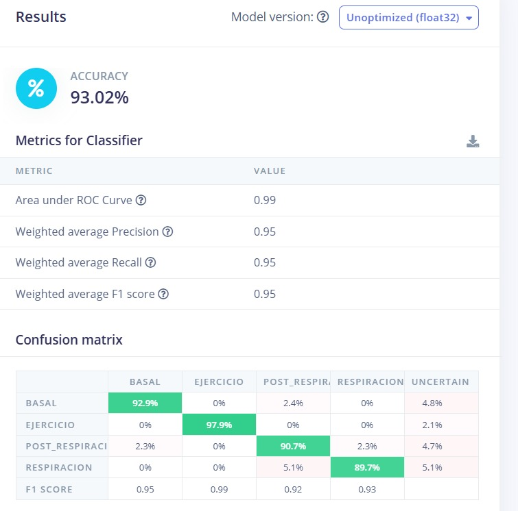

# LABORATORIO 13: Generacion Impulso Edge Impulse
## Alumno
- Fabian Alcides Ñaña Alfaro


---

## Contenido de la sesión

1. [Informe Laboratorio](#id1)
    - [Corrección Dataset](#id2)
    - [Create Impulse](#id3)
    - [Spectral features](#id4)
    - [Classifier](#id5)
    - [Retrain](#id6)
    - [Model Testing](#id7)

---

## 1. Informe Laboratorio <a name="id1"></a>

### 1.1 Corrección Dataset <a name="id2"></a>
https://studio.edgeimpulse.com/studio/560365/acquisition/training?page=1 

Para realizar la clasificación de señales de ECG en **Edge Impulse**, se utilizaron archivos CSV preprocesados. Para obtener un upsampleo y downsampleo y tener mayor cantidad de data, se ha usado este código para crear la mayor cantidad de data posible, sin alterar tanto la información original:
```
import pandas as pd
import os

# Función para realizar upsampling o downsampling
def resample_data(file_path, factor, mode="uS"):
    # Leer archivo CSV (considerando que el delimitador del original también es ';')
    data = pd.read_csv(file_path, sep=';')
    
    # Determinar nuevo tamaño
    n_samples = int(len(data) * factor)
    
    # Resamplear datos
    resampled_data = data.reindex(
        pd.RangeIndex(start=0, stop=n_samples),
        method=None
    ).interpolate(method="linear").ffill().bfill()
    
    # Generar nuevo nombre para el archivo
    base_name = os.path.basename(file_path)
    dir_name = os.path.dirname(file_path)
    new_name = f"{os.path.splitext(base_name)[0]}_{mode}{factor}.csv"
    new_path = os.path.join(dir_name, new_name)
    
    # Guardar archivo resampleado con delimitador ';'
    resampled_data.to_csv(new_path, sep=';', index=False)
    return new_path

# Lista de archivos
file_paths = [
    r"C:\Users\LENOVO\Desktop\DATA\Respiracion\1D_respiracion.csv",
    r"C:\Users\LENOVO\Desktop\DATA\Respiracion\3D_respiracion.csv",
    r"C:\Users\LENOVO\Desktop\DATA\Respiracion\2D_respiracion.csv",
    r"C:\Users\LENOVO\Desktop\DATA\Respiracion\120.csv",
]

# Factores de resampleo
upsampling_factors = [1.2, 1.3, 1.1]
downsampling_factors = [0.8, 0.9, 0.7]

# Procesar archivos
for file_path in file_paths:
    for factor in upsampling_factors:
        resample_data(file_path, factor, mode="uS")
    for factor in downsampling_factors:
        resample_data(file_path, factor, mode="dS")

```
#### Imagen 1: Arreglo de Data


Luego se borró data que no cumplía con los requisitos mínimos de tiempo y finalmente se obtuvo 27 minutos y 47 segundos, con 80% de Train y 20% de Test.

#### Imagen 2: Arreglo de Data

El objetivo de este modelo es idntificar si la medición se ha realizado en estado:
 - Basal
 - Ejercicio
 - Respiración
 - Post Respiración
 

### 1.2 Create Impulse <a name="id3"></a>
Primero Diseñamos
#### Imagen 3: Diseño del Impulso
Usamos un window size de 1,9 segundos y un window increase de 1 segundo, la frecuencia de sampleo es de 1 KHz, usamos Análisis Espectral y el clasificador, el cuál es una recomendación de Edge Impulse.


### 1.2 Spectral features <a name="id4"></a>
Parámetros 
#### Imagen 4: Parametros


### 1.3 Classifier <a name="id5"></a>
#### Imagen 5: Classifier


#### Imagen 5: Training output


### 1.4 Retrain <a name="id6"></a>
#### Imagen 6: Retraining output


### 1.4 Model Testing <a name="id7"></a>
#### Imagen 7: Matriz de Confusión:




Vemos que el Accuracy es de 47.09% lo cual es muy bajo aún, esto se debe a la poca cantidad de data obtenida en el laboratorio, por lo que lo más óptimo sería realizar mayor cantidad de mediciones y en diferentes opciones, no solo 4, como se ha tenido hasta ahora, esto ha generado que haya pocas variaciones y el modelo de aprendizaje sea deficiente.
El proceso de upsampling y downsampling, ha sido contrabeneficioso, aunque necesario, debido a que no se ha contado con la data suficiente.
