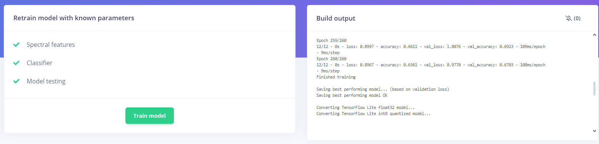

# LABORATORIO 13: Generacion Impulso Edge Impulse
## Alumno
- Flavio Avendaño Cáceres
---
## Contenido de la sesión

[Informe Laboratorio](#id1)
    - [Creacion de impulso](#id2)
    - [Caracteristicas espectrales](#id3)
    - [Clasificacion](#id4)
    - [Retrain](#id5)
    - [Conclucion](#id6)

---

## Informe Laboratorio 

https://studio.edgeimpulse.com/studio/558200/impulse/1/create-impulse

### Creacion de impulso 

En base a la configuracion previa que se hizo al subir los datos al Edge Impulse, se configuró en consecuencia el impulso, en modo "Time Series Data", a 1000Hz, tal y como se subir los datos, agregando un analysis espectral por recomendacion del programa y un clasificador segun las caracteristicas espectral que se obtengan.

Fig. 1 Configuracion inicial del impulso

### Caracteristicas espectrales 

Para un optimo resultado, se emplea un FFT length de 256 y activando el overlap y log del espectro a obtener

Fig. 2 Configuracion de estractor de caracteristicas

Fig. 3 Resultado de extraccion de caracteristicas y su peso respectivo

### Clasificacion 

Para la clasificacion se empleo un alto numero de ciclos de entrenamiento y un ratio de aprendizaje de 0.001, procesiendo a tratar un total de 133 caracteristicas.

Fig. 4 Configuracion 

Fig. 5 Matriz de confusion obtenida

Fig. 6 Distribucion de resultados

### ReTrain 

Si bien se intento mejorar las estadisticas con la funcion de Re-entrenamiento, no hubo mejorias, mas bien una disminucion de la presicion, haciendo inviable este metodo.

Fig. 7 Resultado de ReTrain

### Conclucion 

El valor de accuracy obtenido de 67% resulta ser un valor demasiado bajo, el cual considerando además, el Loss obtenido, presenta como NO optimo el modelo diseñado, teniendo en cuenta el proceso de diseño, dentro de las posibles causas de este bajo valor estan:

* Ventaneo demasiado pequeño que impide obtener suficientes caracteristicas

* Analysis espectral sin suficiente informacion debido al window de 2000 ms seleccionado en CSV wizzard

* Falta de procesos de interpolacion durante la etapa de preprocesamiento de la data adquirida con el BITalino

Teniendo en cuenta estas consdieraciones, se espera que tras el agregar estos pasos extras en el pre-procesamiento de la data, y mayor cuidado al seleccionar las ventanas de informacion y la confirguacion del extractor de caracteristicas, obtener como minimo un ,modelo con prescion superior a 95%.
