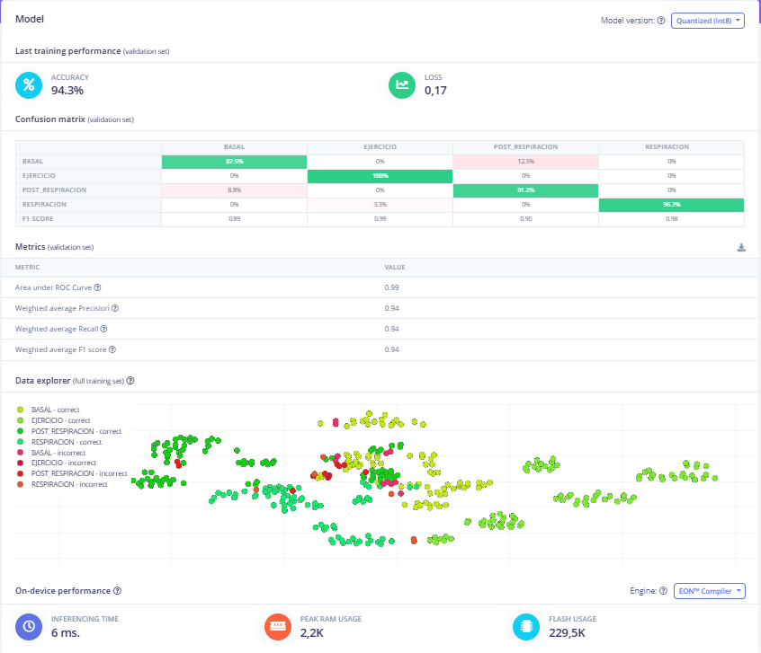

# LABORATORIO 13: Generacion Impulso Edge Impulse
## Alumno
- Favio Alessandro Ryoshin Cavero Mosquera

## Link del Edge Impulse:

### Usando Alex-Net:

https://studio.edgeimpulse.com/studio/552481

### Usando Edge Impulse default:

https://studio.edgeimpulse.com/studio/565669

## Contenido de la sesión

1. [Informe Laboratorio](#id1)
    - [Dataset](#id2)
    - [Create Impulse](#id3)
    - [Spectral features](#id4)
    - [Classifier](#id5)
    - [Retrain](#id6)
    - [Accuracy](#id7)
    - [Discusión](#id8)

---
## 1.1 Dataset <a name="id2"></a>
<p style="text-align:justify">
En este laborotorio he decidido implementar el algoritmo Alex-Net para probar que tan relacionado está con la data recopilada que si bien no tiene la cantidad suficiente para llamarse como tal una base de datos, tiene lo necesario para diferenciarse entre sí, por lo tanto seguimos la siguiente estructura de clasificación de datos de acuerdo mostrados en la Figura 1:
<div align="center">


Figura 1. Fuente: Medium
</div>

Primero transformamos la data recogida previamente de formato .txt a formato .csv para evitar problemas al cargarla en la página de Edge Impulse. Utilizamos el codigo a continuación: 
</p> 

```python
import os
import csv
import json

# Lista de archivos que quieres convertir
archivos_a_convertir = [
    "1D_basal", "1D_ejercicio", "1D_post_respiracion", "1D_respiracion",
    "2D_basal", "2D_ejercicio", "2D_post_respiracion", "2D_respiracion",
    "3D_basal", "3D_ejercicio", "3D_post_respiracion", "3D_respiracion",
    "60", "90", "120", "150"
]

# Encabezado que se usará para todos los archivos CSV
encabezado = ["nSeq", "I1", "I2", "O1", "O2", "A2"]

def convertir_txt_a_csv(archivo_txt, archivo_csv):
    """Convierte un archivo .txt a un archivo .csv con encabezado y datos separados por punto y coma"""
    
    with open(archivo_txt, 'r') as f:
        lines = f.readlines()
    
    # Buscar el índice donde termina el encabezado
    end_of_header_index = None
    for i, line in enumerate(lines):
        if line.strip() == '# EndOfHeader':
            end_of_header_index = i + 1
            break

    # Si no se encuentra '# EndOfHeader', asumir que no hay encabezado y usar todas las líneas
    if end_of_header_index is None:
        end_of_header_index = 0
    # Leer los datos después del encabezado
    data_lines = lines[end_of_header_index:]
    # Convertir los datos en filas separadas por espacios
    rows = [line.strip().split() for line in data_lines if line.strip()]
    # Verificar si hay datos antes de crear el archivo CSV
    if not rows:
        print(f"No se encontraron datos en {archivo_txt}")
        return
    
    # Guardar los datos en un archivo CSV utilizando punto y coma como delimitador
    with open(archivo_csv, 'w', newline='') as csvfile:
        csv_writer = csv.writer(csvfile, delimiter=';')
        
        # Escribir el encabezado
        csv_writer.writerow(encabezado)
        
        # Escribir las filas de datos en columnas separadas
        for row in rows:
            if len(row) == len(encabezado):
                csv_writer.writerow(row)
            else:
                print(f"Advertencia: La fila tiene un número incorrecto de columnas en {archivo_txt}")
    
    print(f"Archivo convertido exitosamente: {archivo_csv}")

def procesar_archivos():
    """Procesa todos los archivos especificados en la lista"""
    directorio_base = r"C:\Users\LENOVO\Desktop\ISB_lab_11\Laboratorios\Laboratorio 11\Data"
    directorio_salida = r"C:\Users\LENOVO\Desktop\ISB_lab_11\Laboratorios\Laboratorio 11\Data_csv"
    
    os.makedirs(directorio_salida, exist_ok=True)
    
    for nombre_archivo in archivos_a_convertir:
        archivo_txt = os.path.join(directorio_base, nombre_archivo + '.txt')
        archivo_csv = os.path.join(directorio_salida, nombre_archivo + '.csv')
        
        if os.path.exists(archivo_txt):
            convertir_txt_a_csv(archivo_txt, archivo_csv)
        else:
            print(f"Archivo no encontrado: {archivo_txt}")
# Ejecutar el procesamiento
procesar_archivos()
```

<p style="text-align:justify">
    
Una vez finalizado la conversión del tipo de datos, procedemos a cargarlo a la página del Edge Impulse con distintos tipos de data, una carpeta de data Downsampleada y Upsampleada junto con una separación entre 2 segundos para cada archivo para aumento de cantidad de datos y otro tipo de dato el cual se usó el archivo en su totalidad. 
Data sin modificar: 2D_basal
Data modificada: 2D_basal_dS0.7 
Ahora probaremos con dos distintos algoritmos, uno implementado por nuestra cuenta usando la facilidad de Edge Impulse y otro usando el algoritmo Alex-Net, conocido por su amplio uso para señales ECG y su gran accuracy relacionado, como en la investigación realizada por Kolhar et al[1]. Usando el algoritmo Alex-Net nos permitirá extraer más tipo de características como la frecuencia cardiaca relacionada es por eso que trabajaremos con la data sin modificar. Mientras que en modo de prueba usaremos la data modificada por el downsampleo y upsampleo para Edge Impulse.
</p>

## 1.2. Create Impulse <a name="id3"></a>

### USANDO ALEX-NET:
En este caso usaremos los siguientes bloques mostrados en la Figura 2.
<div align="center">


Figura 2. Edge Impulse
</div>

### EDGE IMPULSE:

En este caso usaremos los siguientes bloques mostrados en la Figura 3.
<div align="center">


Figura 3. Edge Impulse
</div>

## 1.3. Spectral features <a name="id4"></a>

### USANDO ALEX-NET:

<p style="text-align:justify">
    
En este caso usaremos la extracción de la Frecuencia Cardiaca (HR) debido a que usamos el ProSim el cual varía la señal de acuerdo a la frencuencia cardiaca que se requiere para calibrar. Aprovechando esa data junto con el uso indispensable de las características en frecuencia usando FFT (debido a eventos repetitivos) se procede a modificar las características de los bloques para un mejor accuracy
</p>

### HRV:
<div align="center">


Figura 4. Edge Impulse
</div>

### FFT:
<div align="center">


Figura 5. Edge Impulse
</div>

### EDGE IMPULSE:
En este caso usaremos la extracción usando FFT y variaremos la cantidad de FFT points hasta encontrar el mejor accuracy y el menor loss posible, lo cual se logró a una cantidad de 128 FFT points presentados en la Figura 6.
<div align="center">


Figura 6. Edge Impulse
</div>

## 1.4. Classifier <a name="id5"></a>

### USANDO ALEX-NET:

Hemos usado la siguiente composición siguiendo con la estructura de Alex-Net el cual tiene una capa de MaxPooling1D seguido de una Capa de Flatten para mantener la dimensión de las características de la data (1D).
<div align="center">


Figura 7. Edge Impulse
</div>

### EDGE IMPULSE:

Hemos usado la siguiente composición de Dense Layer junto con una capa llamada DropOut para evitar el overfitting que la data pueda tener.
<div align="center">


Figura 8. Edge Impulse
</div>

## 1.5. Retrain <a name="id6"></a>

### USANDO ALEX-NET:
<div align="center">


Figura 9. Edge Impulse
</div>

### EDGE IMPULSE:
<div align="center">


Figura 10. Edge Impulse
</div>

## 1.6. Accuracy <a name="id7"></a>

### USANDO ALEX-NET:
<div align="center">


Figura 11. Edge Impulse
</div>

### EDGE IMPULSE:

<div align="center">



Figura 12. Edge Impulse
</div>

## 1.7. Discusión <a name="id8"></a>

<p style="text-align:justify">
    
A partir del accuracy y el "lost" observados al probar el modelo con la data de testeo el algoritmo implementado por mi persona presenta un mejor desempeño en cuanto a la data recolectada que el algoritmo Alex-Net. Aunque las respuestas sean concluyentes hay que diferenciar la calidad y cantidad de los datos recopilados, puesto que si bien se puede desempeñar bien para cantidades pequeñas, el Alogritmo Alex-Net tiene un mejor desempeño comprobado para grande cantidad de datos superando los 10000 elementos. Si bien al lector le puede parecer fascinante la creación de un nuevo algoritmo para clasficación de señales ECG, debe tener sus precauciones puesto que no se ha probado ante otra base de datos.
</p>

## Referencias: 

[1] M. Kolhar, R. Kazi, H. Mohapatra y A. Rajeh, “AI-Driven Real-Time Classification of ECG Signals for Cardiac Monitoring Using i-AlexNet Architecture”, Diagnostics, vol. 14, n.º 13, p. 1344, junio de 2024. Accedido el 24 de noviembre de 2024. [En línea]. Disponible: https://doi.org/10.3390/diagnostics14131344
