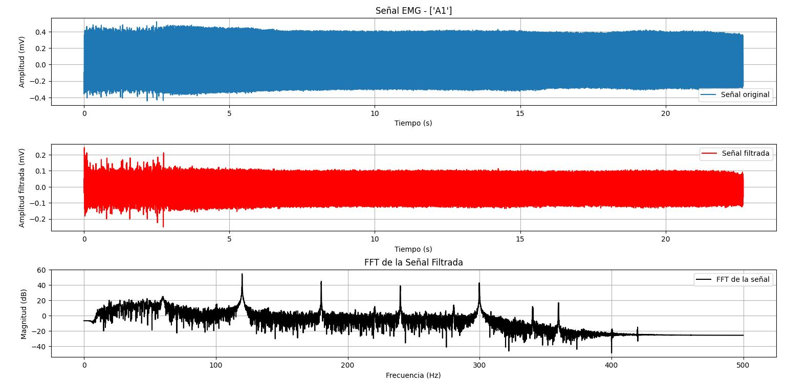
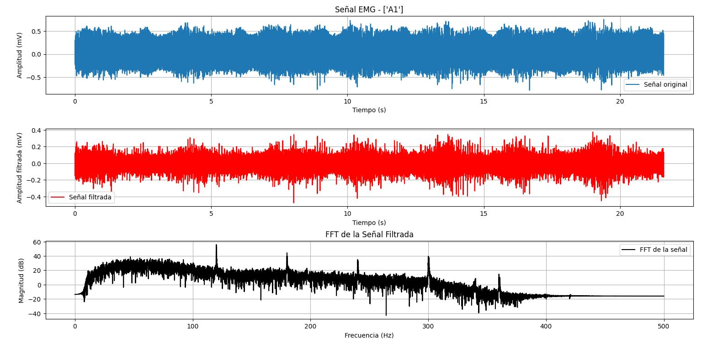
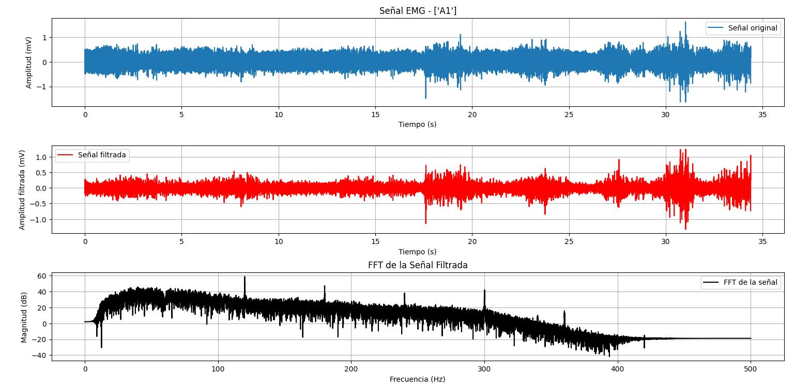
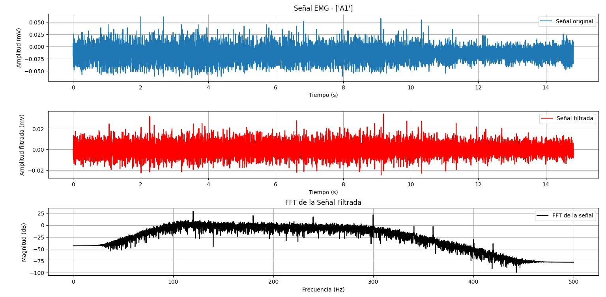
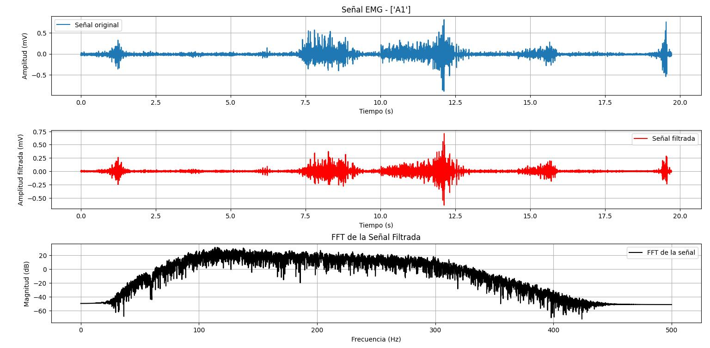
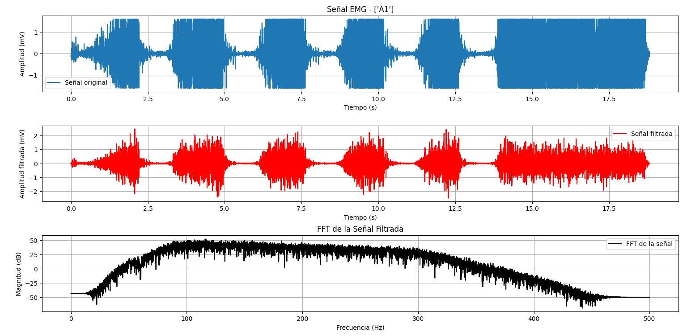
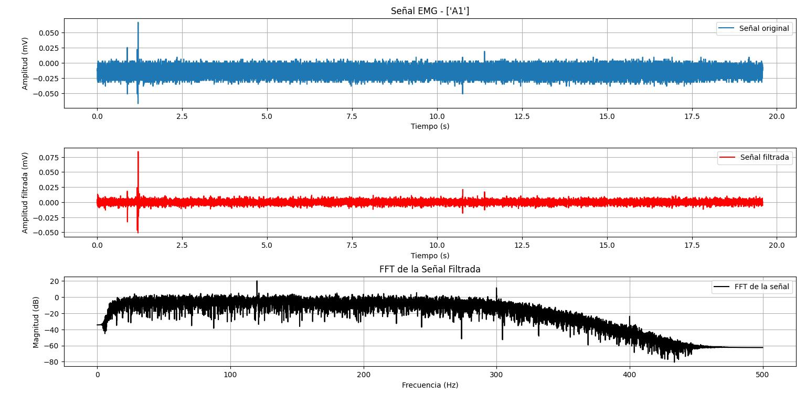
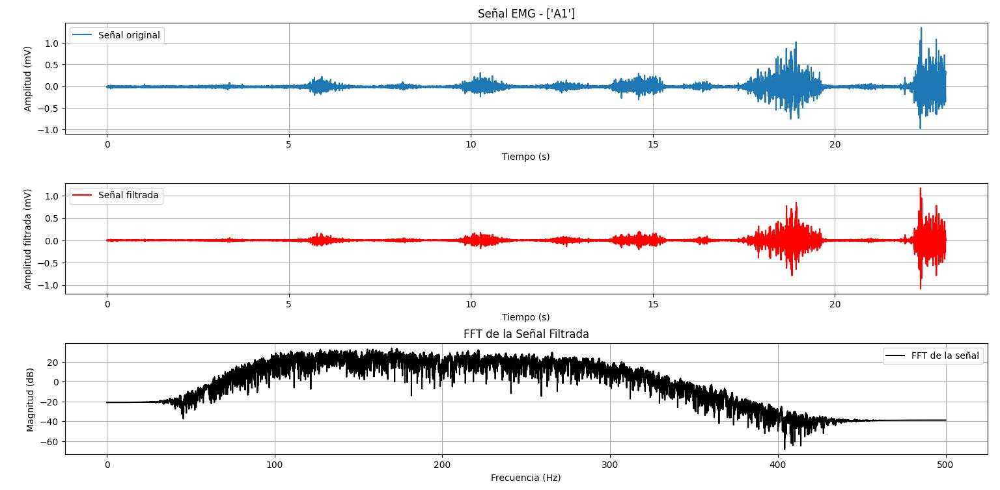
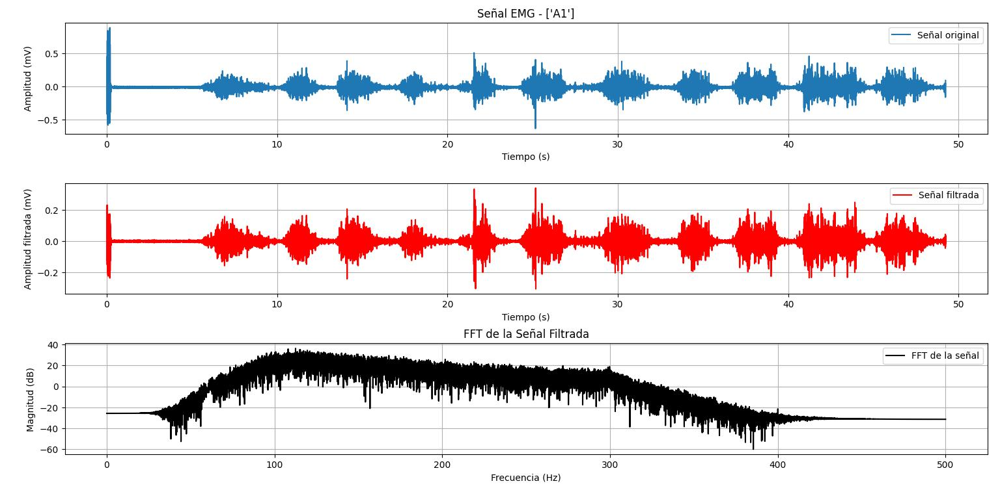

# LABORATORIO 3-4: – Deteccion de EMG mediante BITalino:
***
Este es el desarrollo de la actividad de Laboratorio -Sesion 3-4 realizada en el laboratorio de prototipado

## Contenido de la sesion
***
1. [Objetivos](#id1)
2. [Materiales y equipos](#id2)
3. [Musculos a Evaluar](#id3)
4. [Resultados](#id4)\
     4.1 [Implementacion](#id5)\
     4.2 [EMG Biceps](#id6)\
     4.3 [EMG Triceps](#id7)\
     4.4 [EMG Gastrocnemios](#id8)\
     4.5 [Discucion ](#id9)
     4.6 [Conclusion](#id10)

## Objetivos 
***
* Entendimiento del funcionamiento del BITalino y distrubcion de electrodos
* Obtencion de señal EMG de distintos musculos mediante BITalino
* Procesamiento y exhibicion de la señal mediante OpenSignals

## Materiales y equipos 
***
* Kit BITalino (r)evolution
* Laptop o dispositivo movil para recepcion de datos

## Musculos a evaluar: 
***
* Biceps 
* Triceps 
* Deltoides (no fue posible debido a la cercania a otros musculos)
* Gastrocnemios 
* Vasto medial (no fue posible debido a la cercania a otros musculos)

Los músculos van a ser analizados en 3 situaciones:
* Reposo
* Movimiento simple
* Movimiento con contrafuerza

# Resultados 
***
## Implementacion 
| **Biceps en reposo** | 
|| 

***
## EMG Biceps 

| **Biceps en reposo** | 
|| 
| **Biceps en movimiento** |
|| 
| **Biceps con contrafuerza** |
|| 

***
## EMG Triceps 

| **Triceps en reposo** | 
|| 
| **Triceps en movimiento** |
|| 
| **Triceps con contrafuerza** |
|| 

***
## EMG Gastrocnemios 

| **Gastrocnemios en reposo** | 
|| 
| **Gastrocnemios en movimiento** |
|| 
| **Gastrocnemios con contrafuerza** |
|| 
***

## Discucion 
***
dale fabian
***
## Conclusion 
***

