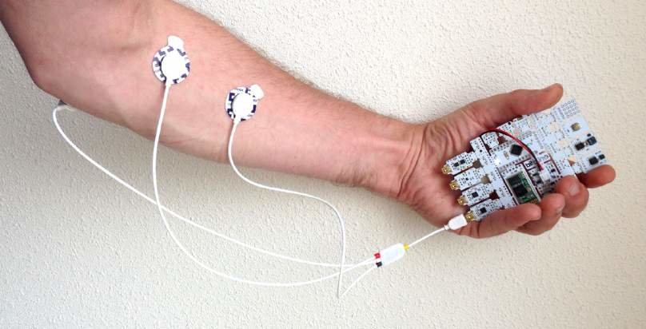
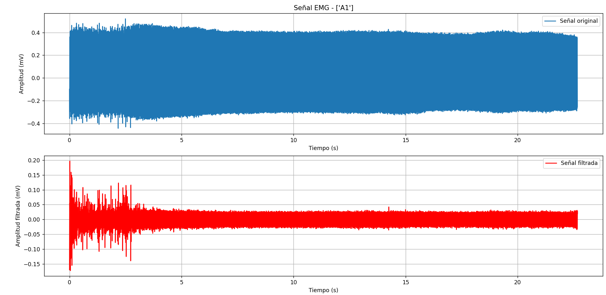
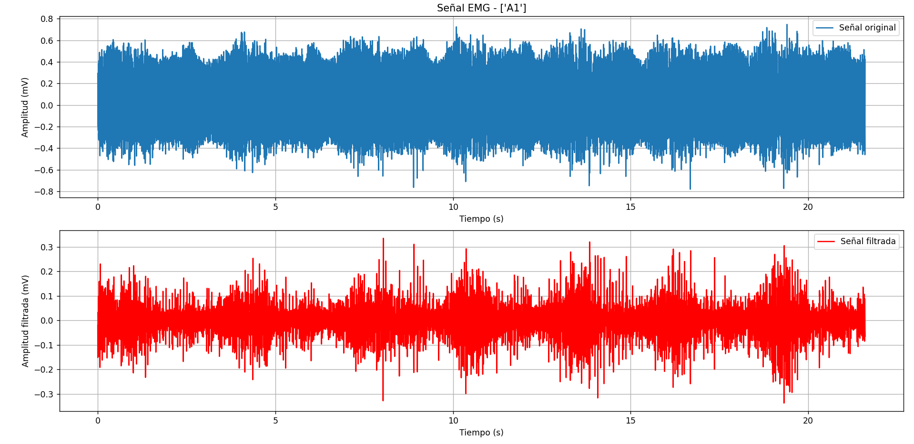
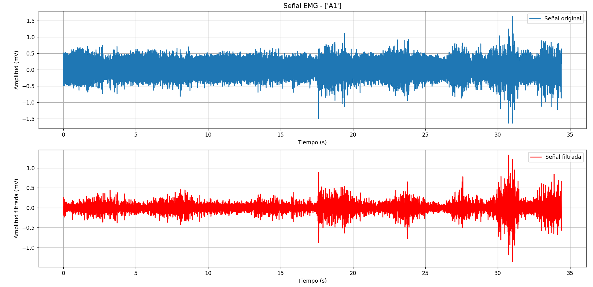
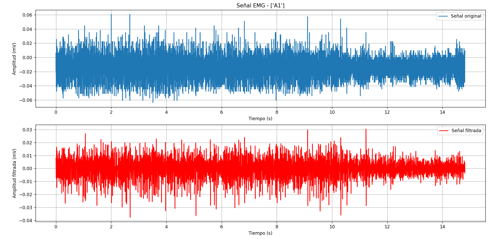
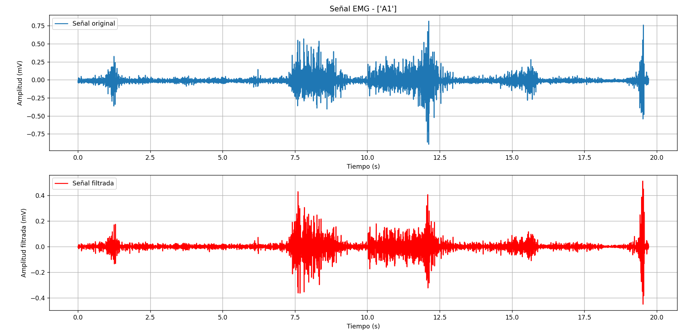
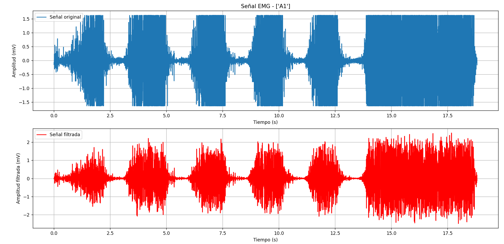
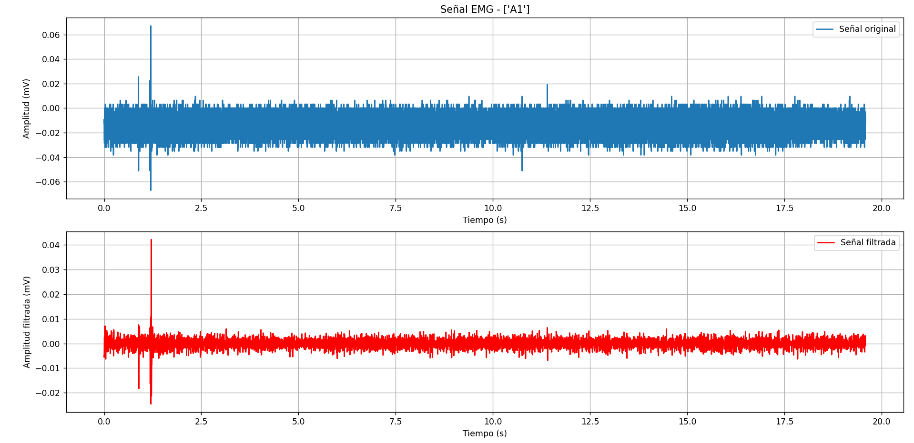
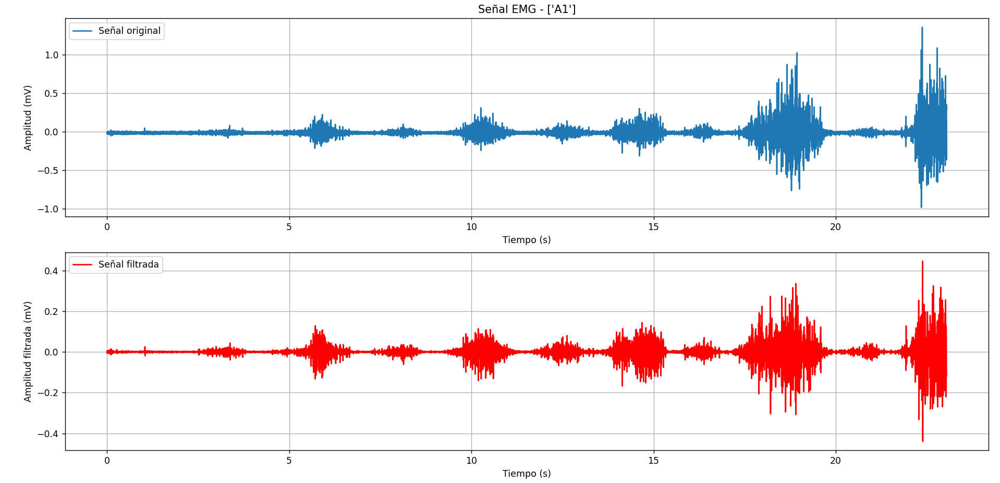
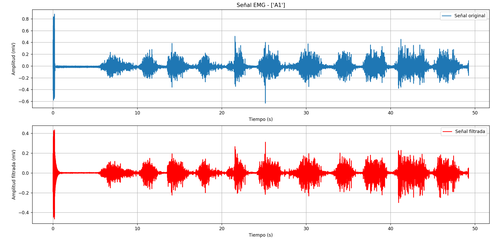

# LABORATORIO 3-4: – Detección de EMG mediante BITalino:
## Integrantes
- Fabian Alcides Ñaña Alfaro

- Christian Huarancca Quispe

- Ryoshin Cavero Mosquera

- Flavio Andreas Avendanho Cáceres

- Joao Marco Torres Rivera

<p style="text-align: justify;">
     Este es el desarrollo de la actividad de Laboratorio - Sesión 3-4 realizada en el laboratorio de prototipado.    
     </p>
     <p style="text-align: justify;">                   
     La electromiografía (EMG) es una técnica utilizada para medir y registrar la actividad eléctrica generada por los músculos esqueléticos. Esta actividad surge debido a la estimulación de los músculos por el sistema nervioso. Básicamente, una unidad motora está formada por una neurona motora y las fibras musculares que esta controla, siendo la unidad funcional más pequeña del músculo. Las señales EMG representan la suma de los potenciales de acción de varias unidades motoras y varían en amplitud y frecuencia, en función de la fuerza y la frecuencia de activación de dichas unidades [1].
</p>


## Contenido de la sesión
1. [Objetivos](#id1)
2. [Materiales y equipos](#id2)
3. [Metodologia](#id3)
4. [Resultados](#id4)  
   4.1 [Implementación](#id5)  
   4.2 [EMG Bíceps](#id6)  
   4.3 [EMG Tríceps](#id7)  
   4.4 [EMG Gastrocnemios](#id8)  
   4.5 [Discusión](#id9)  
   4.6 [Conclusión](#id10)

## Objetivos <a name="id1"></a>
* Entendimiento del funcionamiento del BITalino y distribución de electrodos.
* Obtención de señal EMG de distintos músculos mediante BITalino.
* Procesamiento y exhibición de la señal mediante OpenSignals.
* Adquirir señales biomédicas de EMG y ECG.
* Hacer una correcta configuración de BITalino.
* Extraer la información de las señales EMG y ECG del software OpenSignals (R)evolution.

## Materiales y equipos <a name="id2"></a>
* Kit BITalino (r)evolution  
  Kit biomédico que contiene una placa donde vienen conectados los bloques de sensores de manera que permitan trabajar directamente, sin tener que realizar ninguna conexión. Tiene comunicación Bluetooth y conectores UC-E6.  
 


  **Figura 1. BITalino. Fuente: BITalino (r)evolution Home Guide: EXPERIMENTAL GUIDES TO MEET & LEARN YOUR BIOSIGNALS.**
* Laptop o dispositivo móvil para recepción de datos y el software OpenSignals para obtener la señal medida por el sensor EMG. 

## Metodología <a name="id3"></a>
<div align="justify">
Las señales EMG se adquirieron utilizando el sistema BITalino junto con un sensor EMG de tres electrodos, siguiendo el protocolo de la BITalino (r)evolution Lab-Home Guide [2]. Cada miembro del equipo participó en la toma de señales. Los electrodos se colocaron siguiendo la metodología estándar para registros electromiográficos, manteniendo una separación mínima de 2 cm entre los electrodos activos y ubicando el electrodo de referencia en un área ósea apropiada para minimizar el ruido. 

El procedimiento se aplicó a los siguientes músculos:
<ul>
  <li>Bíceps</li>
  <li>Tríceps</li>
  <li>Gastrocnemios</li>
</ul>

Los músculos fueron analizados en 3 situaciones:
<ul>
  <li>Reposo</li>
  <li>Movimiento simple</li>
  <li>Movimiento con contrafuerza</li>
</ul>

### Proceso de Filtrado
El procesamiento de las señales EMG incluyó un proceso de filtrado en dos etapas, ampliamente utilizado y validado por la literatura científica. El primer paso fue aplicar un filtro pasa banda con un rango de 20 a 500 Hz. Este rango de frecuencia fue elegido para aislar las frecuencias relevantes de la señal EMG, eliminando los componentes de baja frecuencia (artefactos de movimiento) y las de alta frecuencia (ruido electromagnético). Este procedimiento es esencial para mejorar la calidad de la señal y su representatividad de la actividad muscular real. Por ejemplo, Zunaidi et al. (2008) [3] emplearon un filtrado similar (20–450 Hz) en su estudio para obtener señales EMG claras y útiles.

El segundo paso del filtrado fue la aplicación de un filtro notch centrado en 60 Hz. Este filtro se utilizó para eliminar la interferencia de la red eléctrica, una fuente común de ruido en los registros electromiográficos. Al eliminar estas frecuencias no deseadas, se obtuvo una señal más limpia, lo que es crucial para un análisis fiable de la actividad muscular.
</div>

### Código usado en Python
<a name="id11"></a>
<div align="justify">

El código realiza un completo proceso de adquisición, preprocesamiento y visualización de señales electromiográficas (EMG) capturadas utilizando el sistema BITalino y OpenSignals. A continuación, se detallan los procesos de filtrado que se llevaron a cabo en el código:

1. **Conversión de la Señal ADC a Milivoltios (mV):**
   - La función `ADCtomV` se utiliza para convertir la señal de datos digitales (ADC) a voltaje en milivoltios (mV). Dado que la señal se obtiene en formato ADC, es necesario convertirla a un formato más comprensible (milivoltios) para analizar la amplitud real de la señal EMG. Esta conversión es crucial para asegurar que los datos se interpreten correctamente y se puedan comparar con otros estudios electromiográficos.

2. **Remoción del Componente DC:**
   - Antes de aplicar cualquier filtrado, se realiza una remoción del componente DC de la señal. Este paso implica restar el valor promedio de la señal para eliminar cualquier desplazamiento en el nivel base. La presencia de un componente DC podría distorsionar los resultados del filtrado posterior y la representación de la señal. La remoción del componente DC garantiza que las etapas de filtrado subsiguientes no se vean afectadas por un nivel base elevado.

3. **Filtrado Pasa Banda (Bandpass Filter):**
   - Se aplica un filtro pasa banda utilizando la función `butter_bandpass_filter`, que emplea el diseño de filtros Butterworth. Este filtro se diseña con una frecuencia de corte inferior de 20 Hz y una frecuencia de corte superior de 500 Hz. El objetivo de este filtrado es eliminar las componentes de baja frecuencia (como el ruido de movimiento y la línea base) y las componentes de alta frecuencia que suelen estar asociadas con el ruido eléctrico o artefactos no deseados. El uso del filtro pasa banda permite aislar las frecuencias relevantes de la señal EMG que se encuentran dentro de este rango, proporcionando una representación más precisa de la actividad muscular.

4. **Filtrado Notch para Eliminar Ruido de Red Eléctrica:**
   - Después del filtrado pasa banda, se aplica un filtro notch (rechaza bandas específicas de frecuencias) centrado en 60 Hz mediante la función `iirnotch`. La frecuencia de 60 Hz corresponde al ruido de la red eléctrica que es común en los registros electromiográficos. Este ruido puede interferir con la señal EMG, haciendo que sea difícil distinguir las características de la señal. El filtro notch elimina este ruido específico, resultando en una señal más limpia y más representativa de la actividad muscular verdadera.

5. **Visualización de la Señal:**
   - Una vez que la señal ha sido filtrada, se procede a su visualización en tres subgráficos:
     - **Señal Original:** Muestra la señal convertida a mV antes del filtrado.
     - **Señal Filtrada:** Muestra la señal después de los procesos de filtrado (pasa banda y notch), destacando cómo el filtrado mejora la claridad de la señal EMG.

</div>

```python
import numpy as np
import pandas as pd
import matplotlib.pyplot as plt
import json
from scipy.signal import butter, filtfilt, hilbert, lfilter, find_peaks, welch, iirnotch
from scipy.integrate import cumtrapz
from scipy.stats import linregress
import matplotlib.pyplot as plt
import pywt
# Función para leer el archivo OpenSignals
def leer_senal_opensignals(archivo):
    with open(archivo, 'r') as f:
        lineas = f.readlines()

# Buscar la línea que contiene el JSON con los parámetros
    for linea in lineas:
        if linea.startswith('# {'):
            # Remover el prefijo '#' y cargar el JSON
            json_data = json.loads(linea[2:])
            break
# Extraer la frecuencia de muestreo del JSON
    device_key = list(json_data.keys())[0]  # Primera clave del JSON (el ID del dispositivo)
    fs = json_data[device_key]["sampling rate"]
    titulo=json_data[device_key]["label"]

# Encontrar el final del encabezado ('EndOfHeader')
    inicio_datos = 0
    for i, linea in enumerate(lineas):
        if 'EndOfHeader' in linea:
            inicio_datos = i + 1
            break
    # Cargar los datos desde el archivo (a partir del final del encabezado)
    data = pd.read_csv(archivo, delimiter='\t', skiprows=inicio_datos, header=None)
    
    # Suponiendo que la primera columna es el índice y la última columna es la señal de interés (A1)
    tiempo = np.arange(len(data)) / fs  # Crear un vector de tiempo basado en la cantidad de muestras (1000 Hz)
    senal = data.iloc[:, -1]  # Última columna (A1)

    return tiempo, senal, fs,titulo

# Función para graficar la señal
def ADCtomV(ADC, n = 10, VCC = 3.3):
    volts = (((ADC/(2**n))-(1/2)) * VCC)/1009
    return volts*1000
def butter_bandpass(lowcut, highcut, fs, order=5):
    nyq = 0.5 * fs
    low = lowcut / nyq
    high = highcut / nyq
    b, a = butter(order, [low, high], btype='band')
    return b, a

def butter_bandpass_filter(data, lowcut, highcut, fs, order=5):
    b, a = butter_bandpass(lowcut, highcut, fs, order=order)
    y = lfilter(b, a, data)
    return y
def graficar_senal(tiempo, senal, fs, titulo):
    # Convertir la señal a mV (si es necesario, dependiendo del equipo usado)
    signalmV = ADCtomV(senal)
    
    # Preprocesado: remover componente DC
    pre_pro_signal = signalmV - np.average(signalmV)

    # Filtrado de la señal 100-60-30
    low_cutoff = 100.0
    high_cutoff = 300.0
    smooth_signal = butter_bandpass_filter(pre_pro_signal, low_cutoff, high_cutoff, fs)

    # Aplicar filtro notch para eliminar ruido de red
    b, c = iirnotch(60.0, 30.0, fs)
    smooth_signal = filtfilt(b, c, smooth_signal)

    # Configurar el gráfico
    plt.figure(figsize=(12, 8))

    # Subplot 1: Señal original en mV
    plt.subplot(3, 1, 1)
    plt.plot(tiempo, signalmV, label='Señal original')
    plt.title(f'Señal EMG - {titulo}')
    plt.xlabel('Tiempo (s)')
    plt.ylabel('Amplitud (mV)')
    plt.grid(True)
    plt.legend()

    # Subplot 2: Señal filtrada
    plt.subplot(3, 1, 2)
    plt.plot(tiempo, smooth_signal, label='Señal filtrada', color='red')
    plt.xlabel('Tiempo (s)')
    plt.ylabel('Amplitud filtrada (mV)')
    plt.grid(True)
    plt.legend()

    # Subplot 3: FFT de la señal
    n = len(smooth_signal)
    fft = np.fft.fft(smooth_signal)
    fft_magnitud = np.abs(fft)[:n//2]  # Magnitud de la FFT
    freqs = np.fft.fftfreq(n, 1/fs)[:n//2]  # Frecuencias correspondientes
    fft_db = 20 * np.log10(fft_magnitud)  # Convertir magnitud a dB
    
    plt.subplot(3, 1, 3)
    plt.plot(freqs, fft_db, label='FFT de la señal', color='black')
    plt.title("FFT de la Señal Filtrada")
    plt.xlabel("Frecuencia (Hz)")
    plt.ylabel("Magnitud (dB)")
    plt.grid(True)
    plt.legend()

    plt.tight_layout()  # Ajustar el espacio entre subplots
    plt.show()
# Leer y graficar la señal
while(1):
    archivo=input("Ingrese la dirección del archivo(Presione 1 para salir): ")
    # archivo = r"C:\Users\Lenovo\OneDrive\Escritorio\Repositorio ISB\Github\Software\EMG\Movimiento_Biceps.txt" 
    if archivo=="1":
        break
    tiempo, senal, fs, titulo = leer_senal_opensignals(archivo)
    graficar_senal(tiempo, senal, fs, titulo)
```

## Resultados <a name="id4"></a>

La toma de señales comenzó con la captura de señales de cada miembro del equipo, siguiendo el protocolo BITalino (r)evolution Lab-Home Guide [2].  

### Implementación <a name="id5"></a>
***
| **Biceps en reposo**|
|[](https://youtu.be/BjMBCKBP3xE)|

***
| **BITalino con electrodos** |  
||  
**Figura 2. BITalino con electrodos.**

Se siguió el protocolo de conexión y posicionamiento de los electrodos para el sensor EMG:
* Conexión del sensor de EMG
* Colocación de los electrodos
* Posicionamiento del sensor EMG a lo largo de las fibras musculares del músculo elegido
* Inicio de la grabación en el software OpenSignals (R)evolution
* Ciclo de contracción: Contracción-Suelta-Descanso cinco veces, incrementando el nivel en cada repetición.

## EMG Bíceps <a name="id6"></a>

| **Bíceps en reposo** | 
|| 
| **Bíceps en movimiento** |
|| 
| **Bíceps con contrafuerza** |
|| 

## EMG Tríceps <a name="id7"></a>

| **Tríceps en reposo** | 
|| 
| **Tríceps en movimiento** |
|| 
| **Tríceps con contrafuerza** |
|| 

## EMG Gastrocnemios <a name="id8"></a>

| **Gastrocnemios en reposo** | 
|| 
| **Gastrocnemios en movimiento** |
|| 
| **Gastrocnemios con contrafuerza** |
|| 


## Discusión <a name="id10"></a>

### Discusión de Bíceps <a name="id9"></a>
<div align="justify">
El bíceps es un músculo del brazo que desempeña un papel crucial en los movimientos de flexión y rotación del antebrazo. Durante la actividad electromiográfica (EMG), las señales captadas reflejan la actividad eléctrica asociada con la contracción y relajación del músculo. 

En el estudio de Zhang et al. (2013), se utilizaron electrodos de superficie para registrar las señales EMG de los músculos del bíceps y tríceps. Estos electrodos se colocaron siguiendo la metodología estándar, con una separación mínima de 2 cm entre ellos y un electrodo de referencia en el hueso más cercano, en este caso, el proceso estiloides [4]. En la señal EMG de la literatura (Zhang, Q., Hosoda, R., & Venture, G. "Human joint motion estimation for electromyography (EMG)-based dynamic motion control." Proceedings of the Annual International Conference of the IEEE Engineering in Medicine and Biology Society, Osaka, Japan, pp. 21-24, 2013, doi: 10.1109/EMBC.2013.6609427), se identificaron claramente las fases de contracción y reposo. Según la imagen proporcionada en el artículo, las siguientes fases fueron identificadas en la señal EMG:


**Figura . Human joint motion estimation for electromyography (EMG)-based dynamic motion control.**

- **Segundo 10 al 13**: La señal indica que el músculo estaba en contracción durante este período, lo que se refleja en un aumento significativo en la amplitud de la señal EMG.
- **Segundo 13 al 15**: Durante este intervalo, la señal muestra una disminución en la amplitud, indicando un estado de reposo muscular.
- **Segundo 15 al 17**: Se observa un aumento nuevamente en la amplitud de la señal, lo que indica otra fase de contracción muscular.
- **Segundo 17 al 19**: La señal vuelve a mostrar una reducción en la amplitud, lo que sugiere que el músculo regresa a un estado de reposo.
- **Después del segundo 19**: La señal indica que el músculo vuelve a entrar en un estado de contracción.

Además, en el artículo "Capacitive Electrode with High Sensitivity for Detection of Electrical Biopotentials"​ [5], se obtuvieron datos y señales similares utilizando electrodos capacitivos. En este artículo, se realizó la medición de EMG en los bíceps del brazo derecho con electrodos de ancho de banda de 580 Hz. Las señales obtenidas demuestran que los electrodos capacitivos pueden ser utilizados efectivamente para la detección de biopotenciales, proporcionando registros claros de la actividad eléctrica muscular. Las fases de actividad muscular como contracción, relajación y movimiento se observaron con claridad, reflejando patrones de amplitud consistentes con los resultados obtenidos con electrodos de superficie tradicionales​.

  
**Figura . Capacitive Electrode with High Sensitivity for Detection of Electrical Biopotentials.**

### Comparación con las Señales Obtenidas en el Laboratorio
#### Movimiento Voluntario
Las señales originales obtenidas en el laboratorio registran amplitudes en el rango de ±0.6 mV, mientras que las señales filtradas se reducen a un rango de ±0.3 mV. Este resultado coincide con los datos de la literatura, que indican un aumento de la actividad electromiográfica debido a la activación de las fibras musculares durante los movimientos voluntarios.

  
**Figura . Señal EMG de Bíceps en Movimiento Voluntario.**

#### Contracción con Contra Fuerza
La contracción con contra fuerza se caracteriza por un incremento significativo en la amplitud de las señales EMG. En la literatura, se observa un claro aumento en la amplitud durante estas contracciones. En las señales obtenidas en el laboratorio, la señal original presenta amplitudes de ±1 mV, y la señal filtrada también muestra amplitudes entre -1 mV y +1 mV. Este incremento refleja el esfuerzo muscular adicional requerido para vencer una resistencia externa, lo cual es consistente con los hallazgos.

  
**Figura . Señal EMG de Bíceps en Contracción con Contra Fuerza**

#### Reposo
En la fase de reposo, la señal de la literatura muestra una disminución significativa en la amplitud, indicando un estado de inactividad muscular. Las señales originales obtenidas en el laboratorio presentan amplitudes de aproximadamente ±0.4 mV, mientras que las señales filtradas oscilan entre -0.05 mV y +0.05 mV. Esto coincide con las observaciones de la literatura, que establece que en estado de reposo, la actividad electromiográfica es mínima​.

  
**Figura . Señal EMG de Bíceps en Reposo**
</div>

## Discusión de Tríceps <a name="id10"></a>
<div align="justify">
También en el estudio de Zhang et al. (2013) [4], se obtuvo la señal EMG en el tríceps, lo cual fue fundamental para analizar el comportamiento muscular durante diferentes fases de actividad. 

  
**Figura . Señal EMG de Tríceps**

Adicionalmente, en el estudio "Pattern Behavior of Electromyography Signal During Arm Movements" por Zunaidi et al. (2008), se realizó un análisis detallado de la actividad electromiográfica del bíceps y tríceps. En este estudio, se recogieron datos EMG de un sujeto sano a través de dos electrodos EMG aplicados en el brazo izquierdo. Se utilizó un sistema completo de EMG para registrar la actividad eléctrica del músculo, usando un sistema de electrodos bipolares (DE-2.1, Delsys Inc., Boston, MA). La señal EMG se amplificó (1000×) y se filtró con un filtro pasa banda (20–450 Hz) [3].

  
**Figura . Análisis de EMG en Tríceps**

### Señales Observadas
En el estudio de Zunaidi et al. (2008), la señal EMG para el tríceps mostró las siguientes características:
- **Reposo (0 a 1.6 s y 2.5 a 4 s)**: Durante los periodos de reposo, la señal oscilaba alrededor de 0, aunque no se apreciaba de manera clara debido al nivel de detalle de la gráfica.
- **Contracción (1.6 a 2.5 s y 4 a 4.6 s)**: En las fases de contracción, la señal oscilaba entre aproximadamente ±0.00035 V, mostrando la activación muscular durante estas fases.

### Comparación con las Señales Obtenidas en el Laboratorio
#### Contracción con Contra Fuerza
En las pruebas realizadas en el laboratorio, las señales EMG del tríceps durante la contrafuerza mostraron inicialmente saturación debido al ruido, alcanzando valores de hasta ±1.5 V. Sin embargo, después de aplicar el proceso de filtrado previamente explicado, se observó que la amplitud de la señal se reducía a aproximadamente ±2 mV en los momentos de contrafuerza.

  
**Figura . Señal EMG de Tríceps en Contracción con Contra Fuerza**

#### Movimiento Voluntario
Para el movimiento simple (voluntario) del tríceps, las señales obtenidas durante la contracción oscilaron alrededor de ±0.4 mV, lo que es consistente con la actividad electromiográfica esperada durante movimientos voluntarios de menor intensidad.

  
**Figura 9. Señal EMG de Tríceps en Movimiento Voluntario**

#### Reposo
Finalmente, durante el reposo, las señales EMG del tríceps registradas en el laboratorio mostraron una oscilación de aproximadamente ±0.2 mV. Estas observaciones concuerdan con la literatura, donde se indica que la amplitud de la señal EMG aumenta con la fuerza de contracción muscular.

  
**Figura . Señal EMG de Tríceps en Reposo**
</div>

## Discusión de Gastrocnemios <a name="id11"></a>
<div align="justify">
En el artículo "Effect of Novel Designed Bodygear on Gastrocnemius and Soleus Muscles during Stepping in Human Body" por Shankhwar et al. (2021), se investigó la actividad electromiográfica (EMG) de los músculos gastrocnemio y sóleo durante un ejercicio de stepping. Los sujetos realizaron el ejercicio con y sin un equipo especial llamado "CGLM bodygear", diseñado para incrementar la actividad muscular a través de una carga axial desde los hombros hasta los pies. La señal EMG fue capturada usando electrodos de superficie Ag/AgCl, colocados según los criterios de SENIAM. El procesamiento de las señales EMG incluyó un filtrado pasa banda entre 70 Hz y 300 Hz, lo que permitió eliminar las frecuencias bajas (artefactos de movimiento) y las altas asociadas al ruido de la red eléctrica [6].

  
**Figura 11. Señal EMG de Gastrocnemio - Escenario A**

  
**Figura 12. Señal EMG de Gastrocnemio - Escenario B**

  
**Figura 13. Señal EMG de Gastrocnemio - Escenario C**

### Señal Obtenida y Comparación con las Señales del Laboratorio
En el estudio de Shankhwar et al. (2021), se registraron contracciones musculares de aproximadamente 2.5 segundos cada una. Las señales EMG del gastrocnemio mostraron características similares a las obtenidas en el laboratorio. Específicamente, en la señal de la imagen (c) del artículo, se observó que la amplitud de la señal EMG durante la contrafuerza oscilaba alrededor de ±0.3 V. En las pruebas realizadas en el laboratorio, las señales del gastrocnemio durante la contrafuerza oscilaron alrededor de ±0.2 mV.

  
**Figura 14. Señal EMG de Gastrocnemio en Contrafuerza**

### Para los Otros Escenarios en el Estudio de Shankhwar et al. (2021)
- **Imagen (a) y (b)**: Se obtuvieron señales EMG de contracción en un rango de ±0.1 mV a ±0.2 mV, lo cual coincide con las variaciones de amplitud esperadas durante las contracciones musculares voluntarias.
- En las pruebas de movimiento voluntario sin contrafuerza realizadas en el laboratorio, las señales EMG del gastrocnemio mostraron amplitudes de aproximadamente ±0.1 mV.

  
**Figura 15. Señal EMG de Gastrocnemio en Movimiento Voluntario**

### Durante las Fases de Reposo
Durante las fases de reposo, la señal filtrada mostró amplitudes en un rango de aproximadamente ±0.005 mV, mientras que la señal normal osciló entre 0 y -0.003 mV.

  
**Figura 16. Señal EMG de Gastrocnemio en Reposo**
</div>


## Conclusión <a name="id10"></a>
<div align="justify">
Se logró adquirir y analizar correctamente las señales electromiográficas (EMG) utilizando el sistema BITalino y el software OpenSignals. Los resultados obtenidos permitieron observar de manera clara la relación entre la actividad muscular y los estímulos aplicados. En particular, se confirmó la efectividad del sistema para detectar y registrar la actividad eléctrica generada durante las diferentes fases de la contracción muscular, ya sea en estado de reposo, movimiento voluntario, o bajo condiciones de contrafuerza.

El análisis realizado demostró que a mayor fuerza de contracción, se observa un incremento significativo en la amplitud de las señales EMG. Esto concuerda con los hallazgos de estudios previos, como el de Martinez-Valdes et al. (2017) [7], en el cual se investigaron los efectos de diferentes tipos de entrenamiento en la actividad electromiográfica y la fuerza muscular. Dicho estudio evidenció que un incremento en la fuerza muscular, ya sea mediante entrenamiento de alta intensidad o continuo, resultó en un aumento correspondiente en la amplitud de las señales EMG. Este fenómeno se atribuye al mayor reclutamiento de unidades motoras y al incremento en la frecuencia de descarga, reflejándose en un aumento del voltaje registrado por el EMG.

Estos resultados no solo validan la metodología empleada en este estudio, sino que también proporcionan una base sólida para futuros análisis de la función muscular en diferentes contextos. La capacidad de medir y analizar la actividad muscular con precisión a través de señales EMG permite avanzar en la comprensión de los procesos neuromusculares, contribuyendo al desarrollo de aplicaciones clínicas y de entrenamiento físico más efectivas.
</div>


## Bibliografía

[1] "What is electromyography (EMG)?", Tmsi.com, 20-jul-2022.  
[2] BITalino (r)evolution Home Guide: EXPERIMENTAL GUIDES TO MEET & LEARN YOUR BIOSIGNALS. Disponible en: [link](https://support.pluxbiosignals.com/wp-content/uploads/2022/04/HomeGuide0_GettingStarted.pdf)\
[3]I. Zunaidi, W. Zulkarnain, T. I., & A. B. Shahriman, "Pattern Behavior of Electromyography Signal During Arm Movements," TATI University College, Malaysia, 2008.\
[4] Zhang, Q., Hosoda, R., & Venture, G. "Human joint motion estimation for electromyography (EMG)-based dynamic motion control." Proceedings of the Annual International Conference of the IEEE Engineering in Medicine and Biology Society, Osaka, Japan, pp. 21-24, 2013, doi: 10.1109/EMBC.2013.6609427​.\
[5]Varela-Benítez, J.L., Rivera-Delgado, J.O., Espina-Hernández, J.H., & de la Rosa-Vázquez, J.M. "Electrodo Capacitivo de Alta Sensibilidad para la Detección de Biopotenciales Eléctricos." Revista Mexicana de Ingeniería Biomédica, vol. 36, no. 2, pp. 131-142, May 2015. DOI: 10.17488/RMIB.36.2.1​.\
[6] Shankhwar, V., Singh, D., & Deepak, K. K. "Effect of Novel Designed Bodygear on Gastrocnemius and Soleus Muscles during Stepping in Human Body." Microgravity Science and Technology, vol. 33, pp. 29, 2021, doi: 10.1007/s12217-021-09855-y .\
[7] Martinez-Valdes, E., Farina, D., Negro, F., & Falla, D. "Early motor unit conduction velocity changes to high-intensity interval training versus continuous training." Medicine & Science in Sports & Exercise, vol. 49, no. 6, pp. 1126-1136, 2017, doi: 10.1249/MSS.0000000000001210.

