# LABORATORIO 5: – Uso de ECG mediante BITalino:
## Integrantes
- Fabian Alcides Ñaña Alfaro
- Christian Huarancca Quispe
- Ryoshin Cavero Mosquera
- Flavio Andreas Avendanho Cáceres
- Joao Marco Torres Rivera

## Contenido de la sesión
1. [Introducción](#id1)
2. [Objetivos](#id2)
3. [Materiales y equipos](#id3)
4. [Metodologia](#id4)
5. [Resultados](#id5)  
   5.1 [Implementación](#id6)  
   5.2 [ECG Estado Basal](#id7)  
   5.3 [ECG Respiracion](#id8)  
   5.4 [ECG Post-respiración](#id9)  
   5.5 [ECG Post-ejercicio](#id10)
   5.6 [Discusión](#id11)  
   5.7 [Conclusión](#id12)

## Introducción 

                  
    El electrocardiograma (ECG o EKG) es una prueba rápida utilizada para medir y registrar la actividad eléctrica generada por el corazón, lo cual ayuda a diagnosticar enfermedades cardiovasculares como las arritmias, entre otras[1]. La historia del ECG o EKG remonta desde el siglo XIX cuando el fisiólogo británico Augustus Desiré Waller realiza la primera publicación conocida del uso de un Electrocardiograma. Su idea fue presentada en el Congreso Internacional de Fisiología en Londres en 1887 y fue entonces que inspira al médico fisiólogo Willem Einthoven (1860-1927), quien es reconocido por el triángulo de Einthoven para la obtención de derivaciones cardiacas.En 1901 Einthoven presenta un electrocardiógrafo hecho por un galvanómetro de cuerda extremadamente sensible e introdujo las bases de la telemedicina en 1905 cuando conectó su laboratorio con el Hospital Académico de Leiden a través de una línea telefónica. Otro pionero importante fue Norman Jefferis Holter por el uso de rayos catódicos y cubos de agua salina como electrodos envés de un galvanómetro para su electrocardiograma de 38kg. A pesar del avance acelerado a inicios del siglo XX, en 1954 se realizó la estandarización de las 12 derivaciones empezando así la era moderna en el uso de ECG y diseñando prototipos cada vez más portátiles [2].    

   
   El avance de la tecnología ha permitido implementar ECG portátiles para obtener un control extrahospitalario. En síntesis, nos permite visualizar las ondas electrocardiográficas llamadas PQRST y evaluar el tiempo y amplitud de despolarización de aurículas y ventrículos del corazón [3].

   
      
  
   Figura 1. Ondas PQRST. Fuente: My-Ekg.

## Objetivos 
* Entendimiento del funcionamiento del BITalino y distribución de electrodos.
* Obtención de señal ECx|G de distintos músculos mediante BITalino.
* Procesamiento y exhibición de la señal mediante OpenSignals.
* Adquirir señales biomédicas de ECG.
* Hacer una correcta configuración de BITalino.
* Extraer la información de las señales ECG del software OpenSignals (R)evolution.

## Materiales y equipos 

| Material     |Descripción      |Cantidad   |
|-----------   |:------------:   |:---------:|
| (R)Evolution |Kit BITalino[4]  |1          |
| Laptop       |Laptop           |1          |
| Electrodos   |Electrodos ECG   |3          |

  
   Figura 2. BITalino. Fuente: BITalino (r)evolution.

## Metodología 

Las señales ECG se adquirieron utilizando el sistema BITalino junto con un sensor ECG de tres electrodos, siguiendo el protocolo de la BITalino (r)evolution Lab-Home Guide . Para la primera derivación se utilizó como referencia la cresta iliaca izquierda y los otros 2 electrodos se colocaron debajo de las cláviculas tal como se detalla en la figura 3 [4]. Se realizaron las conexiones correspondientes en OpenSignals y se conectó el celular donde se realizó la grabación de la señal ECG de nuestro compañero Fabián Ñaña.

Figura 3. BITalino. Fuente: BITalino (R)evolution Lab Guide.

Posterior a la colocación realizamos la medición de la señal en 4 situaciones:
<ul>
  <li>Reposo</li>
  <li>Manteniendo respiración</li>
  <li>Post Respiración</li>
  <li>Post Ejercicio</li>
</ul>

  

### Proceso de Filtrado
Una vez definido el procedimiento, el siguiente paso es realizar el código en Visual Studio Code para el filtrado de la señal resultante. Este proceso se dividió en dos etapas: 

El primer paso del filtrado fue la aplicación de un filtro notch centrado en 60 Hz. Este filtro se utilizó para eliminar la interferencia de la red eléctrica, una fuente común de ruido en los registros ECG, EEG y EMG. Al eliminar estas frecuencias no deseadas, se obtuvo una señal más limpia, lo que es crucial para un análisis fiable de la actividad cardiaca.

El segundo paso fue aplicar un filtro pasa banda con un rango de 0.5 a 100 Hz. Este rango de frecuencia fue elegido para aislar las frecuencias relevantes de la señal ECG, eliminando los ajenos a la señal ECG . Este procedimiento es esencial para mejorar la calidad de la señal y su representatividad de ella. Por ejemplo, Lorenzo (2015) [5] emplearon un filtrado similar (0.5-100 Hz) en su estudio para obtener señales ECG claras y útiles.

### Código usado en Python

El código realiza un completo proceso de adquisición, preprocesamiento y visualización de señales electromiográficas (ECG) capturadas utilizando el sistema BITalino y OpenSignals. A continuación, se detallan los procesos de filtrado, con su respectiva justificación, que se llevaron a cabo en el código:

1. **Conversión de la Señal ADC a Milivoltios (mV):**
   
   La función `ADCtomV` se utiliza para convertir la señal digital (ADC) a analógico (voltaje en milivoltios (mV)). Dado que la señal se obtiene en formato ADC, es necesario convertirla a un formato más comprensible (milivoltios) para analizar la amplitud real de la señal ECG. Esta conversión es crucial para asegurar que los datos se interpreten correctamente y se puedan comparar con otros estudios electromiográficos.

2. **Remoción del Componente DC:**
   
   Antes de aplicar cualquier filtrado, se realiza una remoción del componente DC de la señal. Este paso implica restar el valor promedio de la señal para eliminar cualquier desplazamiento en el nivel base. La presencia de un componente DC podría distorsionar los resultados del filtrado posterior y la representación de la señal. La remoción del componente DC garantiza que las etapas de filtrado subsiguientes no se vean afectadas por un nivel base elevado.

3. **Filtrado Pasa Banda (Bandpass Filter):**
   
   Se aplica un filtro pasa banda utilizando la función `butter_bandpass_filter`, que emplea el diseño de filtros Butterworth. Este filtro se diseña con una frecuencia de corte inferior de 0.5 Hz y una frecuencia de corte superior de 100 Hz. El objetivo de este filtrado es eliminar las componentes de baja frecuencia (como el ruido de movimiento y la línea base) y las componentes de alta frecuencia que suelen estar asociadas con el ruido eléctrico o artefactos no deseados. El uso del filtro pasa banda permite aislar las frecuencias relevantes de la señal ECG que se encuentran dentro de este rango, proporcionando una representación más precisa de la actividad cardiaca.

4. **Filtrado Notch para Eliminar Ruido de Red Eléctrica:**
   
   Después del filtrado pasa banda, se aplica un filtro notch (rechaza bandas específicas de frecuencias) centrado en 60 Hz mediante la función `iirnotch`. La frecuencia de 60 Hz corresponde al ruido de la red eléctrica que es común en los registros electromiográficos. Este ruido puede interferir con la señal ECG, haciendo que sea difícil distinguir las características de la señal. El filtro notch elimina este ruido específico, resultando en una señal más limpia y más representativa de la actividad muscular verdadera.

5. **Visualización de la Señal:**
   
   Una vez que la señal ha sido filtrada, se procede a su visualización en tres subgráficos:
     - **Señal Original:** Muestra la señal convertida a mV antes del filtrado.
     - **Señal Filtrada:** Muestra la señal después de los procesos de filtrado (pasa banda y notch), destacando cómo el filtrado mejora la claridad de la señal ECG.

## Resultados 

La toma de señales comenzó con la captura de señales de cada miembro del equipo, siguiendo el protocolo BITalino (r)evolution Lab-Home Guide [4].  

## Implementación 
***
### Click on images to visualize the videos
***
|  **Biceps en reposo**  | **Biceps en movimiento** | **Biceps con contrafuerza** |
|:------------:|:---------------:|:------------:|
|||(https://youtu.be/Mb9VrSXVKTM)||
***
|  **Triceps en reposo**  | **Triceps en movimiento** | **Triceps con contrafuerza** |
|:------------:|:---------------:|:------------:|
|||(https://youtu.be/mZ9duE8vDmA)||
***
|  **Gastrocnemio en reposo**  | **Gastrocnemio en movimiento** | **Gastrocnemio con contrafuerza** |
|:------------:|:---------------:|:------------:|
|||(https://youtu.be/E-TUcp1oyTM)||

*** 
||  
**Figura 2. BITalino con electrodos.**

Se siguió el protocolo de conexión y posicionamiento de los electrodos para el sensor ECG:
* Conexión del sensor de ECG
* Colocación de los electrodos
* Posicionamiento del sensor ECG 
* Inicio de la grabación en el software OpenSignals (R)evolution
* Fin de la grabación

## ECG Estado Basal 

| **Derivada 1 Estado Basal** | 
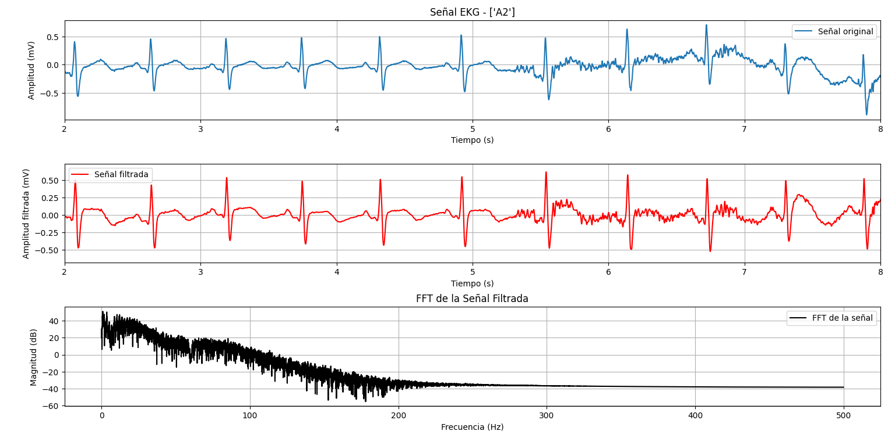
| **Derivada 2 Estado Basal** |
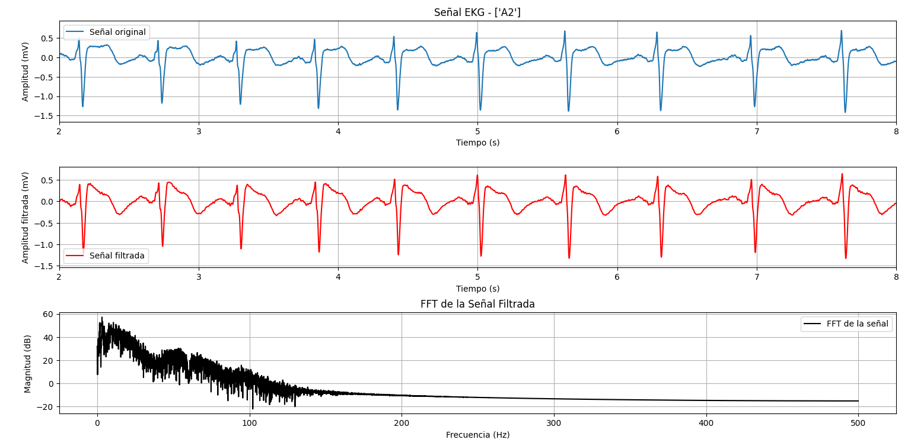 
| **Derivada 3 Estado Basal** |
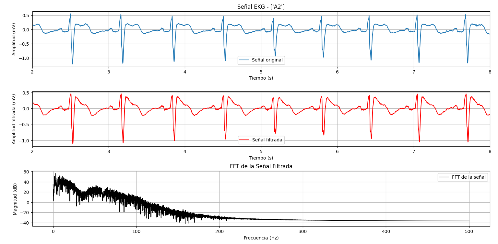

## ECG Respiración 

| **Derivada 1 Respiración** | 
|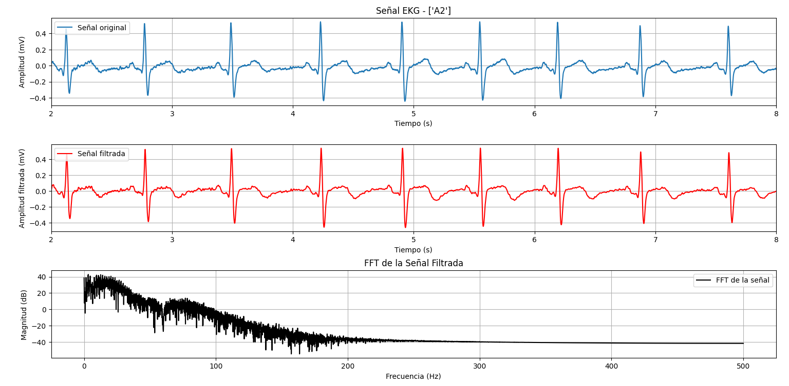|  
| **Derivada 2 Respiración** |
|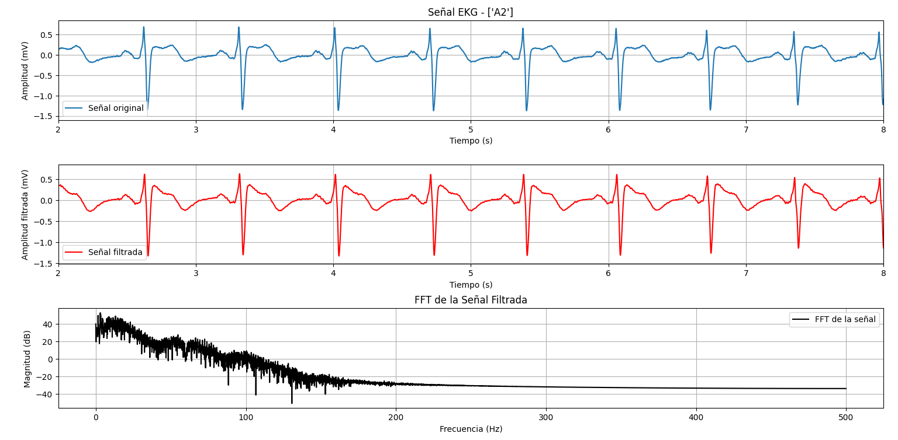| 
| **Derivada 3 Respiración** |
|| 

## ECG Post-respiración 

| **Derivada 1 Post-respiración** | 
|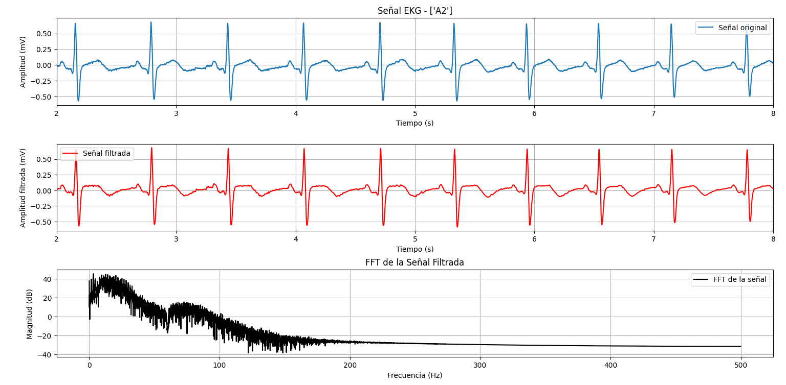| 
| **Derivada 2 Post-respiración** |
|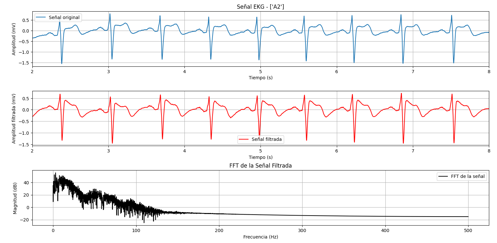| 
| **Derivada 3 Post-respiración** |
|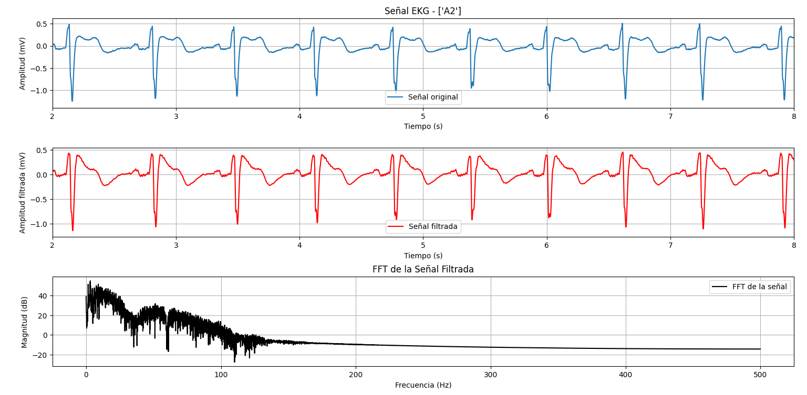| 

## ECG Post-ejercicio 

| **Derivada 1 Post-respiración** | 
|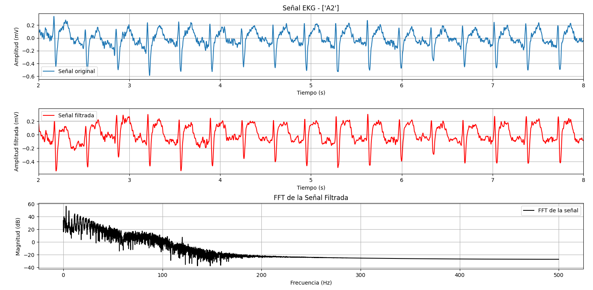| 
| **Derivada 2 Post-respiración** |
|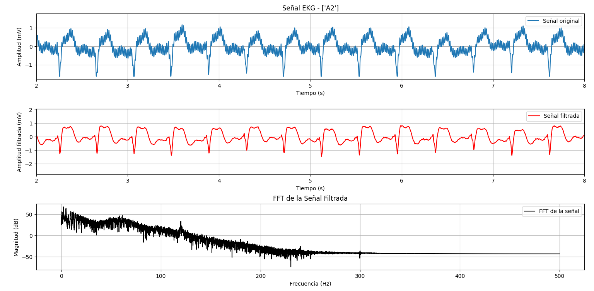| 
| **Derivada 3 Post-respiración** |
|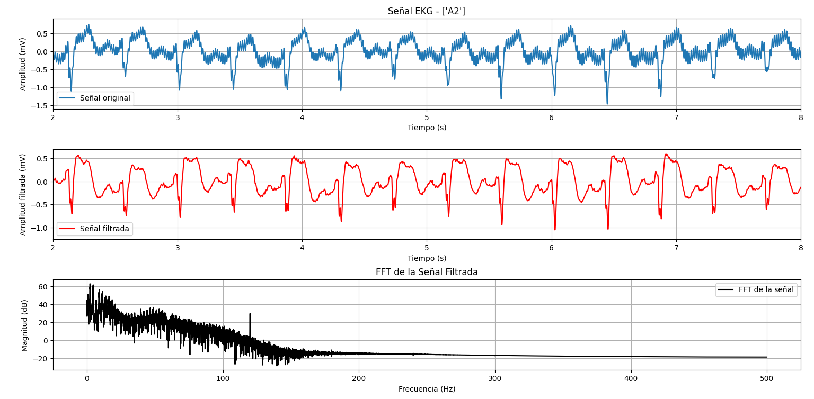| 

## Discusión 
***

La obtencion de una derivada consiste en la medicion de la actividad electrica (comunmente
en la escala de mV) del corazon, empleando puntos de referencia (+,- y tierra) con variadas
distribuciones de electrodos, tales como el triangulo de Einthoven (ver fig.5), pero para 
este laboratorio se empleara la distribucion recomendada por el BITalino (r)evolution (ver
fig.2 en metodologia).

[!eintoven](./Data_bibliografica/Einthoven.png)

Segun la poscicion de los electrodos, se espera que en el derivada 1, se presenten picos 
positivos debido al cambio de fase descendete a fase ascendente (ondas Q-R), mientras que 
para la derivada 2 y 3, picos negativos debido al descenso de fase. (ver fig. 6)

[!spikes](./Data_bibliografica/spikes.png)

***
### Discusión de Estado Basal 

Las mediciones del ECG para cada derivación, al realizarse en estado basal, analizan el estado de la persona en una situación de reposo o sin esfuerzo físico, debido a que la principal información a obtener es la FC (frecuencia cardiaca) en latidos por minuto (lpm) para poder evaluar el nivel de salud del corazon del sujeto en cuestion y poder detectar 
algun signo de arritmias o sobreexigencia del corazón.

Para realizar el calculo del FC se empleará la "regla del ECG" (ver imagen) y considerar
60-100 lpm el rango normal.

[!reglaECG](./Data_bibliografica/reglaECG.png)

Empleando la Derivada 1, y midiendo la distancia entre sus picos R-R (tomando en cuenta que la escala del ploteo obtenida en la seccion de resultados esta en "cm") se obtiene una distancia de 0.65 cm , el cual es equivalente aprox a 88 lpm.

### Discusión de aguantar respiración

ESCRIBA SU DISCUSION

### Discusión post-respiración

ESCRIBA SU DISCUSION

### Discusión post-ejercicio

ESCRIBA SU DISCUSION

## Conclusión 

...

## Bibliografía

[1] “Electrocardiogram (ECG or EKG) - Mayo Clinic”. Top-ranked Hospital in the Nation - Mayo Clinic. Accedido el 21 de septiembre de 2024. [En línea]. Disponible: [Link](https://www.mayoclinic.org/es/tests-procedures/ekg/about/pac-20384983 "Mayo Clinic")

[2] “Del laboratorio a la práctica: una revisión sobre la historia y evolución del electrocardiograma”. SciELO España - Scientific Electronic Library Online. Accedido el 21 de septiembre de 2024. [En línea]. Disponible: [Link](https://scielo.isciii.es/scielo.php?script=sci_arttext&amp;pid=S2695-50752022000400011 "Scielo")

[3]“Ondas del Electrocardiograma”. My EKG, La web del Electrocardiograma. Accedido el 21 de septiembre de 2024. [En línea]. Disponible: [Link](https://www.my-ekg.com/generalidades-ekg/ondas-electrocardiograma.html "My-Ekg")

[4]BITalino (r)evolution Home Guide: EXPERIMENTAL GUIDES TO MEET & LEARN YOUR BIOSIGNALS. Disponible en: [link](https://support.pluxbiosignals.com/wp-content/uploads/2022/04/HomeGuide0_GettingStarted.pdf)

[5] https://openaccess.uoc.edu/bitstream/10609/40186/6/jlorenzoroTFC0115memoria.pdf

