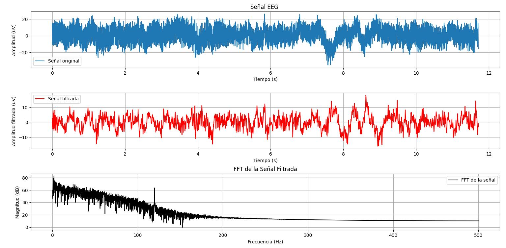
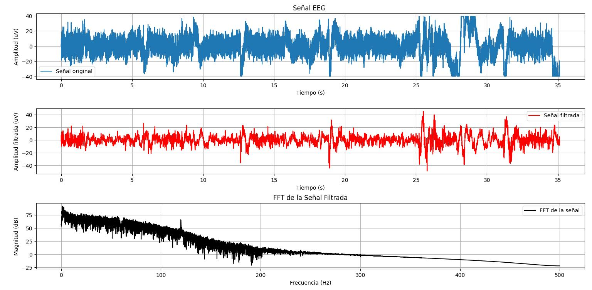
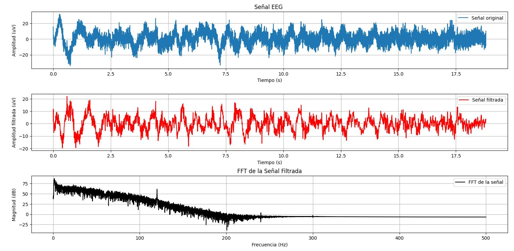
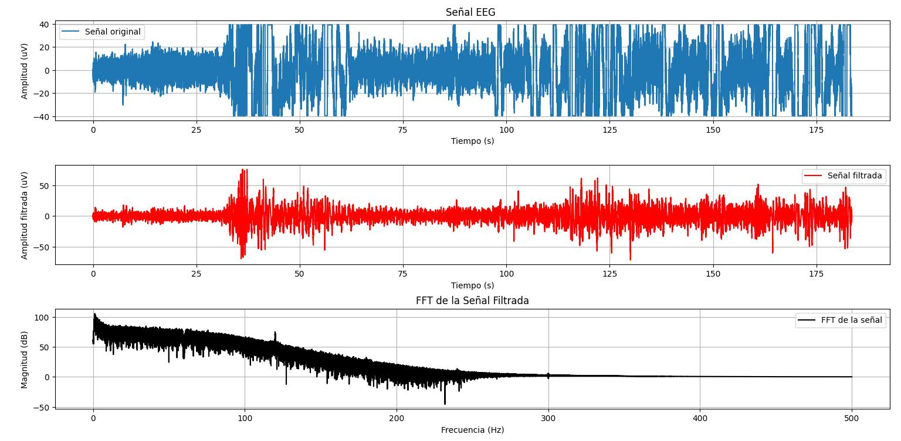
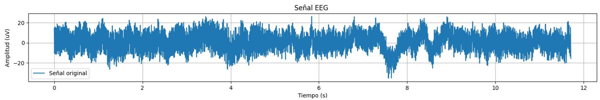
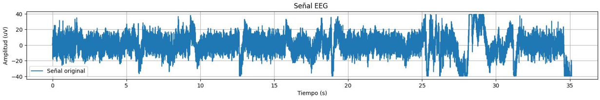
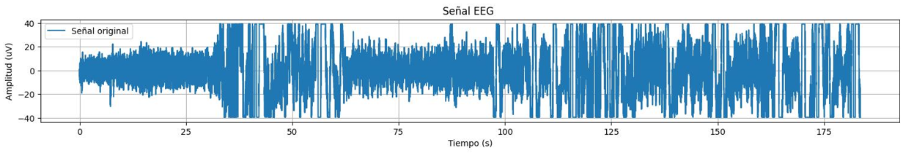
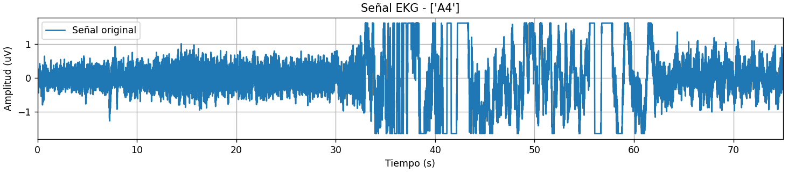

# LABORATORIO 6: – Uso de EEG usando BITalino y Ultracortex Mark IV:
## Integrantes
- Fabian Alcides Ñaña Alfaro
- Christian Huarancca Quispe
- Ryoshin Cavero Mosquera
- Flavio Andreas Avendanho Cáceres
- Joao Marco Torres Rivera

## Contenido de la sesión
1. [Introducción](#id1)
2. [Objetivos](#id2)
3. [Materiales y equipos](#id3)
4. [Metodologia](#id4)
5. [Resultados](#id5)  
   5.1 [EEG alumno](#id6)  
   5.2 [EEG profesor ](#id7)  
6 [Discucion](#id8)  
7 [Resultado](#id9)  
8 [Bibliografia](#id10)

## Introducción 
   ### ¿Qué es un EEG?  

                  
   Un Electroencefalograma (EEG) es una prueba que mide la actividad eléctrica del cerebro, ya que utiliza los impulsos electricos de las neuronas para comunicarse. Además se encuentra en el orden de los microvoltios(uV)[1].

   El examen consiste en la colocación de electrodos en varios lugares del cuero cabelludo como en la parte frontal de la cabeza. Luego se procede a capturar la señal mientras el paciente está despierto o incluso durmiendo[2]. Por último se realiza un filtrado dependiendo del ritmo de EEG que se quiera analizar de la señal.

   ### Conceptos Previos

   
   _"El cerebro es el único órgano que se intenta explicar a sí mismo"_

    
   El cerebro es el órgano ubicado dentro de la corteza cranela que está compuesto de mil millones de  neuronas que coordinan pensamientos, conductas, etc. Es la parte más grande del encéfalo y está dividido por surcos en 2 hemisferios. Cada hemisferio presenta 6 lóbulos, aunque algunos autores consideran solo 4, los cuales se presentan a continuación:
   
   * Lóbulos frontales: Se encargan de las funciones motoras, movimientos, emocione.
   * Lóbulos parietales: Se encargan de los sentidos, de la visión, el tacto y de la orientación espacial y temporal.
   * Lóbulo temporal: Está asociado al habla, la audición y a la memoria de corto plazo.
   * Lóbulo occipital: Está asociado al sistema visual, gestos y expresiones.
   * Insula: Está asociado al habla y la información sensitiva y autónoma de las vísceras.
   * Lóbulo límbico: Reciben conexiones de diversas áreas del encéfalo que están interrelacionados [3,4]. 

   
   Figura 1. Ubicación de los lóbulos. Fuente: 

   Para visualizar cuáles son las porciones del cerebro que se activan cuando se realiza cualquier acción se requiere un EEG. La señal presenta distintas oscilaciones con bandas de frecuencias definidas pero no uniformizadas por todos los autores [5]. Estas son:

   * Gamma: 30-50 Hz. Son las ondas más rápidas. Ocurren en ráfagas cortas. Están relacionados con el proceso de información simultánea en varias áreas del Sistema Nervioso Central. Se observan estallidos de ondas gamma cuando el cerebro se encuentra en un estado de alta resolución. 
   * Beta: 12-30 Hz. Predominan durante el período de vigilia. La frecuencia es rápida, está presente cuando estamos atentos e implicados en la resolución de tareas o problemas diarios, también durante la toma de decisiones o cuando estamos concentrados.
   * Alpha: 8-12 Hz. Predominan cuando el Sistema Nervioso Central está en reposo, relajado pero despierto y atento.
   * Theta: 4-8 Hz. Predominan cuando los sentidos están procesando información interna y el individuo está desconectado del mundo exterior, absorto. Fase 3 sueño no REM
   * Delta: 0.5-4 Hz. Fase 4 sueño REM.

   Algunos autores difieren en 1 o 2 Hz de las bandas de frecuencia de acuerdo a la distribución anterior. Como por ejemplo: Beta: de 13-30 Hz [6].

   

Figura 2. Ritmos EEG. [7]

## Objetivos 
* Obtener señales de electroencefalograma utilizando el arreglo de electrodos UltraCortex MARK IV y la tarjeta de biosensado Cyton de 8 canales.
* Obtener una señal de electroencefalograma utilizando el Kit BITalino (R)evolution.
* Analizar y plotear las señales obtenidas utilizando Python.

## Materiales y equipos 

| Material     |Descripción      |Cantidad   |
|-----------   |:------------:   |:---------:|
|Mark IV       | Ultracortex     |1          |  
| (R)Evolution |Kit BITalino[4]  |1          |
| Laptop       |Laptop           |1          |
| Electrodos   |Electrodos EEG   |3          |
|Cyton         |Tarjeta biosensado|1         |

  
   Figura 3. BITalino. Fuente: BITalino (r)evolution.

## Metodología 

Para el registro de EEG se usaron 2 voluntarios para 2 tipos de procedimientos similares, pero con equipamiento distintos. En ambos realizaron los siguientes 5 pasos detallados a continuación:

1. Registrar una línea base de señal con poco ruido y sin movimientos (respiración normal junto con ojos cerrados) durante 30 segundos.
2. Repetir un ciclo de OJOS ABIERTOS - OJOS CERRADOS cinco veces, manteniendo ambas fases durante cinco segundos.
3. Registrar otra fase de referencia de 30 segundos (paso 1)
4. Otro compañero leerá una serie de ejercicios matemáticos (3 simples y 3 complejos), mientras el voluntario resolverá los ejercicios mirando a un punto fijo.
5. Detener la grabación y guardar datos.

El primer procedimiento consistió en la captura de un EEG mediante el Kit BITalino (R)evolution con la laptop y para ello se siguió la siguiente secuencia:

1. Descarga de la plataforma OpenSignals.
2. Alimentación de la tarjeta BITalino utilizando una batería de litio incluida en el kit de compra.
3. Conexión de los 3 electrodos (Positivo, Negativo y Referencia) a la placa de sensado a través de un conector hacia el canal de sensado de EEG.
4. Conectar por Bluetooth a la tarjeta BITalino con la laptop.

Una vez realizadas las conexiones, se procedió a colocar 2 electrodos en la parte frontal de la cabeza, por encima de cada ceja y 1 electrodo que sirve de referencia por debajo de la oreja derecha, tal como se detalla en la figura 4. Una vez finalizadas las conexiones se procedió a realizar los pasos mencionados al inicio.

Figura 4. Colocación electrodos EEG. Fuente: BITalino Home Guide

---

El segundo procedimiento usó el UltraCortex MARK IV junto a la Tarjeta Cyton y para ello se siguió la siguiente secuencia:

1. Descarga de la plataforma OpenBCI GUI.
2. Alimentación de la tarjeta Cyton utilizando una batería de litio incluida en el kit de compra.
3. Conexión del UltraCortex MARK IV con la tarjeta Cyton.
4. Ajuste del UltraCortex en la cabeza del voluntario (profesor Moises) siguiendo el sistema 10-20 de posicionamiento de electrodos, como se visualiza en la figura 5.
5. Conexión de la laptop y la tarjeta Cyton.

Una vez realizadas las conexiones, se procedió a realizar los pasos mencionados al inicio de Metodología.

Figura 5. Colocacion del ULTRACORTEX en el voluntario.

### Proceso de Filtrado
Una vez definido el procedimiento, el siguiente paso es realizar el código en Visual Studio Code para el filtrado de la señal resultante. Este proceso se dividió en dos etapas: 

El primer paso del filtrado fue la aplicación de un filtro notch centrado en 60 Hz. Este filtro se utilizó para eliminar la interferencia de la red eléctrica, una fuente común de ruido en los registros ECG, EEG y EMG. Al eliminar estas frecuencias no deseadas, se obtuvo una señal más limpia, lo que es crucial para un análisis fiable de la actividad cardiaca.

El segundo paso fue aplicar un filtro pasa banda con un rango de 0.5 a 100 Hz. Este rango de frecuencia fue elegido para aislar las frecuencias relevantes de la señal ECG, eliminando los ajenos a la señal ECG . Este procedimiento es esencial para mejorar la calidad de la señal y su representatividad de ella. Por ejemplo, Lorenzo (2015) [5] emplearon un filtrado similar (0.5-100 Hz) en su estudio para obtener señales ECG claras y útiles.

### Código usado en Python

El código realiza un completo proceso de adquisición, preprocesamiento y visualización de señales electromiográficas (ECG) capturadas utilizando el sistema BITalino y OpenSignals. A continuación, se detallan los procesos de filtrado, con su respectiva justificación, que se llevaron a cabo en el código:

1. **Conversión de la Señal ADC a Milivoltios (uV):**
   
   La función `ADCtomV` se utiliza para convertir la señal digital (ADC) a analógico (voltaje en milivoltios (mV)). Dado que la señal se obtiene en formato ADC, es necesario convertirla a un formato más comprensible (milivoltios) para analizar la amplitud real de la señal ECG. Esta conversión es crucial para asegurar que los datos se interpreten correctamente y se puedan comparar con otros estudios electromiográficos.

2. **Remoción del Componente DC:**
   
   Antes de aplicar cualquier filtrado, se realiza una remoción del componente DC de la señal. Este paso implica restar el valor promedio de la señal para eliminar cualquier desplazamiento en el nivel base. La presencia de un componente DC podría distorsionar los resultados del filtrado posterior y la representación de la señal. La remoción del componente DC garantiza que las etapas de filtrado subsiguientes no se vean afectadas por un nivel base elevado.

3. **Filtrado Pasa Banda (Bandpass Filter):**
   
   Se aplica un filtro pasa banda utilizando la función `butter_bandpass_filter`, que emplea el diseño de filtros Butterworth. Este filtro se diseña con una frecuencia de corte inferior de 0.5 Hz y una frecuencia de corte superior de 100 Hz. El objetivo de este filtrado es eliminar las componentes de baja frecuencia (como el ruido de movimiento y la línea base) y las componentes de alta frecuencia que suelen estar asociadas con el ruido eléctrico o artefactos no deseados. El uso del filtro pasa banda permite aislar las frecuencias relevantes de la señal ECG que se encuentran dentro de este rango, proporcionando una representación más precisa de la actividad cardiaca.

4. **Filtrado Notch para Eliminar Ruido de Red Eléctrica:**
   
   Después del filtrado pasa banda, se aplica un filtro notch (rechaza bandas específicas de frecuencias) centrado en 60 Hz mediante la función `iirnotch`. La frecuencia de 60 Hz corresponde al ruido de la red eléctrica que es común en los registros electromiográficos. Este ruido puede interferir con la señal ECG, haciendo que sea difícil distinguir las características de la señal. El filtro notch elimina este ruido específico, resultando en una señal más limpia y más representativa de la actividad muscular verdadera.

5. **Visualización de la Señal:**
   
   Una vez que la señal ha sido filtrada, se procede a su visualización en tres subgráficos:
     - **Señal Original:** Muestra la señal convertida a mV antes del filtrado.
     - **Señal Filtrada:** Muestra la señal después de los procesos de filtrado (pasa banda y notch), destacando cómo el filtrado mejora la claridad de la señal ECG.

## Resultados 
***
### EEG del alumno
***
|**EEG alumno - Estado Basal**|**EEG alumno - Parpadeos (lapsos 5 segundos)**|
|:---------------------------:|:------------------------:|
|("https://youtu.be/GpzFBP9PeDw")|("https://youtube.com/shorts/yvh0mibmzds")|
|**EEG alumno - 2do Estado Basal**|**EEG alumno - Ejercicios mentales (total)**|
|("https://youtube.com/shorts/2i9HHr30mw0")|("https://youtu.be/fh9nf8_U0Es")|
***

|**EEG alumno - Estado Basal**|**EEG alumno - Parpadeos (lapsos 5 segundos)**|
|:---------------------------:|:------------------------:|
|| |
|**EEG alumno - 2do Estado Basal**|**EEG alumno - Ejercicios mentales (total)**|
|||

### EEG del profesor
***
|**EEG profesor - Estado Basal**|**EEG profesor - Parpadeos (lapsos 5 segundos)**|
|:---------------------------:|:------------------------:|
|("https://youtu.be/DEUQdwvzWDg")|("https://youtu.be/_X7cUqVrU60")|
|**EEG profesor - 2do Estado Basal**|**EEG profesor - Ejercicios mentales (total)**|
|("https://youtu.be/Zm6OFPL9uPM")|("https://youtu.be/FpcMIeKeOmc")|
***

|**EEG profesor - Estado Basal**|**EEG profesor - Parpadeos (lapsos 5 segundos)**|
|:---------------------------:|:------------------------:|
|||
|||
***

## Discusión 
***
### Análisis señal en estado basal

En esta gráfica, se observa una representación de la señal EEG en basal , es decir , en condición de reposo y sin movimientos oculares , la señal está ploteada en un intervalo de 0 a 15 segundos . La  señal obtenida muestra una variabilidad considerable, con picos que se extienden a lo largo de un rango de amplitudes que van desde aproximadamente -40 µV a +40 µV. 

Fig 6. EEG de alumno - estado basal

### Análisis señal durante pestañeo

Se observan diferencias significativas con respecto a la señal en estado basal , en la señal se observan numerosos picos, tanto positivos como negativos, que se extienden más allá de la actividad EEG en reposo, posiblemente indicando los momentos en los que el usuario parpadeó . Estos artefactos por parpadeo son comúnmente más grandes que la actividad eléctrica cerebral típica y pueden identificarse por sus formas características de gran amplitud.

Fig 7. EEG de alumno - Parpadeos

### Análisis durante preguntas 

En la primera gráfica, la señal EEG muestra variaciones de amplitud considerables, con valores que oscilan entre aproximadamente -40 y +40 µV. Estas fluctuaciones sugieren una la detección de actividad cerebral dinámica, posiblemente debido a la carga cognitiva de responder a las preguntas planteadas . 

Fig 8. EEG de alumno - ejercicios mentales

Fig 9. EEG de alumno - ejercicios (ventana 0-75)

En la segunda imagen, que muestra un intervalo más corto de 0 a 75 segundos , las variaciones de la señal son evidentes con la diferente aparición de picos positivos y negativos. Esta gráfica representa  respuestas cerebrales a momentos específicos de resolución de problemas que fueron planteados, donde la actividad mental es más intensa . Asimismo,el nivel de las preguntas fue aumentando con respecto a la dificultad.

## Análisis de los resultados en OpenBCI
Fisiológicamente , las neuronas se comunican entre sí mediante pequeños impulsos eléctricos que pueden medirse. A estas las llamamos ondas cerebrales. Estas ondas tienen diferentes tipos de frecuencias, algunas son más rápidas y otras más lentas. Si se separan mediante filtros podremos observarlos con mayor claridad.
Un electroencefalograma (EEG) es necesario para registrar  la actividad eléctrica del cerebro a través de sensores colocados en el cuero cabelludo que nos permiten ver estos potenciales eléctricos en forma de ondas.

**Ondas delta (0,5-4Hz):** Son características de cuando el individuo está dormido y predominan durante el sueño.

**Ondas theta (4-8Hz):** predominan cuando los sentidos están procesando información interna y el individuo está desconectado del mundo exterior, absorto.

**Ondas alfa (8-12Hz):** predominan cuando el Sistema Nervioso Central está en reposo, relajado pero despierto y atento.

**Ondas beta (12-30Hz):** predominan durante el período de vigilia. La frecuencia es rápida, está presente cuando estamos atentos e implicados en la resolución de tareas o problemas diarios, también durante la toma de decisiones o cuando estamos concentrados.

**Ondas gamma (30-90 Hz):** Son las ondas más rápidas. Ocurren en ráfagas cortas. Están relacionados con el proceso de información simultánea en varias áreas del Sistema Nervioso Central. Se observan estallidos de ondas gamma cuando el cerebro se encuentra en un estado de alta resolución. 

## Conclusión 

## Bibliografía

[1] https://www.mayoclinic.org/es/tests-procedures/eeg/about/pac-20393875

[2] https://medlineplus.gov/spanish/ency/article/003931.htm

[3]https://www.msdmanuals.com/es-pe/professional/trastornos-neurol%C3%B3gicos/funci%C3%B3n-y-disfunci%C3%B3n-de-los-l%C3%B3bulos-cerebrales/generalidades-sobre-la-funci%C3%B3n-cerebral

[4]https://www.mayoclinic.org/es/diseases-conditions/epilepsy/in-depth/brain/art-20546821

[5]https://www.msdmanuals.com/es-pe/professional/trastornos-neurol%C3%B3gicos/pruebas-y-procedimientos-neurol%C3%B3gicos/electroencefalograf%C3%ADa-eeg

[6]https://fisiologia.facmed.unam.mx/index.php/fisiologia-de-la-actividad-electrica-del-cerebro-electroencefalografia/

[7]https://psicoterapeutas.eu/electroencefalograma/electroencefalograma-2/