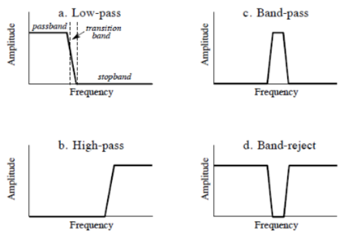
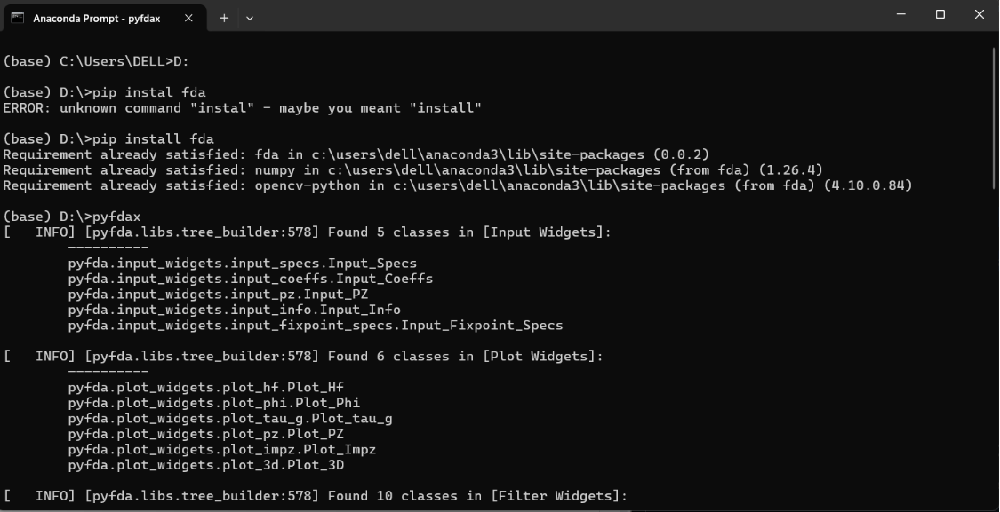
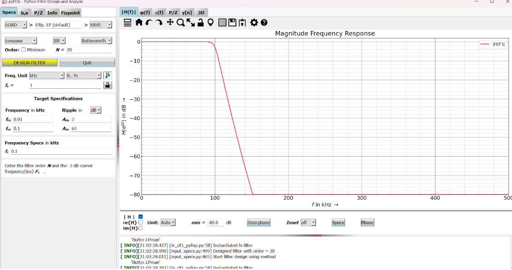

# LABORATORIO 7: – Filtrado de señales biomédicas 
***
## Alumno:

### Christian Edu Huarancca Quispe

Para el desarrollo de esta sesión de laboratorio ,  se aplicaron filtros FIR e IIR a señales biomédicas previamente medidas en 
laboratorios anteriores(señales EMG y ECG). Los filtros digitales son esenciales en el procesamiento de señales biomédicas para 
eliminar el ruido y resaltar frecuencias deseadas. Se exploraron dos tipos principales: los filtros IIR(Infinite Impulse 
Response) y los filtros FIR(Finite Impulse Response). El objetivo fue evaluar la efectividad de estos filtros en el procesamiento 
de señales ECG y EMG para  mejorar el análisis de cada señal .

## Contenido 
1. [Introducción](#id1)
2. [Objetivos](#id2)
3. [Marco Teorico](#id3)
    3.1 [Filtro FIR](#id4)
    3.2 [Filtro IIR](#id5)
4. [Materiales](#id6)
4. [Metodologia](#id7)
5. [Resultados](#id8)  
6. [Discución](#id9)  
7. [Conclusion](#id10)  
8. [Bibliografia](#id11)

## Introducción 

El procesamiento de señales biomédicas se ha beneficiado enormemente del uso de filtros digitales, que 
permiten eliminar el ruido y mejorar las frecuencias importantes en las señales digitales. Nos centramos 
en dos tipos principales: los filtros IIR, con respuesta impulsiva infinita, y los filtros FIR, con 
respuesta impulsiva finita. Además, exploramos el filtro wavelet, útil para señales no estacionarias. 
Nuestro estudio se enfoca en evaluar la efectividad de estos filtros en el procesamiento de señales EEG, 
ECG y EMG, con el objetivo de mejorar la calidad de las mediciones biomédicas para diagnóstico y 
monitoreo clínico.

## Objetivos 

* Desarrollar un filtro IIR seleccionando entre los tipos disponibles en pyFDA: Bessel, Butterworth, Chebyshev o Elíptico.

* Desarrollar un filtro FIR utilizando métodos de enventanado disponibles en pyFDA.

* Adquirir un conocimiento teórico y práctico sobre el diseño y la aplicación de filtros IIR y FIR.

* Obtener y comparar las señales filtradas de EMG y ECG con las señales originales para evaluar 
la efectividad de los filtros diseñados  , asimismo , comparar los espectros de las señales en el dominio de la frecuencia.

## Marco Teórico 

Los filtros digitales son herramientas fundamentales en el procesamiento de señales biomédicas, donde manipulan señales 
digitales mediante la eliminación de ruido y la mejora de componentes de frecuencia útiles. Estos sistemas operan con 
señales en tiempo discreto y utilizan algoritmos que realizan operaciones de retardo, multiplicación y suma para modificar 
la señal de entrada según los requisitos específicos de la aplicación. Los diferentes tipos de filtrado son : 

Filtro pasa-bajas: permite el paso de todas las frecuencias menores a la frecuencia de corte, atenuando aquellas que son 
mayores a esta última.

Filtro pasa-altas: atenúa todas las frecuencias bajas y permite el paso de aquellas por encima de la frecuencia de corte.

Filtro pasa-bandas: deja pasar las frecuencias comprendidas entre la frecuencia de corte inferior y la frecuencia de corte 
superior, atenuando las demás.

Filtro rechaza-bandas: atenúa las frecuencias comprendidas entre la frecuencia de corte inferior y la frecuencia de corte 
superior, dejando pasar las demás.

Fig 1. Tipos de filtros segun banda de paso

## Filtro FIR 

Un filtro FIR es aquel que tiene una respuesta finita al impulso y  que se caracterizan por ser sistemas no recursivos. En este tipo de filtrado no existe retroalimentación. Además, la respuesta al impulso H(w), es de duración finita ya que si la entrada se mantiene en cero durante N periodos consecutivos la salida también será cero. Algunas de las características de este tipo de filtros son las siguientes: 

1. Un filtro FIR puede ser diseñado para tener fase lineal. 
2. Siempre son estables porque son hechos únicamente con ceros en el plano complejo. 
3. Los errores por desbordamiento no son problemáticos porque la suma de productos en un filtro FIR es desempeñada por un conjunto finito de datos. 
4. La salida siempre es una combinación lineal de los valores presentes y pasados de la señal de entrada. 
5. Tiene memoria finita. 
6. Requiere un mayor número de coeficientes necesarios; requiere más recursos y mayor complejidad computacional.
7. Son preferidos en aplicaciones donde la integridad de la fase y la señal son críticas, como en el procesamiento de audio/video de alta fidelidad.

## Filtro IIR 

Un filtro IIR es aquel que tiene una respuesta infinita al impulso y  que se caracteriza por tener una retroalimentación de la señal de salida. En los filtros IIR, la salida es función no sólo de la entrada actual y de las precedentes, sino también de las salidas anteriores. Es decir, se trata de filtros recursivos (poseen realimentación), y por tanto se espera que posean una respuesta impulsional infinita. Algunas de sus características son : 

Potencialmente inestables: la estabilidad depende del diseño específico del filtro.

Menor número de coeficientes para una especificación dada: más eficientes en uso de recursos.

Fase no lineal (generalmente), lo que puede introducir distorsión en la señal procesada. Adecuados para sistemas de bajo coste y con recursos limitados donde se pueden manejar complicaciones de fase.

## Materiales 

* Señales EMG y EEG medidas utilizando el BiTalino y capturadas utilizando el software OpenSignals en laboratorios previos.
* Una laptop con el software de Python 
* Software pyFDA

## Metodologia 

### Medición de señales ECG, EMG, EEG:

La medición se realizó en los laboratorios anteriores, donde se siguió el protocolo determinado por la guía de usuario del BiTalino para cada sensor.

### Captura de señales usando el software OpenSignals:

En este pudimos observar la señal medida en tiempo real y luego guardarla en un archivo bajo formato .txt .

### Procesamiento de  las señales desde los archivos .txt:

Se diseñaron los filtros FIR e IIR usando el programa de pyFDA ,el cual fue previamente abierto y se obtuvieron los coeficientes de cada filtro en archivo de formato .csv.Luego se realizó un filtrado de las señales utilizando filtros FIR e IIR. 
Posteriormente se filtraron las señales y se realizaron ajustes hasta comprobar la efectividad de los filtros.

Fig 2. Descarga de pyFDA

Fig 3. Ambiente de pyFDA

### Diseño de filtros para señales EMG y ECG en pyFDA 

### Filtros para señales EMG ( características ):

Fig 4. Filtro pasa bajas Butterworth 

Fig 5. Filtro pasabajas Chebyshev 1

Fig 6. Filtro pasabajas con ventana de Hamming

### Filtros para señales ECG ( características ):

Fig 7. Filtro pasa bajas Butterworth 

Fig 8. Filtro pasabajas Chebyshev 1

Fig 9. Filtro pasabajas con ventana de Hamming

## Resultados 

Ver resultados en [Resultados](./Resultados)

## Discución 

### Discusión de señales EMG

El primer filtro Butterworth se caracteriza por  introducir mínimas distorsiones en cuanto a la ganancia. La transición entre 
la banda de paso y la banda de atenuación es más suave en comparación con otros filtros. Por otro lado ,como se observa en la 
gráfica ,  el filtro Chebyshev I introduce rizado en la banda de paso, lo que significa que hay pequeñas fluctuaciones en la 
ganancia dentro de las frecuencias de 100 a 400 Hz. Sin embargo, este filtro tiene una transición más rápida a la banda de 
atenuación, lo que implica una mejor selectividad para las frecuencias fuera de esa banda.
El alto orden mayor en el diseño del filtro asegura una atenuación significativa de las frecuencias no deseadas, pero esto 
también implica una mayor complejidad computacional y un posible desfase en la señal. El filtro Chebyshev I , de menor o
rden , permite una transición más rápida de la banda de paso a la de atenuación. El filtro Butterworth  al no tener 
rizado en la banda de paso, preserva la forma de las señales EMG dentro de la banda deseada .Por otro lado, para el 
filtro Butterworth, la transición es más lenta entre la banda de paso y la de atenuación. Esto significa que si existe  
ruido o señales interferentes cercanas a los bordes de la banda de paso (100 Hz y 450 Hz), un filtro Chebyshev I sería 
una mejor opción

### Discusión de señales ECG

Los tres filtros para señales ECG presentan características distintas que afectan la señal de diversas maneras. El filtro 
Butterworth se destaca por su respuesta que minimiza la distorsión de ganancia dentro del rango, pero introduce un desfase 
significativo, especialmente al ser de orden alto en comparación a los otros 2 filtros diseñados . Este desfase puede 
afectar la alineación temporal de la señal ECG, algo crítico en la medición de intervalos como el RR, aunque es eficiente 
eliminando componentes fuera de la banda. Por otro lado, el filtro Bessel (orden menor de 15) se caracteriza por una 
respuesta de fase lineal, preservando mejor la temporalidad de la señal, lo que lo hace ideal para el análisis de los 
tiempos relativos entre los picos de la señal ECG . Sin embargo, su transición más suave lo hace menos eficaz en la 
atenuación fuera de la banda de paso en comparación con el Butterworth. Finalmente, el filtro basado en una ventana de 
Hanning (orden más alto de 50) tiene una transición relativamente suave, lo que reduce el rizado tanto en la banda de 
paso como en la banda de detención. Aunque su respuesta en frecuencia es menos selectiva y su eficiencia de atenuación es 
inferior a la de los otros filtros, introduce menos desfase que el Butterworth y es más simple computacionalmente, siendo 
adecuado para aplicaciones menos críticas en ECG.

## Conclusión 

## Bibliografía 

--------------------------------------