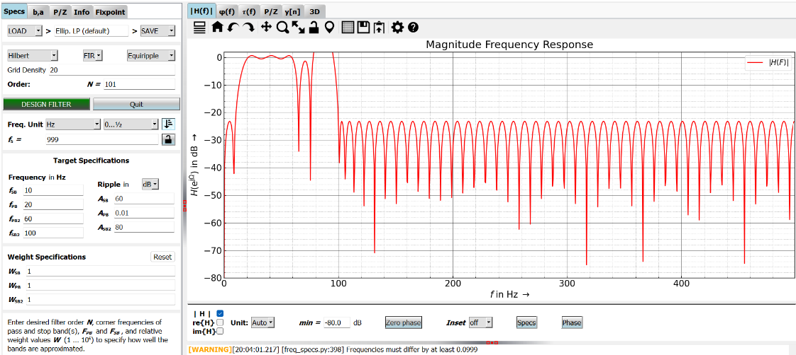
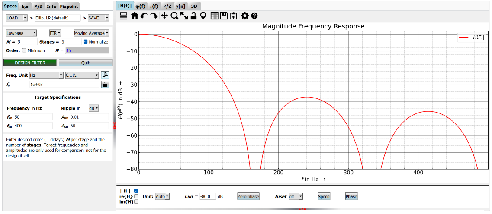

# LABORATORIO 7: Filtrado de Señales Usando PyFDA

## Integrante
- Fabian Alcides Ñaña Alfaro

## Contenido del Informe
1. [Introducción](#id1)
2. [Objetivos](#id2)
3. [Materiales y Equipos](#id3)
4. [Metodología](#id4)
5. [Resultados](#id5)  
   5.1 [Filtrado ECG](#id6)  
   5.2 [Filtrado EMG](#id7)  
6. [Discusión](#id8)  
7. [Conclusión](#id9)  
8. [Bibliografía](#id10)

## Introducción <a name="id1"></a>
<p style="text-align: justify;">
Los avances en bioingeniería permiten realizar el modelamiento híbrido de circuitos biológicos y electrónicos, interactuando en mallas conjuntas. De esta manera, es posible detectar las corrientes iónicas de un organismo, denominadas biopotenciales, para luego transducirlas a voltajes de salida interpretables. En este contexto, los filtros activos, constituidos por amplificadores operacionales, cumplen dos funciones clave: la atenuación del ruido ambiental o tisular y la amplificación de la señal de interés. En este experimento se utilizaron dos amplificadores: uno de filtrado paso banda (LF353) y otro de instrumentación (AD620), ambos conectados a una protoboard, para procesar una señal senoide monitorizada en un osciloscopio.[1]</p>


## Objetivos <a name="id2"></a>
- Obtener señales filtradas utilizando diferentes tipos de filtros (FIR e IIR).
- Comparar el efecto de cada filtro en las señales originales (ECG y EMG).
- Usar PyFDA para generar coeficientes que permitan el filtrado adecuado de las señales.

## Materiales y Equipos <a name="id3"></a>
- Señales de EMG y ECG obtenidas previamente con el dispositivo BITalino en los laboratorios de Introducción a Señales Biomédicas.
- Software PyFDA para generar filtros.
- Visual Studio Code.
- Computadora con Python instalado.
- Osciloscopio y protoboard.

## Metodología <a name="id4"></a>

### Recopilación de Señales
Las señales de ECG y EMG fueron obtenidas en experimentos previos realizados en los laboratorios de Introducción a Señales Biomédicas utilizando el dispositivo BITalino. Las señales obtenidas fueron almacenadas en formato CSV para su posterior procesamiento en PyFDA.

### Instalación de PyFDA
Para poder procesar las señales, se procedió a instalar PyFDA mediante el siguiente comando en el CMD de Windows:


**Figura 1**: Instalación de PyFDA mediante el comando en el CMD.

Una vez instalado PyFDA, se procedió a inicializarlo para la configuración de los filtros:


**Figura 2**: Proceso de instalación de PyFDA completado.

### Inicialización de PyFDA
PyFDA se inicializó con el siguiente comando para poder comenzar con el diseño de los filtros:


**Figura 3**: Inicialización de PyFDA para el diseño de filtros.

### Diseño de Filtros para ECG
Se utilizaron varios tipos de filtros FIR para el procesamiento de las señales de ECG. Basándonos en estudios previos, se seleccionó un rango de 0.5 a 100 Hz como valores clave para el diseño de filtros. Este rango permite atenuar el ruido de alta frecuencia y resaltar los componentes relevantes de la señal ECG, tal como se describe en [2].

#### Filtro Hilbert: FIR
Se diseñó un filtro Hilbert para realzar componentes específicos de la señal ECG.


**Figura 4**: Filtro Hilbert aplicado a la señal ECG.

#### Filtro Lowpass Windowed FIR
Se diseñó un filtro pasa bajas FIR con ventana para eliminar componentes de alta frecuencia.


**Figura 5**: Filtro Lowpass aplicado a la señal ECG.

#### Filtro Boxcar FIR
El filtro Boxcar se utilizó para un suavizado adicional de la señal ECG, mejorando su estabilidad.


**Figura 6**: Filtro Boxcar aplicado a la señal ECG.

### Diseño de Filtros para EMG
Para el procesamiento de las señales EMG se utilizaron filtros Notch y Butterworth, como sugiere la literatura en [3]. 

#### Filtro Notch y Filtro Butterworth
Se aplicaron filtros digitales notch en múltiplos de 50 Hz para eliminar interferencias de la red eléctrica y un filtro Butterworth de tercer orden (paso banda) con un rango de frecuencia de 10 Hz a 500 Hz para aislar las señales musculares de interés.


**Figura 7**: Filtro Butterworth aplicado a la señal EMG.

#### Filtro Lowpass Hamming Windowed Filter N=100
Se utilizó un filtro de ventana Hamming para la señal EMG con un orden de 100.


**Figura 8**: Filtro Hamming aplicado a la señal EMG.

#### Filtro Moving Average
Un filtro de media móvil se implementó para suavizar las variaciones bruscas en la señal EMG.


**Figura 9**: Filtro Moving Average aplicado a la señal EMG.

Luego de obtuvieron los coeficientes correspondientes y se usó el siguiente código de python para poder aplicar el filtrado y posterior ploteo comparando las FFT entre las señales antes y después del proceso de filtrado:

### Código Python para el filtrado de señales

```python
import numpy as np
import pandas as pd
import matplotlib.pyplot as plt
import json
from scipy.signal import filtfilt, freqz
from scipy.fft import fft, fftfreq
from matplotlib.widgets import Slider

# Función para leer los coeficientes del filtro desde un archivo
def leer_coeficientes_filtro(archivo_coef, tipo_filtro):
    if tipo_filtro.lower() == 'fir':
        with open(archivo_coef, 'r') as f:
            coeficientes = np.array([float(coef) for coef in f.read().split()])
        return coeficientes, np.array([1])  # El coeficiente "a" es [1] para FIR
    elif tipo_filtro.lower() == 'iir':
        # Leer el archivo línea por línea, cada línea tiene un coeficiente b y a
        b = []
        a = []
        with open(archivo_coef, 'r') as f:
            for linea in f:
                coef_b, coef_a = linea.split(',')
                b.append(float(coef_b))
                a.append(float(coef_a))
        return np.array(b), np.array(a)
    else:
        raise ValueError("Tipo de filtro desconocido. Debe ser 'FIR' o 'IIR'.")

# Función para leer el archivo OpenSignals
def leer_senal_opensignals(archivo):
    with open(archivo, 'r') as f:
        lineas = f.readlines()
    # Buscar la línea que contiene el JSON con los parámetros
    for linea in lineas:
        if linea.startswith('# {'):
            json_data = json.loads(linea[2:])
            break
    # Extraer la frecuencia de muestreo del JSON
    device_key = list(json_data.keys())[0]
    fs = json_data[device_key]["sampling rate"]
    titulo = json_data[device_key]["label"]
    # Encontrar el final del encabezado ('EndOfHeader')
    inicio_datos = 0
    for i, linea in enumerate(lineas):
        if 'EndOfHeader' in linea:
            inicio_datos = i + 1
            break
    # Cargar los datos desde el archivo
    data = pd.read_csv(archivo, delimiter='\t', skiprows=inicio_datos, header=None)
    tiempo = np.arange(len(data)) / fs  # Crear un vector de tiempo basado en la cantidad de muestras
    senal = data.iloc[:, -1]  # Última columna (A2)
    return tiempo, senal, fs, titulo

# Función para convertir ADC a mV
def ADCtomV(ADC, n=10, VCC=3.3):
    volts = (((ADC/(2**n)) - (1/2)) * VCC) / 1009
    return volts * 1000

# Función para aplicar el filtro usando los coeficientes b y a con filtfilt (sin desfase)
def aplicar_filtro(senal, b, a):
    senal_filtrada = filtfilt(b, a, senal)  # Usar filtfilt para evitar el desfase
    return senal_filtrada

# Función para calcular y graficar la FFT
def calcular_fft(senal, fs):
    n = len(senal)
    fft_values = fft(senal)
    fft_magnitud = np.abs(fft_values)[:n//2]
    freqs = fftfreq(n, 1/fs)[:n//2]
    return freqs, fft_magnitud

# Función para actualizar las gráficas cuando se mueve el slider
def actualizar_graficas(val, ax1, ax3, tiempo, signalmV, senal_filtrada, fs, ventana_tiempo):
    t_min = val
    t_max = t_min + ventana_tiempo
    # Actualizar gráfica de señal original
    ax1.clear()
    ax1.plot(tiempo[(tiempo >= t_min) & (tiempo <= t_max)], signalmV[(tiempo >= t_min) & (tiempo <= t_max)], label='Señal original', linewidth=0.8)
    ax1.set_title('Señal Original')
    ax1.set_xlabel('Tiempo (s)')
    ax1.set_ylabel('Amplitud (mV)')
    ax1.grid(True)
    # Actualizar gráfica de señal filtrada
    ax3.clear()
    ax3.plot(tiempo[(tiempo >= t_min) & (tiempo <= t_max)], senal_filtrada[(tiempo >= t_min) & (tiempo <= t_max)], label='Señal filtrada', color='red', linewidth=0.8)
    ax3.set_title('Señal Filtrada')
    ax3.set_xlabel('Tiempo (s)')
    ax3.set_ylabel('Amplitud (mV)')
    ax3.grid(True)
    # Redibujar
    plt.draw()

# Función principal para leer los archivos, aplicar el filtro y graficar
def procesar_y_graficar(archivo_coef, archivo_senal, tipo_filtro):
    # Leer los coeficientes del filtro
    b, a = leer_coeficientes_filtro(archivo_coef, tipo_filtro)
    # Leer la señal
    tiempo, senal, fs, titulo = leer_senal_opensignals(archivo_senal)
    # Convertir señal a mV
    signalmV = ADCtomV(senal)
    # Filtrar la señal
    senal_filtrada = aplicar_filtro(signalmV, b, a)
    # Calcular FFT de las señales
    freqs_original, fft_original = calcular_fft(signalmV, fs)
    freqs_filtrada, fft_filtrada = calcular_fft(senal_filtrada, fs)
    # Crear figura y ejes
    fig, ((ax1, ax2), (ax3, ax4)) = plt.subplots(2, 2, figsize=(12, 8))
    # Graficar las FFTs (no son controladas por el slider)
    ax2.plot(freqs_original, 20 * np.log10(fft_original), label='FFT original', linewidth=0.8)
    ax2.set_title('FFT de la Señal Original')
    ax2.set_xlabel('Frecuencia (Hz)')
    ax2.set_ylabel('Magnitud (dB)')
    ax2.grid(True)
    ax4.plot(freqs_filtrada, 20 * np.log10(fft_filtrada), label='FFT filtrada', color='red', linewidth=0.8)
    ax4.set_title('FFT de la Señal Filtrada')
    ax4.set_xlabel('Frecuencia (Hz)')
    ax4.set_ylabel('Magnitud (dB)')
    ax4.grid(True)
    # Graficar señales (controladas por el slider)
    ventana_tiempo = 30  # Mostrar solo 2 segundos
    ax1.plot(tiempo[:int(ventana_tiempo * fs)], signalmV[:int(ventana_tiempo * fs)], label='Señal original', linewidth=0.8)
    ax1.set_title('Señal Original')
    ax1.set_xlabel('Tiempo (s)')
    ax1.set_ylabel('Amplitud (mV)')
    ax1.grid(True)
    ax3.plot(tiempo[:int(ventana_tiempo * fs)], senal_filtrada[:int(ventana_tiempo * fs)], label='Señal filtrada', color='red', linewidth=0.8)
    ax3.set_title('Señal Filtrada')
    ax3.set_xlabel('Tiempo (s)')
    ax3.set_ylabel('Amplitud (mV)')
    ax3.grid(True)
    # Slider para controlar la ventana de tiempo
    ax_slider = plt.axes([0.25, 0.01, 0.5, 0.03], facecolor='lightgoldenrodyellow')
    slider = Slider(ax_slider, 'Tiempo', 0, max(tiempo) - ventana_tiempo, valinit=0, valstep=0.1)
    # Actualizar gráficas al mover el slider
    slider.on_changed(lambda val: actualizar_graficas(val, ax1, ax3, tiempo, signalmV, senal_filtrada, fs, ventana_tiempo))
    plt.subplots_adjust(left=0.1, right=0.9, top=0.95, bottom=0.15)
    plt.show()

# Ejecución principal
tipo_filtro = input("Ingrese el tipo de filtro (FIR o IIR): ")
archivo_coef = input("Ingrese la dirección del archivo de coeficientes: ")
archivo_senal = input("Ingrese la dirección del archivo de la señal: ")
procesar_y_graficar(archivo_coef, archivo_senal, tipo_filtro)
```

## Resultados <a name="id5"></a>


### 5.1 Filtrado ECG <a name="id6"></a>
Los filtros aplicados a la señal ECG lograron una reducción efectiva del ruido de alta frecuencia. El filtro Hilbert permitió realzar componentes específicos de la señal, mientras que el filtro Lowpass y el Boxcar mejoraron la estabilidad general.
[Ver resultados ECG](./Ploteos_filtrados/ECG)


### 5.2 Filtrado EMG <a name="id7"></a>
Los filtros aplicados a la señal EMG lograron eliminar el ruido de la red eléctrica y aislar las señales musculares. El filtro Butterworth y el de ventana Hamming fueron los más efectivos para reducir el ruido sin alterar las características clave de la señal.
[Ver resultados EMG](./Ploteos_filtrados/EMG)


## Discusión <a name="id8"></a>
<p style="text-align: justify;">
El uso de diferentes tipos de filtros permite adaptar las técnicas de procesamiento a las características específicas de cada señal. En el caso de las señales ECG, la combinación de un filtro Hilbert con filtros Lowpass permitió obtener señales más limpias. Para las señales EMG, el filtro Butterworth se destacó por su capacidad para aislar las señales de baja frecuencia y eliminar el ruido eléctrico. Las metodologías y configuraciones utilizadas en este laboratorio coinciden con las recomendaciones de la literatura especializada [2].
</p>

## Conclusión <a name="id9"></a>
<p style="text-align: justify;">
El filtrado de señales biopotenciales requiere una selección adecuada de los tipos de filtros para optimizar los resultados. En este laboratorio, el uso de PyFDA permitió diseñar y aplicar filtros efectivos tanto para señales de ECG como de EMG, mejorando la calidad de las señales para su posterior análisis. La implementación de filtros FIR e IIR permitió observar cómo cada uno ofrece ventajas en distintos escenarios de procesamiento.
</p>

## Bibliografía <a name="id10"></a>
[1] J. P. Ramírez-Galvis, Medición de biopotenciales, Oct. 2020. DOI: 10.13140/RG.2.2.31445.24805. [Online]. Available: https://www.researchgate.net/publication/344852056_Medicion_de_biopotenciales.

[2] P. Bharti, G. Singh, and R. Kumari, "Noise Removal Techniques for ECG Signals: A Review," *IET Signal Processing*, vol. 14, no. 3, pp. 125-132, 2020. DOI: 10.1049/iet-spr.2019.0071.

[3] F. H. Neto, A. S. C. Oliveira, and T. M. Vieira, "Surface Electromyography: Why, When and How to Use it," *Sensors*, vol. 20, no. 7, p. 1771, 2020. DOI: 10.3390/s20071771.


---