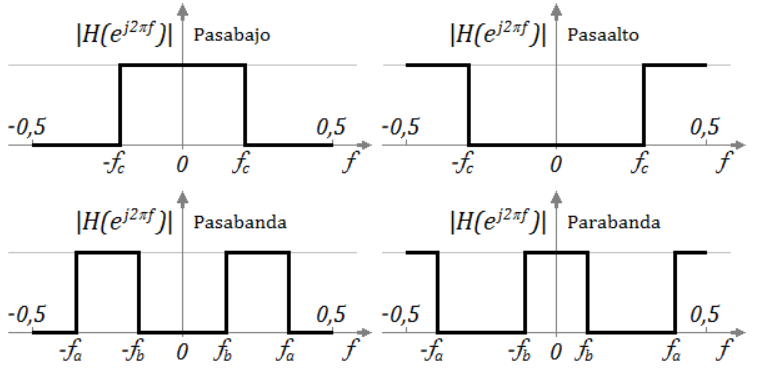
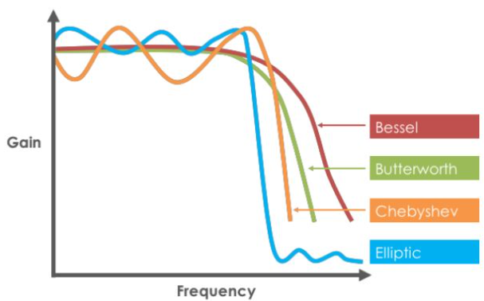
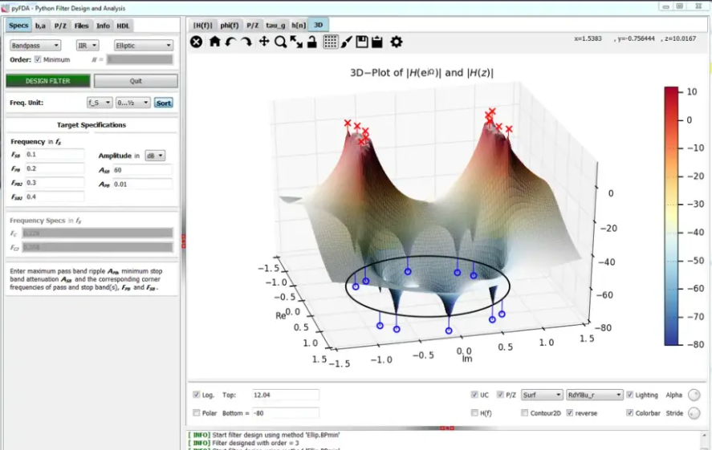
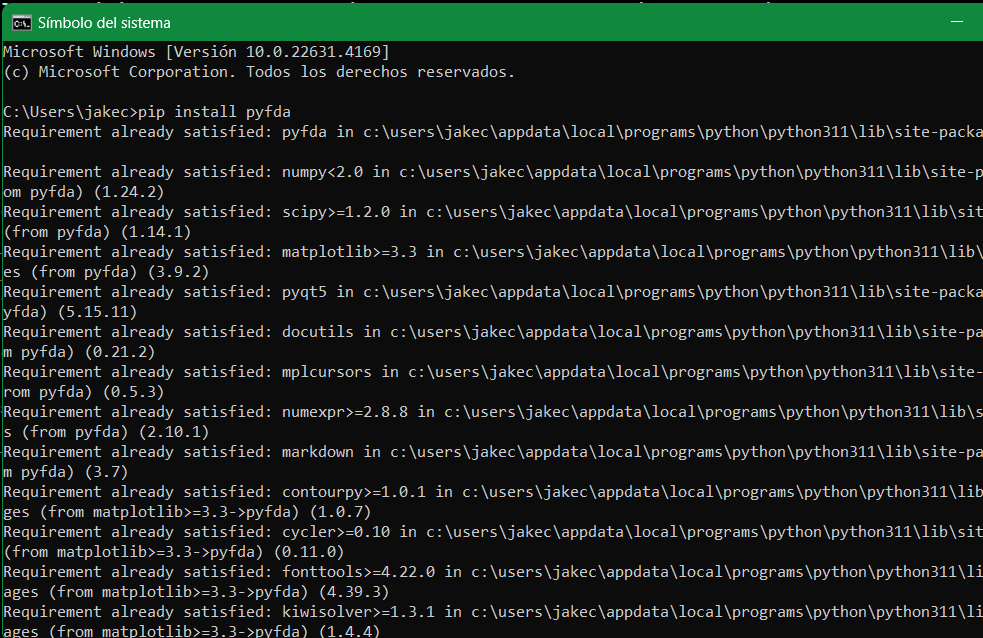
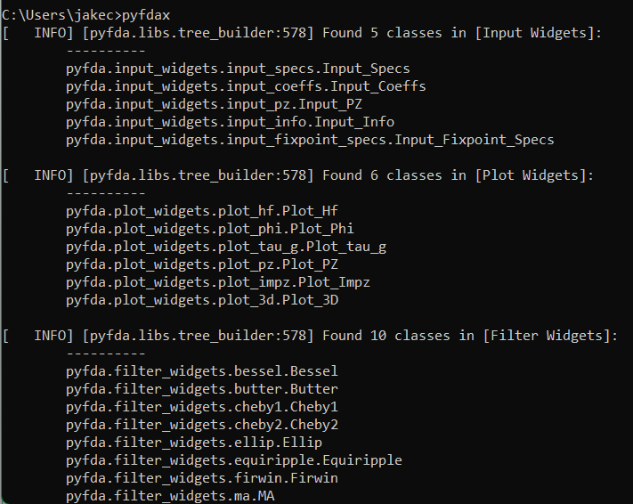
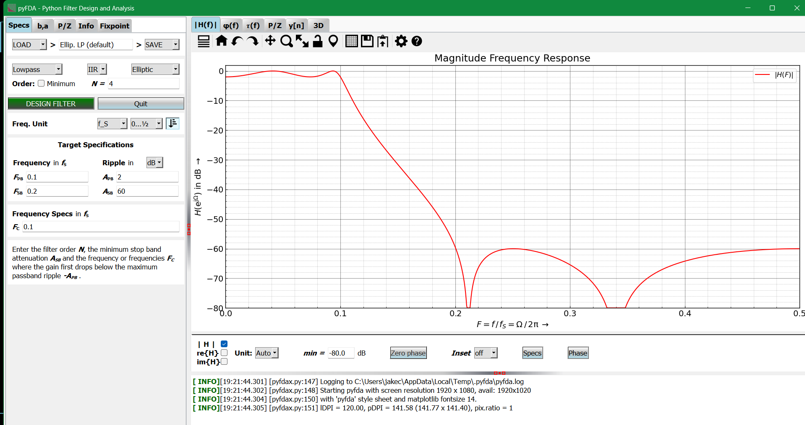
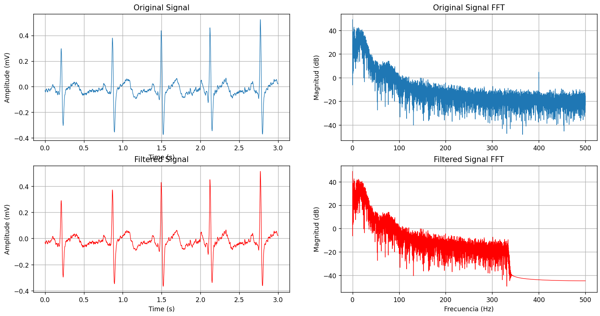
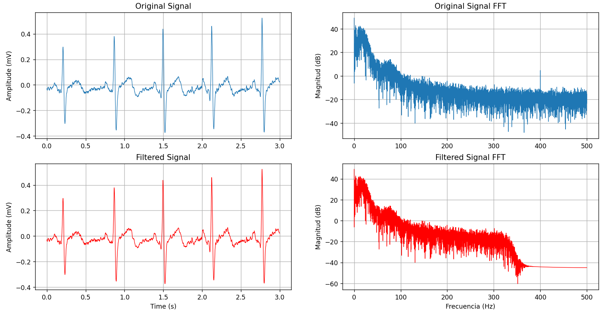

# LABORATORIO 7: – Diseño y aplicaciones de Filtros mediante PyFDA
***
## Autor

### Flavio Avendaño Cáceres

## Contenido del informe
1. [Introducción](#id1)
2. [Objetivos](#id2)
3. [Materiales y equipos](#id3)
4. [Metodologia](#id4)
5. [Resultados](#id5)  
6. [Discución](#id6)  
7. [Conclusion](#id7)  
8. [Bibliografia](#id8)

## Introducción 

En el proceso de obtencion de bioseñales, tales como los EMGs, ECGs y EEGs, las calidad de las señales puede verse afectadas por factores como la calidad del elctrodo, campos electromagenticos o ruido (biologico o eléctrico) del mismo ambiente de evaluaciones.

Por lo cual es imperativo el uso de los filtros, los cuales son sistemas (analogicos o digitales) que tiene por funcion recibir la señal y eliminar componentes no deseados conservarndo solo elementos característicos relevantes de la señal en cuestión. Para el diseño de estos filtros se empleara el software pyFDA(Python Digital Filtering and Analysis) aplicandolo a señales EMG y ECG de laboratorios previos y evaluar el rendimiento de disntintos tipos de filtros segun cuanto conserven y refinen las señales de entarda.

   ### Conceptos Previos
  
   Los filtros pueden ser divididos en:[1]

   * Filtro pasa-bajas: permite el paso de todas las frecuencias menores a la frecuencia de corte, atenuando aquellas que son mayores a esta última.
   * Filtro pasa-altas: atenúa todas las frecuencias bajas y permite el paso de aquellas por encima de la frecuencia de corte.
   * Filtro pasa-bandas: deja pasar las frecuencias comprendidas entre la frecuencia de corte inferior y la frecuencia de corte superior, atenuando las demás.
   * Filtro rechaza-bandas: atenúa las frecuencias comprendidas entre la frecuencia de corte inferior y la frecuencia de corte superior, dejando pasar las demás.

Fig 1. Representación gráfica de los tipos de filtros [1]

Estos filtros se pueden clasificar, de acuerdo a la aproximación matemática empleada, en:

   * Butterworth: tiene objetivo una respuesta de ganancia plana en la banda de paso. Esto se consigue mediante una región de transición de caída lenta y una respuesta de fase no lineal alrededor de la frecuencia de corte
   * Chebyshev: tiene como objetivo maximizar la pendiente de la característica de ganancia en la región de transición. Presenta un cierto rizado en la banda de paso, que se incrementa al aumentar el orden de filtro.
   * Bessel: tiene como objetivo lograr una respuesta de fase lineal en un margen de frecuencias amplio en torno a la frecuencia de corte. La ganancia en la banda de paso no es tan plana como en un filtro Butterworth ni la pendiente en la banda de transición tan acentuada como en un filtro Chebyshev
   * Elíptica: se caracteriza por tener ondulaciones constantes tanto en la banda de paso como en la banda de corte.

Fig 2. Representación gráfica segun la Aproximacion Matematica [1]

## Objetivos 
* Analizar y seleccionar los filtros segun la señal a procesar.
* Diseñar un total de 6 filtros y aplicarlos a las señales EMG y EKG mediante pyFDA.
* Comparar los resultados obtenidos y diferenciar ventajas y desventajas de un 
  filtro sobre otro.

## Materiales y equipos 

| Material     |Descripción      |Cantidad   |
|-----------   |:------------:   |:---------:| 
| Laptop       |Laptop           |1          |
| Programa de diseño   | pyFDA   |1          |

Fig 3. Software pyFDA

## Metodología 

### Adquiscion de Señales

Las señales seleccionadas para su procesamiento son la 1ra derivada del ECG (en estado basal, aguante de respiracion, 2do etado basal y ejercicio) y EMG de los biceps (reposo, en movimiento y en contra fuerza) las cuales fueron adquiridas en los laboratrios previos mediante el Kit BITalino.

### Descarga de pyDFA

El procedimiento para la obtencion del software es relativente sencillo y consta de 2 pasos:

   1. Ingresar en interprete de comandos de la laptop (cmd) "pip install pyfda"
   2. Tras terminada la descarga, para ejecutar el programa ingresar "pyfdax"
   3. Reingresar el comando cada vez que se quiera brir el programa y ya dentro
      se puede iniciar el diseño del filtro

|**Paso 1**|**Paso 2**|**Paso 3**|
|:---------------------------:|:------------------------:|:------------------------:|
||||

Tabla 1. Proceso de descargar de pyFDA

     

### Filtros para ECG

El primer criterio para el diseño de los filtros son las frecuencias de corte, las cuales en el caso de los ECG, son característicamente 0.5 y 100 Hz. Tambien es importante considerar, al decidir entre un filtro FIR o IIR, el filtro IIR (Infinite Impulse Response) es la mejor eleccion, debido a su eficiencia computacional ya que requiere pocos coeficientes, mientras que un filtro FIR puede resultar menos estable ya que requiere un altísimo numero de coeficientes además en los procesamientos de ECG no es necesario mantener una fase lineal, la cual es una característica principal del filtro FIR

En conclusion, para los ECG se aplicara 3 filtros IIR pasa baja de 0.5 a 100 Hz, cuya diferencia principal sera el modelo matematico a emplear: eliptico, buttersworth y chebyshev.

 

Con el modelo eliptico se busca un cambio rapido entre la banda de paso y la banda de rechazo para evitar filtraciones de frecuencias mayores no deseadas con amyor presición, pero con leves ondulaciones ne la banda de paso

  

Fig 4. Diseño de Filtro IIR - modelo Eliptico

 

En el caso del filtro buttersworth hay riesgos de que se filtren algunas frecuencias no deseadas debido a las curvas suaves pero a cambio se converva al maximo la forma de la onda ECG.

  

Fig 5. Diseño de Filtro IIR - modelo Buttersworth

 

Para el caso del modelo Chebyshev es muy probable que cierta regiones de la señal se distorsionen un poco pero eso se intercambia poruna eliminacion mas eficiente de ruido fuera de la banda de paso.

 

Fig 6. Diseño de Filtro IIR - modelo Chebyshev Tipo 1

 

### Filtros para EMG

Para el diseño de los filtros de EMG se debe considerar el rango de frecuencia de estos, el cual es 100-300 Hz. Ahora si bien apra estos casos aun es optimo emplear IIR, se usara filtros FIR de clase **Pasa Banda** para evaluar su desempeño practico, a pesar de requerir un alto coste computacional, variando entre los modelos Equiriple, Windowed FIR y Moving Average.

Al emplear el modelo Equiriple se gana control sobre la respuesta en frecuencia y nos permitira definir con presicion los elementos dentro de la banda de paso aunque requiera un alto numero de coeficientes.

 

Fig 7. Diseño de Filtro FIR - modelo Equiriple

 

Al multiplicar una respuesta ideal en frecuencia con una ventana se reduce el ruido no deseado en la señal EMG, aunque a costa de una transición menos nítida entre la banda de paso y la de atenuación.

 

Fig 8. Diseño de Filtro FIR - modelo Windowed 

 

De los 3 modelos es el que requiere menos coeficientes y reduce el ruido de alta frecuencia, suavizando bastante la señal, pero con una capacidad de filtrado limitado debido a su reducido control por promedios consecutivos

 

Fig 9. Diseño de Filtro FIR - modelo Moving Average 

 

***
## Resultados 

### ECG

|**IIR Lowpass Eliptico**|**IIR Lowpass Buttersworth**|**IIR Lowpass Chebyshev**|
|:----------------------:|:--------------------------:|:-----------------------:|
|:---------------------------------EstadoBasal---------------------------------:|
||||
|:--------------------------Respiracion 10 segundos----------------------------:|
||||
|:-----------------------------2do estado basal--------------------------------:|
||||
|:------------------------------Post Ejercicio---------------------------------:|
||||

### EMG

|**FIR Bandpass Equiriple**|**FIR Bandpass Windowed**|**FIR Bandpass Moving AV**|
|:------------------------:|:-----------------------:|:------------------------:|
|:------------------------------Bicep en reposo--------------------------------:|
||||
|:----------------------------Biceps en movimiento-----------------------------:|
||||
|:---------------------------Bicep con contrafuerza----------------------------:|
||||

## Discusión 
***

### Filtros ECG   

Con el uso de los 3 filtros hubo una leve mejoria en la resolucion de la señal por igual, y correccion del espectro a su rango de frecuencias respectivo, ya que al ser todos del tipo IIR optimizan calculos y costes computacionales en comparacion de los FIR, ademas que segun los graficos de plano z, todos los filtros de este tipo son sistemas del tipo estable ya que todos sus polos se encuentran dentro del circulo unitario y BIBO estables, considerar que la señal de entrada de por si ya poseia una considerable resolucion de ECG. Para poder visualizar a detalle todos los resultados (Espectros en frecuencia, diagramas de polos y zeros, fases,etc.) [Información ECG Buttersworth](./Filtros/IIR%20Lowpas%20Buttersworth) [Información ECG Eliptic](./Filtros/IIR%20Lowpass%20Eliptic) [Información ECG Chebyshev](./Filtros/IIR%20Lowpass%20Chebyshev)

### Filtros EMG

Los filtros FIR presntaron complicaciones durante su diseño, principalmente porque requerian un altisimo numero de coeficientes (minimo 700) dificultando el computo para la obtencion del filtro, ademas de que los polos y zeros del modelo FIR windowed indican alta inestabilidad, y el modelo Moving Average un baja aunque presente inestabilidad, mientras que el modelo Equiriple cumplia con la BIBO estabilidad, todo esto apreciable en los ploetos tras los filtrados en los de mayor a menor eficiencia estan: Equiriple, Moving Average y FIR windowed, indicando una relacion proporcional entre coste computacional, numero de coeficientes e inestabilidad del filtro.Para poder visualizar a detalle todos los resultados (Espectros en frecuencia, diagramas de polos y zeros, fases,etc.) [Información EMG Equiriple](./Filtros/FIR%20Bandpass%20Equiriple/) [Información EMG Windowed](./Filtros/FIR%20Bandpass%20Windowed) [Información EMG Moving Av](./Filtros/FIR%20Bandpass%20Moving%20AV)

## Conclusión 

El uso de filtros nos permite mejorar la resolucion de las bioseñales con la finalidad de poder realizar mejores analisis y diagnosticos, ya sea por IAs o profesionales de la salud, esta mejora de calidad permite obtener datos con amyor presicion que puede significar la diferencia entre poder detectar una patologia o no.

Y el analizar una señal en el dominio de la frecuencia y el plano Z de su filtro nos permite reconocer interferencias para poder ser eliminados por filtro de tipo FIR o IIR segun su estabilidad, que segun los filtrados realizados y costes de computo, se concluye que el filtro IIR es más eficiente para poder eliminar interferencias en una señal ECG por su practicidad y reducido coste de diseño.

## Bibliografía

[1] Federico Miyara.(2004)Electronica III - Filtros Activos, Segunda Edicion. Universidad Nacional de Rosario
   https://www.fceia.unr.edu.ar/enica3/filtros-t.pdf

[2] Kumar, Hemant.(2015)Comparative Study of FIR Digital Filter for Noise Elimination in EMG Signal
   https://www.researchgate.net/publication/330703731_Comparative_Study_of_FIR_Digital_Filter_for_Noise_Elimination_in_EMG_Signal

[3] Roshni, Y. (2020, marzo 24). Difference between FIR filter and IIR filter. Circuit Globe.
   https://circuitglobe.com/difference-between-fir-filter-and-iir-filter.html 
