# LABORATORIO 9: – Procesamiento de señales EMG
## Integrantes
- Fabian Alcides Ñaña Alfaro
- Christian Huarancca Quispe
- Ryoshin Cavero Mosquera
- Flavio Andreas Avendanho Cáceres
- Joao Marco Torres Rivera

## Contenido de la sesión

1. [Introducción](#id1)
2. [Objetivos](#id2)
3. [Metodología](id3)
4. [Resultados](#id4)  
   4.1 [Extracción de características](#id5)  
5. [Discusión](#id6)  
6. [Conclusiones](#id7)  
7. [Bibliografia](#id8)
***

## Introducción 

La electromiografía de superficie (EMG) utiliza los biopotenciales creados por ciertos músculos para cuantificar estos. Se puede saber que tanta fuerza se aplica en un ejercicio determinado, mas no cuáles son los músculos que se activan en el proceso. Los transductores capaces de captar la señal, son los electrodos y dependen en su número y posición cuando se trata de la finalidad de la extracción de valores. En el deporte se utiliza como evaluación de fatiga y principalmente para evaluar el rendimiento deportivo del atleta [1]. 
La extracción de características de un EMG sigue un preprocesamiento que consta en amplificar la señal obtenida de los electrodos para obtener valores visibles y manipulables. Posteriormente, sigue la etapa de procesamiento, donde varios investigadores usan la transformada de Wavelet como un filtro de señales no deseadas como el ruido eléctrico. Como ya se comentó en previos informes, la transformada de Wavelet presenta mejores resultados que la transformada de Fourier, puesto que esta no tiene un enfoque en el tiempo-frecuencia [2]. Por ejemplo, Harold et al. usa la transformada de Wavelet para segmentar en longitud de 256 muestras y realizar la extracción de características a cada segmento [3], mientras que Vinzenz et al. utiliza ventanas usando el tiempo antes y después de la pisada del pie [4]. 
El presente trabajo utiliza transformada de Wavelet Discreta “Daubechies” para los 3 músculos previamente muestreados realizando 3 actividades distintas: En reposo, en movimiento y a contrafuerza. 
 
## Objetivos 
* Elección del mejor filtro Wavelet para EMG en base a búsqueda bibliográfica 
* Segmentación de la señal.
* Extracción de parámetros estáticos y temporales de la señal.
* Realizar el análisis de las características y cómo varían estos  valores.
* Verificar el comportamiento de la señal EMG.

## Metodología 
### Extracción de características

 
Esta información se obtiene de la aplicación  de las llamadas  técnicas  de  extracción  de  características, dentro de las cuales se destacan como pioneras las basadas en análisis temporal por su sencillez y facilidad de evaluación, debido a que no requieren ningún tipo de transformación de la señal .
También están las basadas en análisis espectral, para las cuales se requiere de la transformación de la señal, como la transformada de Fourier de tiempo corto (STFT­ short time Fourier transform)  con la cual se obtiene información  de la señal en el dominio de ­frecuencia , aunque esta técnica asume la condición  de estacionariedad  en la señal, lo cual no se cumple para las señales EMG.Una solución a este inconveniente se refleja en los últimos trabajos de investigación en el área de procesamiento de señales con la técnica de análisis espectral basada en la “teoría  de  wavelets”, mediante las  transformadas  wavelets: CWT (Continuous Wavelet Transform) y DWT (Discrete Wavelet Transform) . Con esta técnica se consigue una representación de la señal en los dominios de tiempo­ y frecuencia mucho  más compacta que la conseguida por transformada de Fourier STFT, puesto que permite disponer de información de la señal en sus dominios original y transformado de manera simultánea , en laboratorios previos se realizó el filtrado de la señal EMG  mediante Transformada Wavelet Discreta usando la wavelet Daubechies de orden 4 ('db4') ,la cual es la más efectiva para la corrección de ruido en las señales[5] .

La extracción de características como la Raíz Cuadrática Media (RMS), Valor Absoluto Medio (MAV), Longitud de la Onda (WL) y Cruce por Cero (ZC) permite el desarrollo de sistemas de control precisos en prótesis basados en señales EMG. El RMS y MAV son indicadores clave de la intensidad y energía de la señal, útiles para diferenciar estados de reposo de contracciones de baja y alta intensidad. La WL aporta información sobre la complejidad de la contracción, permitiendo identificar patrones asociados a movimientos suaves o de fuerza. El ZC, al detectar cambios de fase, facilita la identificación de inicios y finales de contracción, cruciales en la sincronización de los movimientos de la prótesis con la intención del usuario.
Estas características, al ser integradas en algoritmos de control, permiten que la prótesis responda en tiempo real, adaptando su nivel de respuesta a las variaciones de la señal EMG. Por ejemplo, un sistema puede aumentar la potencia del dispositivo en función de la amplitud de la señal (medida por RMS o MAV) durante contracciones de fuerza, o activar movimientos de precisión cuando se detectan movimientos voluntarios de baja intensidad.

### Análisis de los ploteos antes y después de aplicar la Transformada Wavelet:

 
La señal EMG en reposo obtenida del bíceps refleja una actividad basal con baja amplitud, representativa de la ausencia de contracción activa. Esta baja actividad suele estar dominada por el ruido fisiológico de fondo y otras interferencias ambientales que afectan el registro de la señal. La aplicación de la transformada Wavelet en esta señal permite una eliminación efectiva de los componentes de alta frecuencia, manteniendo únicamente las fluctuaciones lentas inherentes al estado de reposo. Esto resulta en una línea de base más limpia y facilita la diferenciación de este estado pasivo de otras actividades musculares, lo cual es clave para el reconocimiento de patrones en sistemas de control prostético.
El perfil obtenido tras el filtrado permite detectar transiciones hacia la actividad, algo fundamental en el control de dispositivos externos como prótesis. La estabilidad de esta señal en reposo crea un contraste claro con los estados activos, permitiendo la identificación temprana de intentos de movimiento. Esta capacidad de diferenciar entre reposo y activación es esencial en aplicaciones donde una prótesis debe responder únicamente a comandos intencionados del usuario, minimizando activaciones no deseadas causadas por ruidos o fluctuaciones de fondo.

En el caso de la señal de movimiento voluntario del bíceps, se observa un incremento en la amplitud y variabilidad, con picos que corresponden a contracciones controladas y esporádicas del músculo. Esta amplitud moderada refleja la activación intermitente que caracteriza a las contracciones musculares voluntarias de baja a media intensidad. La aplicación de la transformada Wavelet permite destacar las oscilaciones de baja y media frecuencia, las cuales están asociadas a patrones de activación sostenida y controlada, típicos de actividades que no requieren esfuerzo máximo.
Este perfil de señal representa un patrón reconocible en el control de dispositivos protésicos, ya que permite discriminar entre esfuerzos moderados y estados de reposo. La estabilidad y regularidad del patrón de contracción es ideal para identificar intenciones de movimiento suave y controlado, lo cual facilita el uso de la prótesis en tareas que requieren precisión en los movimientos, como tomar objetos o manipular herramientas, sin activar modos de alta potencia innecesarios.
Durante una contracción de fuerza en el bíceps, la señal EMG presenta una amplitud significativamente elevada y una alta densidad de picos, reflejando una activación muscular intensa y sostenida. Los picos de alta frecuencia y su periodicidad indican un reclutamiento máximo de unidades motoras, característico de esfuerzos intensos. Tras aplicar la transformada Wavelet, se conservan los componentes de alta frecuencia en la señal filtrada, resaltando las fases de máxima activación. Esta respuesta es útil para aplicaciones donde la prótesis debe reflejar el aumento de fuerza demandado por el usuario.

Por su parte, la señal EMG en reposo del gastrocnemio muestra una baja amplitud con un patrón de fondo estable, típico de un músculo en estado pasivo. Los escasos potenciales de acción presentes se atribuyen principalmente a artefactos o ruidos externos, como el electromagnético. La aplicación de la transformada Wavelet reduce estos artefactos, destacando los componentes de baja frecuencia y produciendo una señal de reposo más estable. Este proceso de filtrado es crucial, ya que permite establecer una línea base clara que facilita la identificación de transiciones hacia la actividad muscular.
El perfil resultante en estado de reposo es esencial en el contexto de control de prótesis, dado que una señal limpia y libre de ruido contribuye a minimizar activaciones no deseadas en el dispositivo. Esta distinción entre el reposo y otros estados musculares permite una mayor precisión en la interpretación de las intenciones del usuario, maximizando la eficiencia de respuesta de la prótesis.
En el gastrocnemio durante movimiento voluntario, la señal EMG presenta picos de amplitud variable, correspondientes a los potenciales generados durante contracciones moderadas del músculo. Esta oscilación es característica de una activación moderada, con valores de amplitud que fluctúan en un rango controlado. La filtración mediante Wavelet permite mantener las oscilaciones de baja y media frecuencia, mejorando la claridad de la señal al eliminar el ruido de alta frecuencia. Este procesamiento de la señal es útil en aplicaciones de control de prótesis, donde es crucial detectar con precisión las fases de activación muscular en movimientos controlados.
La capacidad de esta señal para representar movimientos suaves y controlados es ideal para la manipulación de una prótesis en tareas de baja intensidad. La regularidad en las contracciones permite que el sistema de control responda de forma acorde, mejorando la coordinación en movimientos precisos, sin responder de forma exagerada a los estímulos de baja intensidad.

Mientras que durante contracciones de fuerza en el gastrocnemio, la señal EMG muestra amplitud alta y picos densos, lo cual es indicativo de una activación muscular intensa. Este patrón se caracteriza por un reclutamiento máximo de fibras musculares y una alta frecuencia de activación, lo cual es observable en los picos de gran amplitud de la señal. Al filtrar la señal con Wavelet, se conservan estas oscilaciones principales, eliminando el ruido de fondo y permitiendo una representación clara de la contracción de fuerza.
Este perfil de señal es esencial en dispositivos prostéticos que requieren diferenciar entre niveles de esfuerzo muscular. La capacidad de distinguir entre contracciones de fuerza y movimientos voluntarios de baja intensidad es clave para desarrollar prótesis que adapten su potencia y respuesta a las necesidades específicas de cada actividad, asegurando un control más eficiente y natural para el usuario.
La extracción de características como la Raíz Cuadrática Media (RMS), Valor Absoluto Medio (MAV), Longitud de la Onda (WL) y Cruce por Cero (ZC) permite el desarrollo de sistemas de control precisos en prótesis basados en señales EMG. El RMS y MAV son indicadores clave de la intensidad y energía de la señal, útiles para diferenciar estados de reposo de contracciones de baja y alta intensidad. La WL aporta información sobre la complejidad de la contracción, permitiendo identificar patrones asociados a movimientos suaves o de fuerza. El ZC, al detectar cambios de fase, facilita la identificación de inicios y finales de contracción, cruciales en la sincronización de los movimientos de la prótesis con la intención del usuario.
Estas características, al ser integradas en algoritmos de control, permiten que la prótesis responda en tiempo real, adaptando su nivel de respuesta a las variaciones de la señal EMG. Por ejemplo, un sistema puede aumentar la potencia del dispositivo en función de la amplitud de la señal (medida por RMS o MAV) durante contracciones de fuerza, o activar movimientos de precisión cuando se detectan movimientos voluntarios de baja intensidad. Con estas métricas, es posible crear un control intuitivo y proporcional que mejora la calidad de vida del usuario, brindando una respuesta adaptativa y natural en actividades diarias.

### Características Temporales:

#### A. Valor medio absoluto (MAV):
Valor medio absoluto. Estima el valor medio absoluto Xi , sobre cada segmento i de N muestras de la señal, mediante la expresión:

 

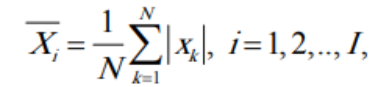 

Figura 1. Fórmula del MAV

#### B. Valor medio absoluto de pendientes (MAVS):

Este es simplemente la diferencia entre sumas de segmentos adyacentes[6], i e i +1, definido por:

 

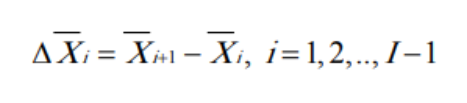  

Figura 2. Fórmula del MAVS

#### C. Cruces por cero (ZC):  

Es una forma simple de medir la frecuencia de la señal, puede determinarse contando el número de veces que la forma de onda cruza por cero[6]. Se requiere un umbral para reducir el número de cruces por cero inducidos por  ruido, y se selecciona con respecto al voltaje de la señal V.

#### D. Cambios de signo de pendiente(SSC) : 

Provee otra forma de medir el contenido de frecuencia en la señal mediante el conteo del número de veces que la pendiente de la forma de onda cambia de signo. Igualmente requiere de un umbral para reducir los cambios de signo dependiente inducidos por el ruido. 

#### E. Longitud de forma de onda (WL): 

Provee información de la complejidad  de la forma de onda en cada segmento, está dada por la siguiente expresión: 

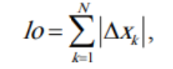

Figura 3. Fórmula del WL.

#### F. Cambios de signo de pendiente (CSP) : 

Mide el número de veces que la pendiente de la señal cambia de signo. Esto implica que si la señal cambia de creciente a decreciente o viceversa, se cuenta como un cambio de signo de pendiente[5]. Similar a SSC, puede indicar cambios rápidos en la señal.

#### G. Valor absoluto integrado (IAV):

Es el valor absoluto integrado de la señal en un segmento, sumando todos los valores absolutos de la señal. Esto da una medida de la energía acumulada de la señal, sin considerar el signo.Es similar al MAV en el sentido de que mide la actividad general de la señal, pero en lugar de obtener un promedio, se considera la suma total. Esto resulta útil para evaluar la energía acumulada en un segmento de tiempo .

#### H. Varianza (VAR):

Se encarga de medir  la dispersión de la señal alrededor de su media. Es un indicador de cuánto se desvía la señal de su valor promedio.Es fundamental para entender la estabilidad o la variabilidad de la señal  , ya que una varianza alta indica que la señal tiene una amplitud variable, mientras que una baja indica que la señal es más constante en amplitud.

#### I. Número de cruces de umbral (NF):

Se encarga de contar el número de veces que la señal cruza un valor de umbral predeterminado. En este caso, el umbral suele ser el promedio de la señal u otro valor de referencia. En señales de electromiografía , NF podría usarse para medir el nivel de actividad muscular respecto a un nivel basal, lo que permite  identificar eventos de activación en periodos de reposo.

## Resultados 

### Extracción de características 

#### Bíceps:

| Parámetros   | En reposo | En movimiento   | Contrafuerza |
|-----------   |:--------: |:-----------: | :-------: |
| RMS (mV)     |  0.7728   |  0.3694      |   0.5154
| MAV(mV)      |  0.7723   |  0.3618      | 0.5125
| WL (mV)      |  43.4638  |  203.5500    | 225.0002
| ZC (sin unidades)      |   1.0       |  2.0      | 2.0 
| SSC (sin unidades)     |   1623.0   |  1609.0   | 2495.0
| CSP (sin unidades)     |   21042.0   |  19990.0  | 31892.0
| LFO (mV)          |  43.4638      |   203.5500         | 225.0002
| IAV (mV)          |  17504.7023   |    7816.2264       |  17624.1007
| Varianza (mV²)    |  0.0008       |    0.0055          | 0.0030
| Threshold (mV)    |  0.7723       |    0.3618          | 0.5125
| NF (sin unidades) |  962.0    |    1088.0      | 1746.0000

Tabla 1.

En reposo:
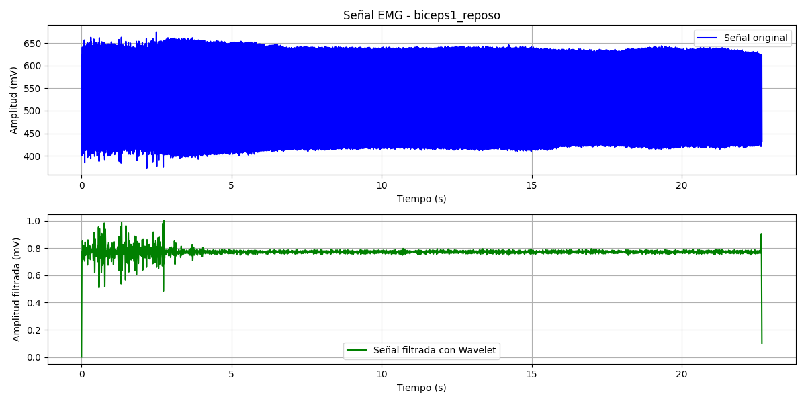
Figura 4.

En movimiento:
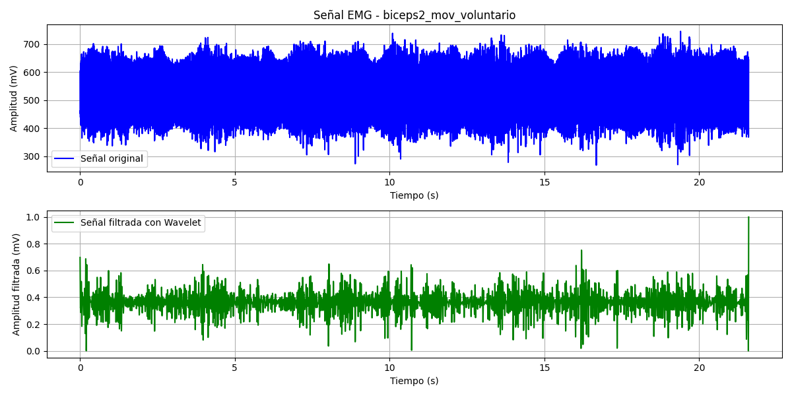 
Figura 5.

En contrafuerza:
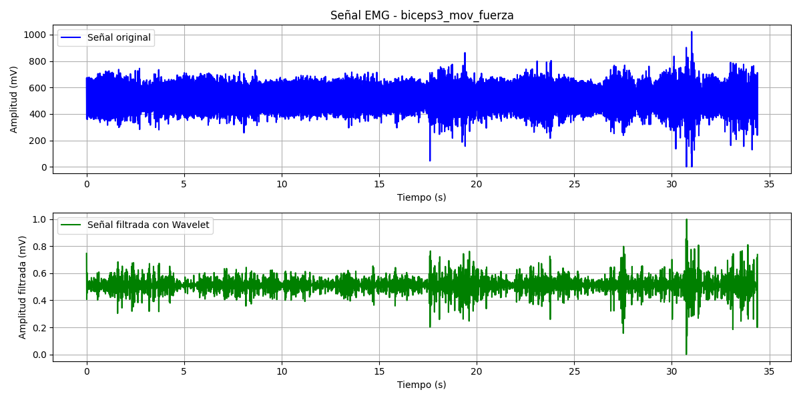 
Figura 6.

#### Tríceps:

| Parámetros   | En reposo | En movimiento   | Contrafuerza |
|-----------   |:--------: |:-----------: | :-------: |
| RMS (mV)     |  0.5045   |  0.5407      | 0.5159
| MAV(mV)      |  0.4934   |  0.5402      | 0.5098
| WL (mV)      |  191.9882  |  65.5542    | 165.2068
| ZC (sin unidades)      |   2.0       |  2.0      | 2.0 
| SSC (sin unidades)     |   1071.0    |  1914.0   | 1487.0
| CSP (sin unidades)     |   13743.0   |  17807.0  | 17327.0
| LFO (mV)          |  191.9882     |   65.5542         | 165.2068
| IAV (mV)          |  7310.0352    |   10653.5196      | 9591.4750
| Varianza (mV²)    |  0.0110       |   0.0006          | 0.0064
| Threshold (mV)    |  0.4934       |   0.5402          | 0.5098
| NF (sin unidades) |  736.0        |   1287.0      |  892.0

Tabla 2.

En reposo:
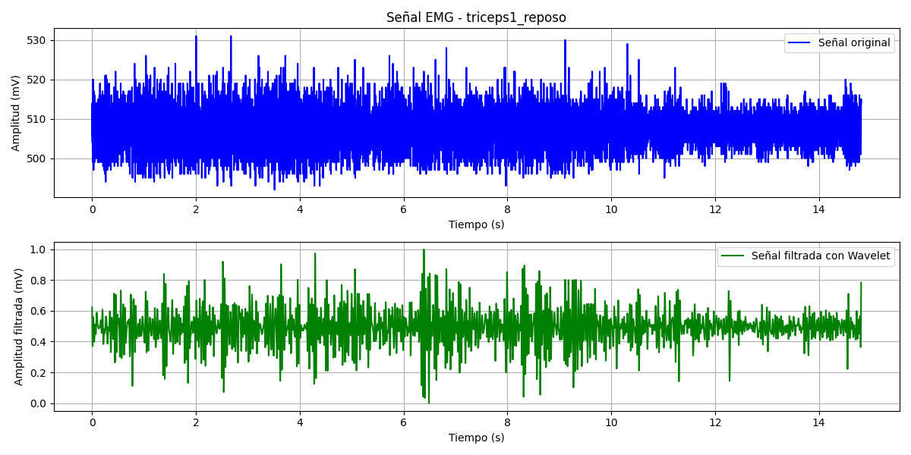
Figura 7

En movimiento:
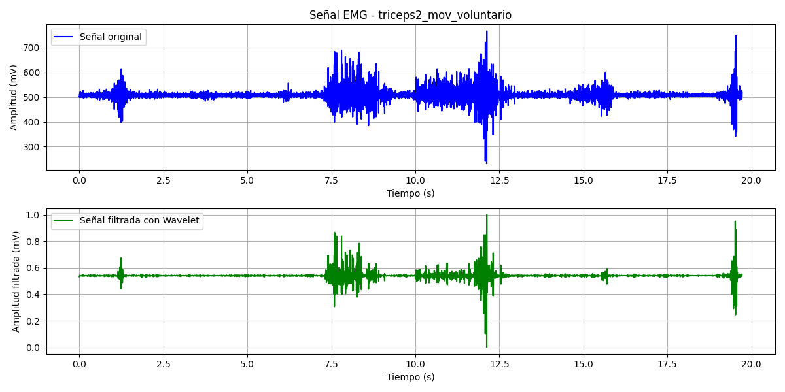 
Figura 8

En contrafuerza:
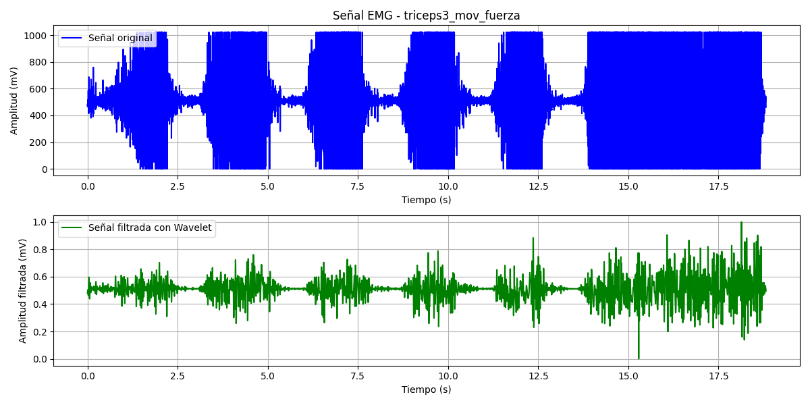 
Figura 9.

#### Gastrocnemio:

| Parámetros   | En reposo | En movimiento   | Contrafuerza |
|-----------   |:--------: |:-----------: | :-------: |
| RMS (mV)     |  0.4088   |  0.4306      | 0.4665
| MAV(mV)      |  0.4064   |  0.4300      | 0.4660
| WL (mV)      |  86.9380  |  95.9563        | 142.5047
| ZC (sin unidades)      |   2.0       |  2.0      | 2.0 
| SSC (sin unidades)     |   1384.0    |  2457.0   | 5440.0
| CSP (sin unidades)     |   18198.0   |  20582.0  | 43796.0
| LFO (mV)          |  86.9380      |   95.9563    | 142.5047
| IAV (mV)          |  7957.9909    |   9907.5563  | 22944.4305
| Varianza (mV²)    |  0.0020       |   0.0005     | 0.0005
| Threshold (mV)    |  0.4064       |   0.4300     | 0.4660
| NF (sin unidades) |  793.0        |   1640.0     |  3627.0

Tabla 3.

En reposo:
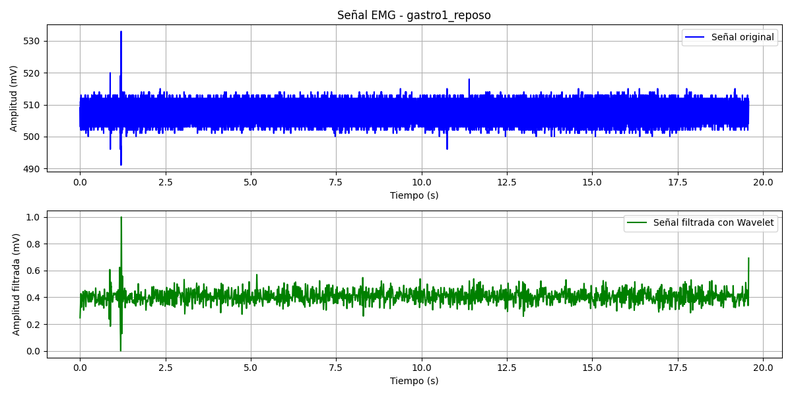
Figura 10.

En movimiento:
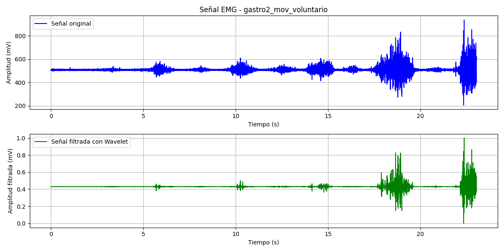 
Figura 11.

En contrafuerza:
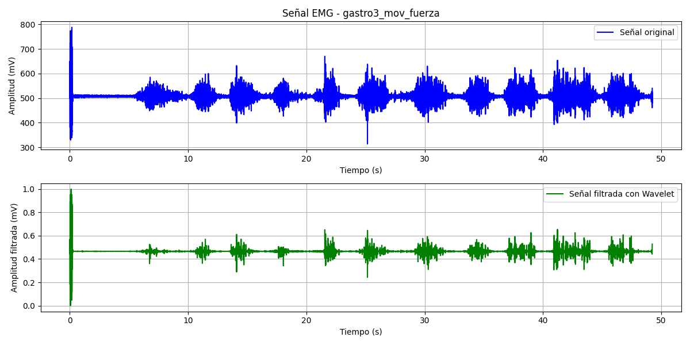 
Figura 12.

## Discusión 

### Grupo Reposo:

* RMS y MAV: Los valores de RMS y MAV son relativamente bajos:
biceps: RMS = 0.7728 mV, MAV = 0.7723 mV
gastro: RMS = 0.4088 mV, MAV = 0.4064 mV
triceps: RMS = 0.5045 mV, MAV = 0.4934 mV
Promedio RMS y MAV: Aproximadamente 0.56 mV, reflejando una baja actividad muscular.
* LFO (Longitud de forma de onda) y WL: Ambas características son relativamente bajas, reflejando baja variabilidad en amplitud:
LFO en el rango de 43.46 mV a 191.98 mV.
WL: Por ejemplo, biceps1_reposo tiene WL = 43.46 mV y triceps1_reposo = 191.98 mV.
* Cruces por Cero (ZC) y Cambios de Pendiente (SSC): El grupo de reposo muestra un bajo número de ZC y SSC:
ZC promedio = 1-2, indicando menos variaciones en la señal.
SSC promedio de alrededor de 1350.
* IAV y NF: Los valores de IAV en reposo también son bajos:
IAV: Entre 7310 y 17504 mV.
NF: Valores más bajos, promedio de alrededor de 830, que indican una señal relativamente estable.

### Grupo Movimiento:

* RMS y MAV: Los valores RMS y MAV son bajos, indicando que la actividad es más controlada y menos sostenida que en el grupo de fuerza:
biceps: RMS = 0.3694 mV, MAV = 0.3618 mV
gastro: RMS = 0.4306 mV, MAV = 0.4300 mV
triceps: RMS = 0.5407 mV, MAV = 0.5402 mV
Promedio RMS y MAV: Aproximadamente 0.45 mV.
* WL y LFO: Valores significativamente mayores que en reposo:
WL: Hasta 203.55 mV en biceps2_mov_voluntario.
LFO en el rango de 65.55 mV a 203.55 mV.
* Cruces por Cero (ZC) y Cambios de Pendiente (SSC):
ZC promedio = 2.
SSC es más alto que en reposo (promedio de 2000), indicando mayor actividad muscular.
* IAV y NF: Valores de IAV moderados, en un rango entre 7816 y 10653 mV.
NF también es más alto, en promedio de 1200, debido a la naturaleza activa de la señal.

### Grupo Movimiento con Fuerza:

* RMS y MAV: Estos valores son más altos que en movimiento voluntario y reposo, reflejando la intensidad de la contracción:
biceps: RMS = 0.5154 mV, MAV = 0.5125 mV
gastro: RMS = 0.4665 mV, MAV = 0.4660 mV
triceps: RMS = 0.5159 mV, MAV = 0.5098 mV
Promedio RMS y MAV: Aproximadamente 0.5 mV.
* LFO y WL: Valores altos, como se observa en biceps3_mov_fuerza con WL = 225.0002 mV, reflejando una actividad intensa:
Rango LFO y WL: 142.5 mV a 225.0 mV.
* Cruces por Cero (ZC) y Cambios de Pendiente (SSC): Los valores de ZC y SSC son elevados en este grupo, debido a la contracción intensa y sostenida:
ZC promedio de 2.
SSC varía de 1487 a 5440, reflejando actividad muscular constante y fuerte.
* IAV y NF: Los valores de IAV son los más altos:
IAV: Rango entre 9591 y 22944 mV, lo que refleja la magnitud de la actividad en este grupo.
NF: Promedio más alto de 2500, debido a la gran variabilidad en la señal y la actividad muscular sostenida.

## Conclusión 

### Comparación Cuantitativa entre Grupos:

* Reposo: Las señales de reposo en los tres músculos estudiados (bíceps, tríceps y gastrocnemio) presentan características de baja intensidad, destacándose valores bajos de RMS, MAV, LFO, WL y NF. Esto indica una actividad mínima y estabilidad en la señal, con variabilidad limitada, que es esperable en un estado sin contracción muscular activa.
* Movimiento Voluntario: En este estado, las señales muestran valores intermedios en características como LFO, WL y SSC, lo cual es coherente con una actividad moderada e intermitente. Las señales en movimiento voluntario presentan valores más altos de ZC y NF en comparación con el reposo, lo que sugiere una mayor frecuencia de activación muscular sin llegar a los niveles observados en contracción con fuerza.
* Movimiento con Fuerza: Las señales de contracción con fuerza presentan los valores más elevados en RMS, MAV, LFO, WL y SSC, lo que confirma la intensidad de la contracción. Los altos valores de IAV y NF reflejan la magnitud y variabilidad de la actividad muscular en este grupo, confirmando que las señales en contracción con fuerza son las de mayor nivel de actividad.

### Diferencias en Variabilidad y Cruces por Cero:

La variabilidad en ZC (Cruces por Cero) y SSC (Cambios de Signo de Pendiente) es evidente entre los grupos de reposo, movimiento voluntario y fuerza. En particular, los valores de ZC y SSC aumentan en los grupos de actividad, lo que indica que estos parámetros son efectivos para distinguir entre los estados de reposo y contracción. En el grupo de fuerza, los cambios de pendiente y cruces por cero aumentan significativamente, reflejando la dinámica rápida de una contracción intensa.

### Hallazgos de Interés:

* Longitud de Forma de Onda (LFO) y Longitud de Onda (WL): Estas características son especialmente útiles para diferenciar entre niveles de actividad. En general, los valores de LFO y WL aumentan con la intensidad de contracción, siendo más bajos en reposo, intermedios en movimiento voluntario y máximos en contracción con fuerza. Este comportamiento respalda el uso de LFO y WL como indicadores de la complejidad y la magnitud de la actividad muscular.
* Integral Absoluta (IAV): La IAV proporciona una medida acumulada de la actividad muscular, siendo útil para diferenciar la intensidad de contracción. Los valores de IAV son particularmente altos en el grupo de fuerza (hasta 22944 mV), lo que indica un esfuerzo muscular sostenido. Este parámetro es clave para evaluar la cantidad de esfuerzo en cada tipo de contracción.

La extracción de características temporales como RMS, MAV, LFO, WL, ZC, SSC y IAV permite una clasificación eficaz de los estados musculares en reposo, movimiento voluntario y movimiento con fuerza. Estas características reflejan de manera confiable los patrones de activación muscular, siendo útiles para aplicaciones de control de dispositivos, como prótesis que dependen de la precisión en la detección de los diferentes niveles de esfuerzo. En conclusión, las características temporales analizadas proporcionan una base sólida para el reconocimiento de patrones EMG, facilitando un control adaptativo y personalizado de dispositivos basados en actividad muscular.

## Bibliografía

[1] N. Massó, F. Rey, D. Romero, G. Gual, L. Costa y A. Germán, “Aplicaciones de la electromiografía de superficie en el deporte”, Apunt. Medicina L´Sport, vol. 45, n.º 165, pp. 127–136, 2010.

[2] S. Sakhuja. “Limitations of Fourier Transform and the Role of Wavelet Transform”. Medium. Accedido el 27 de octubre de 2024. [En línea]. Disponible: https://sakhujasaiyam.medium.com/disadvantages-of-fourier-transform-and-the-role-of-wavelet-transform-a4218d8cc6de

[3] H. Romo, J. Realpe y P. Jojoa, “Análisis de Señales EMG Superficiales y su Aplicación en Control de Prótesis de Mano”, Repos. Univ. Nac., 2007. Accedido el 26 de octubre de 2024. [En línea]. Disponible: https://repositorio.unal.edu.co/handle/unal/24106

[4] V. von Tscharner, M. Ullrich, M. Mohr, D. Comaduran Marquez y B. M. Nigg, “A wavelet based time frequency analysis of electromyograms to group steps of runners into clusters that contain similar muscle activation patterns”, PLOS ONE, vol. 13, n.º 4, abril de 2018, art. n.º e0195125. Accedido el 27 de octubre de 2024. [En línea]. Disponible: https://doi.org/10.1371/journal.pone.0195125

[5]X. Liu, X. Xi, X. Hua, H. Wang, y W. Zhang, "Feature Extraction of Surface Electromyography Using Wavelet Weighted Permutation Entropy for Hand Movement Recognition," *Journal of Healthcare Engineering*, vol. 2020, Art. no. 8824194, Nov. 2020, doi: 10.1155/2020/8824194.

[6] H. A. Romo, J. C. Realpe, y P. E. Jojoa, "Análisis de Señales EMG Superficiales y su Aplicación en Control de Prótesis de Mano," Revista Avances en Sistemas e Informática, vol. 4, no. 1, pp. 127-136, junio 2007.

