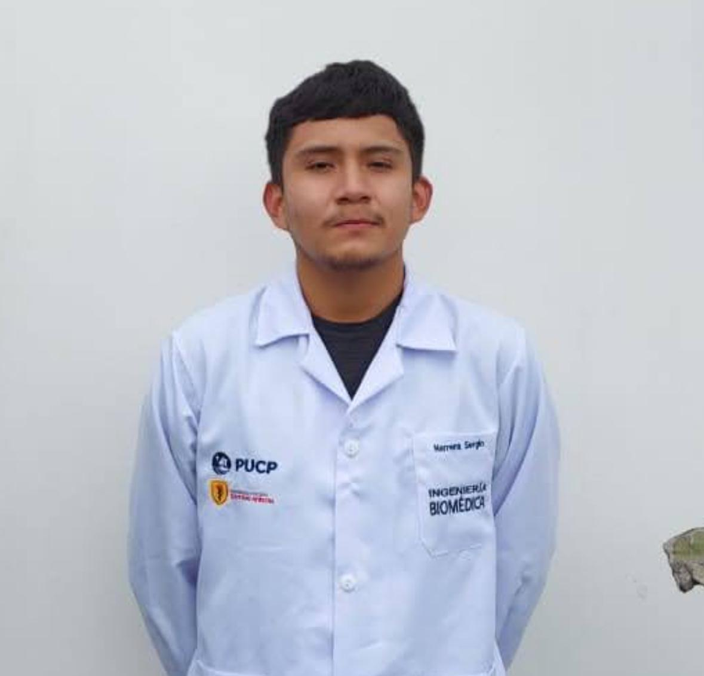
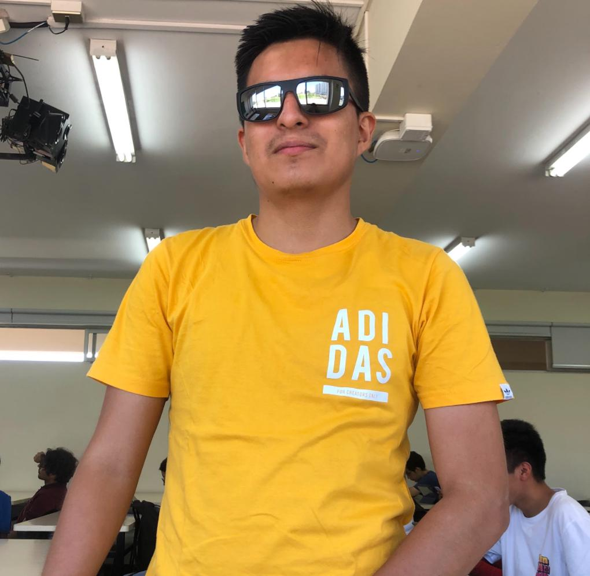

# INTRODUCCIÓN  DE SEÑALES BIOMÉDICAS GRUPO 1:

# Miembros: 
***

Lider del equipo: Fabian Alcides Ñaña Alfaro

***

Miembro (responsabilidad: por asignar): Christian Huarancca Quispe

***

Miembro (responsabilidad: por asignar): Ryoshin Cavero Mosquera

***

Miembro (responsabilidad: por asignar): Flavio Andreas Avendanho Çaceres

***

Miembro (responsabilidad: por asignar): Joao Marco Torres Rivera

***

