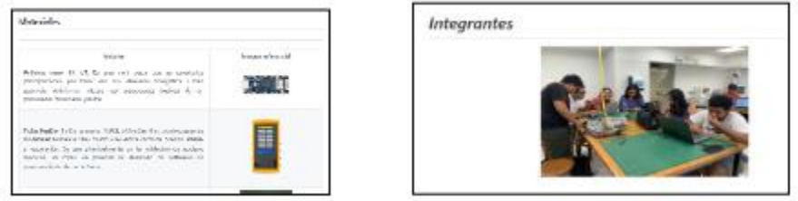

# INTRODUCCIÓN  DE SEÑALES BIOMÉDICAS GRUPO 1:

Este es el repositorio del proyecto  Grupo 1.

Integrantes: 
* Fabián Alcides Ñaña Alfaro - [fabian.nana@upch.pe](fabian.nana@upch.pe)
* Flavio Andrés Avendaño Cáceres - [flavio.avendano@upch.pe](flavio.avendano@upch.pe)
* Joao Marco Torres Rivera - [joao.torres@upch.pe](joao.torres@upch.pe)
* Favio A. Ryoshin Cavero Mosquera - [favio.cavero@upch.pe](favio.cavero@upch.pe)
* Christian Edú Huarancca Quispe - [christian.huarancca@upch.pe](christian.huarancca@upch.pe)
 
***

PROYECTO: ...

***

# Tabla de Contenidos

## Introducción
## Materiales 
## Metodología
## Resultados
## Discusión 
## Bibliografía 
## Docentes 
